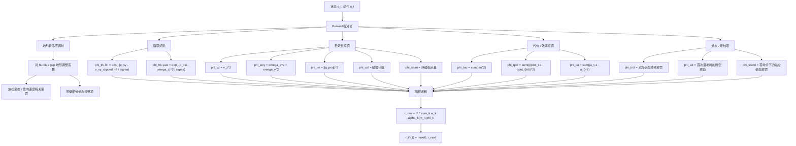

# MGDP Stage 1 Reward 公式整理

> 本文档用于把 `MGDP Stage 1` 的 reward 写成论文/笔记可直接引用的数学形式，并统一改为中文表述。
>
> 说明：
> - 本文档整理的是历史 `MGDP Stage 1` reward 口径。
> - 本次整理已将文档中的公式统一改为 Obsidian 可编译的数学语法。
> - 当前仓库未保留原始 `legged_gym/random_dog` 源文件，因此文末只保留历史来源说明，不再使用失效的仓库内链接。

## 1. 总体奖励形式

对 `MGDP Stage 1` 而言，单步奖励不是单一项，而是多个 reward 分量加权求和后，再做非负截断。其总奖励可以写成：

$$
r_t^{(1)} = \max \left( 0,\ \Delta t \sum_{k \in \mathcal{K}} w_k \, \phi_k(s_t, a_t) \right)
$$

其中：

- $\Delta t = 0.02$，由仿真步长和控制降采样共同决定：
  - `sim.dt = 0.005`
  - `decimation = 4`
- $\mathcal{K}$ 表示当前启用的 reward 项集合。
- $w_k$ 表示第 $k$ 个 reward 项的权重。
- $\phi_k(s_t, a_t)$ 表示对应 reward 项的计算函数。

实现逻辑是先把所有启用项加总，然后执行：

$$
r_t^{(1)} \leftarrow \max \left( r_t^{(1)}, 0 \right)
$$

这是因为配置中使用了 `only_positive_rewards = True`。

## 2. Stage 1 启用的 Reward 项

`Stage 1` 中启用的 reward 权重为：

$$
\begin{aligned}
w_{\text{trk-lin}} &= 1.0, \\
w_{\text{trk-yaw}} &= 0.5, \\
w_{v_z} &= -1.0, \\
w_{\omega_{xy}} &= -0.05, \\
w_{\tau} &= -10^{-5}, \\
w_{\ddot q} &= -2.5 \times 10^{-7}, \\
w_{\Delta a} &= -0.01, \\
w_{\text{ori}} &= -0.2, \\
w_{\text{col}} &= -1.0, \\
w_{\text{trot}} &= -0.1, \\
w_{\text{air}} &= 1.0, \\
w_{\text{stum}} &= -1.0, \\
w_{\text{stand}} &= -0.1.
\end{aligned}
$$

因此，`Stage 1` 的总奖励可以展开写成：

$$
\begin{aligned}
r_t^{(1)} = \max \Bigl( 0,\ \Delta t [
&w_{\text{trk-lin}} \phi_{\text{trk-lin}}
+ w_{\text{trk-yaw}} \phi_{\text{trk-yaw}}
+ w_{v_z} \phi_{v_z}
+ w_{\omega_{xy}} \phi_{\omega_{xy}} \\
&+ w_{\tau} \phi_{\tau}
+ w_{\ddot q} \phi_{\ddot q}
+ w_{\Delta a} \phi_{\Delta a}
+ w_{\text{ori}} \phi_{\text{ori}} \\
&+ w_{\text{col}} \phi_{\text{col}}
+ w_{\text{trot}} \phi_{\text{trot}}
+ w_{\text{air}} \phi_{\text{air}}
+ w_{\text{stum}} \phi_{\text{stum}}
+ w_{\text{stand}} \phi_{\text{stand}}
] \Bigr).
\end{aligned}
$$

## 3. 各 Reward 项的数学定义

记：

- $\mathbf{c}_t = [c_x, c_y, c_\psi]$ 为命令速度；
- $\mathbf{v}_t = [v_x, v_y, v_z]$ 为机体线速度；
- $\boldsymbol{\omega}_t = [\omega_x, \omega_y, \omega_z]$ 为机体角速度；
- $\mathbf{q}_t, \dot{\mathbf{q}}_t, \boldsymbol{\tau}_t$ 为关节位置、关节速度和关节力矩；
- $\mathbf{a}_t$ 为策略输出动作；
- $\mathbf{g}_t^{\text{proj}} \in \mathbb{R}^2$ 为投影重力向量；
- $\sigma = 0.25$，$\epsilon = 0.1$。

### 3.1 线速度跟踪奖励

$$
\phi_{\text{trk-lin}}
=
\exp \left(
- \frac{\left\| \mathbf{c}_{xy} - \tilde{\mathbf{v}}_{xy} \right\|_2^2}{\sigma}
\right)
$$

其中，$\tilde{\mathbf{v}}_{xy}$ 是对平面速度测量值做裁切后的结果：

$$
\tilde{v}_j = \operatorname{clip}(v_j,\ \ell_j,\ u_j), \quad j \in \{x, y\}
$$

$$
\ell_j =
\begin{cases}
-\infty, & c_j > 0 \\
c_j - \epsilon, & c_j \le 0
\end{cases}
\qquad
u_j =
\begin{cases}
c_j + \epsilon, & c_j \ge 0 \\
+\infty, & c_j < 0
\end{cases}
$$

这表示：

- 同方向超速会被适度容忍；
- 但速度不足仍会被惩罚；
- 因此这是一个带方向性的非对称速度跟踪项。

### 3.2 偏航角速度跟踪奖励

$$
\phi_{\text{trk-yaw}}
=
\exp \left(
- \frac{(c_\psi - \omega_z)^2}{\sigma}
\right)
$$

### 3.3 垂向速度惩罚

$$
\phi_{v_z} = v_z^2
$$

### 3.4 横滚/俯仰角速度惩罚

$$
\phi_{\omega_{xy}} = \omega_x^2 + \omega_y^2
$$

### 3.5 力矩惩罚

$$
\phi_{\tau} = \sum_i \tau_i^2
$$

### 3.6 关节加速度惩罚

$$
\phi_{\ddot q}
=
\sum_i
\left(
\frac{\dot q_{i,t-1} - \dot q_{i,t}}{\Delta t}
\right)^2
$$

### 3.7 动作变化率惩罚

$$
\phi_{\Delta a} = \sum_i (a_{i,t-1} - a_{i,t})^2
$$

### 3.8 姿态惩罚

$$
\phi_{\text{ori}} = \left\| \mathbf{g}_t^{\text{proj}} \right\|_2^2
$$

### 3.9 碰撞惩罚

$$
\phi_{\text{col}}
=
\sum_{b \in \mathcal{B}_{\text{pen}}}
\mathbf{1} \left( \left\| \mathbf{f}_b \right\|_2 > 0.1 \right)
$$

其中，$\mathcal{B}_{\text{pen}}$ 表示被纳入惩罚统计的刚体集合。

### 3.10 对角小跑对称性惩罚

$$
\phi_{\text{trot}}
=
\left\| \mathbf{q}_{FL} - \mathbf{q}_{RR} \right\|_1
+
\left\| \mathbf{q}_{FR} - \mathbf{q}_{RL} \right\|_1
$$

这一项主要用于较简单地形上的步态规整；在训练早期之后，该项会被关闭。

### 3.11 足端腾空时间奖励

$$
\phi_{\text{air}}
=
\sum_{f \in \mathcal{F}}
(T_f - 0.5)\, \mathbf{1}(\text{first-contact}_f)
$$

并且该项只在 $\left\| \mathbf{c}_{xy} \right\|_2 > 0.1$ 时启用。

### 3.12 足端绊碰惩罚

$$
\phi_{\text{stum}}
=
\mathbf{1} \left(
\exists f \in \mathcal{F},
\ \left\| \mathbf{f}_{f,xy} \right\|_2 > 4 \left| f_{f,z} \right|
\right)
$$

### 3.13 静止站立姿态惩罚

$$
\phi_{\text{stand}}
=
\left\| \mathbf{q}_t - \mathbf{q}^{\text{default}} \right\|_1
\cdot
\mathbf{1} \left( \left\| \mathbf{c}_{xy} \right\|_2 < 0.1 \right)
$$

## 4. 地形自适应 Reward 调制

`Stage 1` 使用 `mesh_type = 'mix'`，并开启 `terrain_adaptive_reward = True`。因此，部分 reward 项还会被地形相关系数进一步调制：

$$
r_t^{(1)} =
\max \left(
0,\ \Delta t \sum_k w_k \, \alpha_k(m_t) \, \phi_k(s_t, a_t)
\right)
$$

其中：

- $m_t$ 表示当前环境所处的地形类别；
- $\alpha_k(m_t)$ 表示对应 reward 项在该地形下的调制系数。

在 `Stage 1` 中，主要会被地形调制的 reward 项包括：

- `motion_trot`
- `collision`
- `lin_vel_z`
- `orientation`

对 `mix` 地形来说：

- `env_class = 5` 表示类似跨栏/跨台阶地形；
- `env_class = 6` 表示沟壑/缺口地形。

论文式紧凑写法可记为：

$$
\alpha_k(m) =
\begin{cases}
0 \text{ 或 } 0.25, & m \in \{\text{hurdle}, \text{gap}\} \\
1, & \text{其他情况}
\end{cases}
$$

这表示在 hurdle、gap 这类通过性更强约束的地形上，系统会：

- 放松某些稳定性惩罚；
- 压低某些步态规整项；
- 避免平地目标对越障行为形成过强约束。

## 5. 乘上 $\Delta t$ 后的实际单步系数

由于所有配置权重最终都会乘上 $\Delta t = 0.02$，因此每一步真正生效的系数为：

$$
\begin{aligned}
r_t^{(1)} = \max(0,\ 
&0.02 \, \phi_{\text{trk-lin}}
+ 0.01 \, \phi_{\text{trk-yaw}}
- 0.02 \, \phi_{v_z}
- 0.001 \, \phi_{\omega_{xy}} \\
&- 2 \times 10^{-7} \, \phi_{\tau}
- 5 \times 10^{-9} \, \phi_{\ddot q}
- 2 \times 10^{-4} \, \phi_{\Delta a}
- 0.004 \, \phi_{\text{ori}} \\
&- 0.02 \, \phi_{\text{col}}
- 0.002 \, \phi_{\text{trot}}
+ 0.02 \, \phi_{\text{air}}
- 0.02 \, \phi_{\text{stum}}
- 0.002 \, \phi_{\text{stand}}
)
\end{aligned}
$$

## 6. Stage 1 Reward 结构图

## 7. 历史源码映射说明

本文档原本对应的历史实现来源包括：

- reward 配置：
  - `legged_gym/envs/random_dog/random_dog_config_stage1.py`
- reward 汇总与缩放：
  - `legged_gym/envs/base/legged_robot.py`
- `Stage 1` 任务专属 reward：
  - `legged_gym/envs/random_dog/random_dog.py`
- 通用 reward 工具：
  - `legged_gym/envs/baseline/legged_robot_rewards.py`
- `mix` 地形类别定义：
  - `legged_gym/utils/new_terrains/add_mix_terrain.py`

当前仓库中上述历史文件均已缺失，因此本节只保留文字映射，供论文写作或回溯口径时参考。
