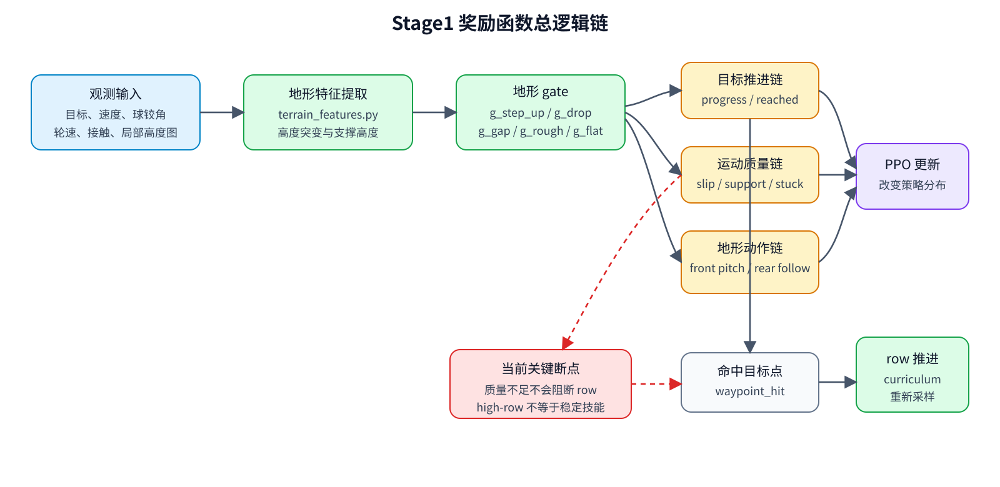
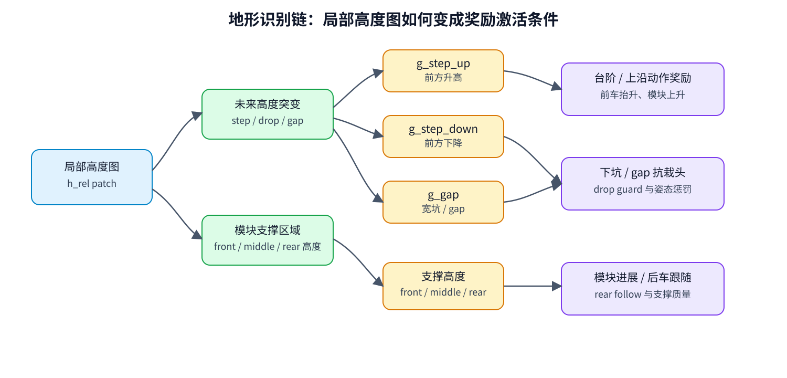
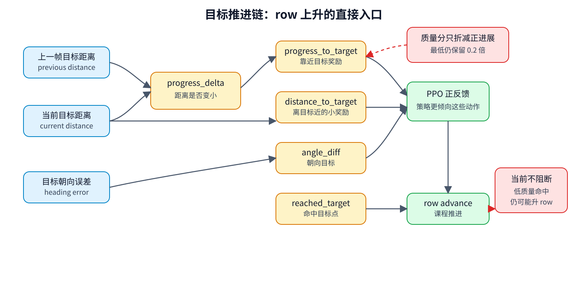
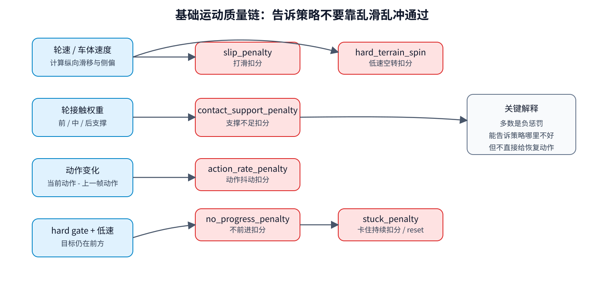
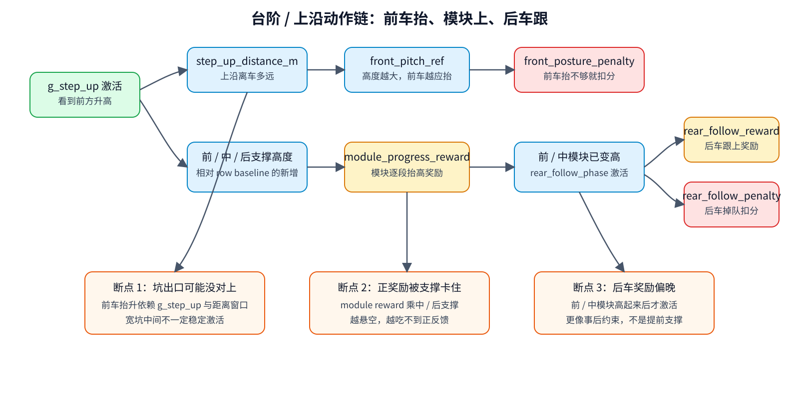
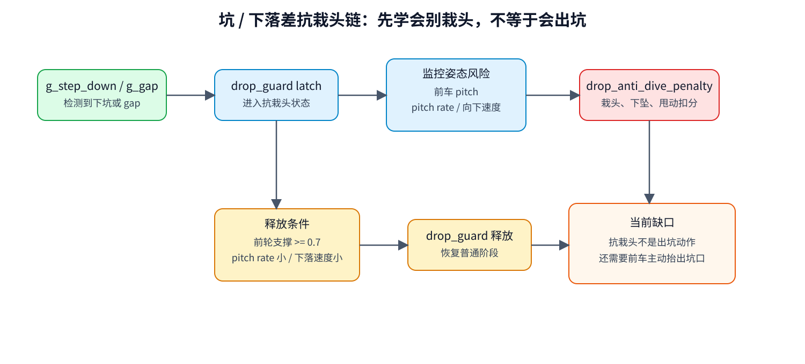
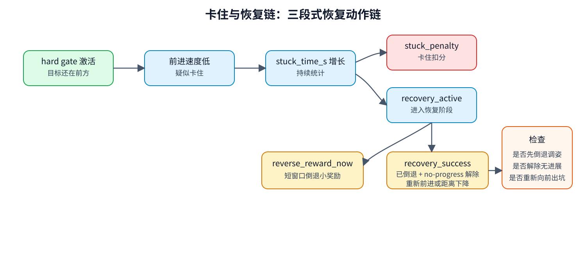
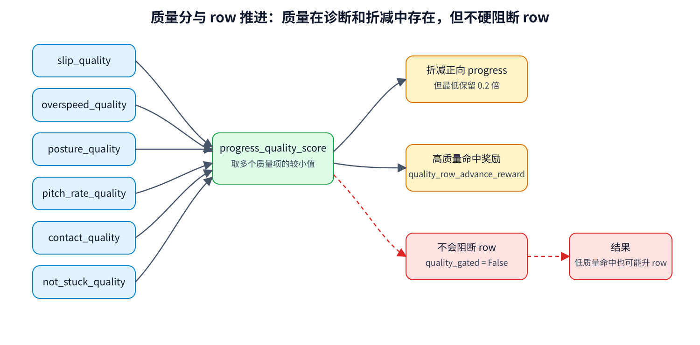
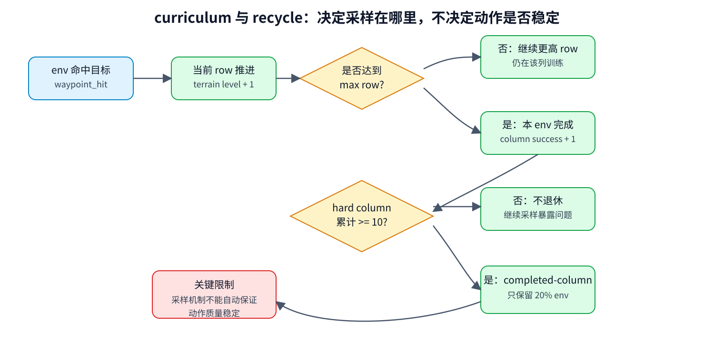
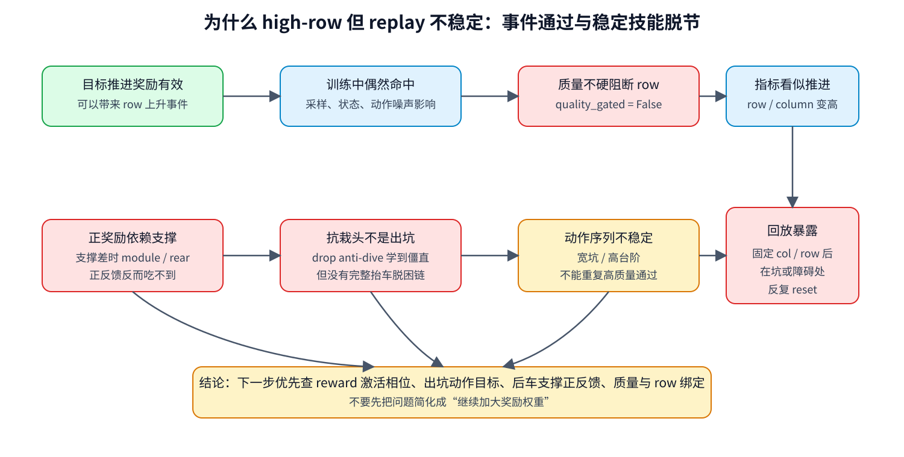

# Stage1 奖励函数逻辑链图解

本文档用图和表把当前 Stage1 的整条逻辑链讲清楚：策略看到了什么，地形特征如何被识别，奖励项在什么阶段被激活，row 是怎样推进的，以及为什么现在会出现“训练中 row 到了高处，但回放里行为仍不稳定”的现象。

对应当前源码口径：

- 奖励计算：`rewards.py`
- 地形特征：`terrain_features.py`
- reset / row 推进 / stuck / recovery / drop guard：`env.py`
- 当前 Stage1 配置：`complete_car_stage1_cfg.py`

## 1. 一句话总览

当前 Stage1 不是一个单一奖励，而是三条链并行工作：

- 目标推进链：鼓励小车接近目标点、命中目标点，并由命中目标推动 row 上升。
- 运动质量链：惩罚滑移、超速、无进展、卡住、接触支撑差、姿态差。
- 地形动作链：在台阶 / 障碍 / 坑附近，诱导前车抬升、模块依次抬高、后车跟随、下坑抗栽头、卡住后恢复。

现在的核心矛盾是：目标推进链已经可以把 row 推高，但运动质量链大多只是奖励折减或诊断，不会阻断 row 推进；地形动作链里的正反馈又常常依赖“动作已经部分做对”之后才激活。因此训练可能出现“row 到了，但动作不是稳定技能”的情况。

## 2. 当前奖励权重表

下表是当前 Stage1 源码中的权重口径。注意：权重大小不等于实际训练中的奖励量级，实际量级还要乘以激活条件、归一化、episode 长度和当前行为状态。

| 奖励项 | 当前权重 | 通俗作用 | 主要激活条件 |
|---|---:|---|---|
| `distance_to_target` | `10.0` | 离目标越近越好 | 全程 |
| `progress_to_target` | `8.0` | 这一小步让目标距离变小 | 全程，正进展会被滑移和 hard quality 折减 |
| `reached_target` | `6.0` | 吃到目标点 | waypoint hit |
| `angle_diff` | `14.0` | 朝向目标更好 | 全程 |
| `slip_penalty` | `-2.0` | 轮子打滑扣分 | 全程，按接触权重统计 |
| `action_rate_penalty` | `-10.0` | 动作变化太猛扣分 | 全程 |
| `contact_support_penalty` | `-20.0` | 支撑不足扣分 | flat / rough / step-up / drop 分相位统计 |
| `terrain_aware_edge_speed_penalty` | `-80.0` | 台阶 / 坑 / 障碍附近超速扣分 | `g_step_up` 或 `g_drop` 激活 |
| `stuck_penalty` | `-3.0` | 卡住时间超过 grace 后扣分 | hard terrain 且低前进速度 |
| `no_progress_penalty` | `-1.0` | hard terrain 上不前进扣分 | hard gate 激活且目标在前方 |
| `airborne_spin_penalty` | `-1.0` | 悬空轮空转扣分 | 轮子离地且转速大 |
| `hard_terrain_spin_penalty` | `-1.0` | hard terrain 低速打滑扣分 | hard gate、低速或无进展、滑移大 |
| `step_up_front_posture_penalty` | `-12.0` | 台阶前前车抬升不足扣分 | `g_step_up` 与距离姿态窗口，不再乘 `target_ahead` |
| `step_up_module_progress_reward` | `40.0` | 前 / 中 / 后模块在台阶上产生高度进展 | `g_step_up`、目标在前、模块高度相对 row baseline 有新增 |
| `rear_follow_reward` | `8.0` | 后车追赶高度进展 + 跟上后支撑保持奖励 | `g_step_up` 且前 / 中模块已经明显变高，不再乘 `target_ahead` |
| `rear_follow_penalty` | `-36.0` | 后车掉队扣分 | 前 / 中模块已经明显变高但后车高度落后 |
| `quality_row_advance_reward` | `1.0` | 高质量命中目标额外奖励 | hard terrain 命中目标且质量分超过阈值 |
| `recovery_reward` | 成功 `1.0`，短时倒退 `+0.2 * dt` | 卡住后先短时倒退 / 调姿，再重新前进成功 | recovery active |
| `drop_anti_dive_penalty` | `-40.0` | 下坑 / gap 附近抗栽头 | `g_drop` 或 drop guard latch 激活 |

2026-05-14 已清理三个不再提供有效训练信号的 reward 项：`far_from_target` 不再作为 reward，只保留终止保护；旧版 `edge_speed_penalty` 已由 `terrain_aware_edge_speed_penalty` 替代；`action_soft_limit_penalty` 在动作已有 hard clamp 后删除。

停止点附近的 TensorBoard 均值量级大致如下。它反映的是“训练实际感受到的平均信号”，比单看权重更有用。

| 类别 | 代表项 | 停止点附近均值量级 | 说明 |
|---|---|---:|---|
| 正向目标 | `progress_to_target` | `+0.013` | 主要稳定正项之一 |
| 正向目标 | `reached_target` | `+0.014` | 命中目标带来明显正反馈 |
| 正向基础 | `distance_to_target` | `+0.0065` | 小而持续 |
| 正向基础 | `angle_diff` | `+0.0098` | 小而持续 |
| 正向地形 | `step_up_module_progress_reward` | `+0.0107` | 已接近目标推进量级 |
| 正向地形 | `rear_follow_reward` | 上次 trace 接近 `0` | 当前已拆为 `rear_follow_progress_reward_raw` 与 `rear_follow_hold_reward_raw`，需要重新回放验证是否吃到 |
| 负向卡滞 | `no_progress_penalty` | `-0.011` | 与 progress 同量级 |
| 负向卡滞 | `stuck_penalty` | `-0.011` | 与 progress 同量级 |
| 负向滑移 | `slip_penalty` | `-0.011` | 与 progress 同量级 |
| 负向下坑 | `drop_anti_dive_penalty` | `-0.008` | 已经不是弱信号 |
| 负向支撑 | `contact_support_penalty` | `-0.007` | 有影响，但不是直接教会“如何恢复支撑” |
| 负向后车 | `rear_follow_penalty` | `-0.0056` | 有惩罚，但正向跟随奖励没跟上 |
| 负向姿态 | `step_up_front_posture_penalty` | `-0.0054` | 前车抬升不足会被看到 |
| 负向速度 | `terrain_aware_edge_speed_penalty` | `-0.0042` | 超速问题仍存在 |
| 总奖励 | `total` | `-0.012` | hard terrain 上整体处于负收益压力 |

这说明当前问题不再像早期那样是“hard terrain 信号太弱”。更准确的说法是：很多负信号已经足够强，但它们没有形成清晰的动作闭环。

## 3. 地形识别链

奖励不是直接知道“这是台阶”或“这是坑”。它先从局部高度图中提取几类量，再把这些量变成 gate。

这些 gate 的含义可以这样理解：

- `g_step_up`：前方看到了明显升高，台阶上沿或坑出口可能出现。
- `g_step_down`：前方看到了明显下降，进入坑或下落差。
- `g_gap`：下降同时带有一定宽度，更像坑或 gap。
- `g_edge`：`g_step_up` 和 `g_drop` 的合并，用来控制边缘速度和 hard terrain 质量。

因此宽坑是一个混合问题：进入坑时是 `g_drop/g_gap`，出坑时应该转成 `g_step_up`。如果这个转换窗口、距离窗口或支撑高度定义没有对上，策略就可能只学到“别栽头”，但没有学到“抬前车出坑”。

## 4. 目标推进链

目标推进链负责让小车往目标点走，也是 curriculum row 上升的直接入口。

这条链有两个关键点：

第一，`waypoint_hit` 会直接推动 row 逻辑。只要目标命中了，就能触发 row 相关更新；当前 `quality_gated_terrain_advance = False`，所以“低质量命中目标”不会被硬拦下来。

第二，质量分会折减 hard terrain 上的正进展，但不会把正进展完全归零。当前 `step_up_progress_quality_min_multiplier = 0.2`，意思是质量再差，正进展仍至少保留一部分。这对训练早期探索是有利的，但也意味着策略可能保留一些“侥幸通过”的动作。

这就是为什么“训练中 row8、row9 通过了”不等于“回放中一定稳定通过整个 column”。训练中可能存在随机状态、reset 初始差异、动作采样差异、某次刚好命中目标；而回放里固定列、固定 row、固定初始条件后，策略暴露出它并没有把该动作变成稳定能力。

## 5. 基础运动质量链

基础运动质量链负责告诉策略：前进不能靠乱滑、乱冲、乱甩动作。

这里最重要的是 `contact_support_penalty`。它不是简单地奖励“轮子接触越多越好”，而是在不同地形相位下看不同模块：

- 平地 / rough：前、中、后三模块都要有基本支撑。
- step-up：更关注中车和后车支撑，当前比例是中车 `0.4`、后车 `0.6`。
- drop / gap：也关注中车和后车，避免前车进入坑后整个车体失稳。

但是它本质上仍是负惩罚：支撑不好就扣分。它没有直接告诉策略“应该通过哪一个球铰动作、哪一个轮速配合，把后轮重新压回地面”。因此如果只加大这个惩罚，策略可能学到保守、停滞、贴边界，未必学到有效支撑动作。

## 6. 台阶 / 上沿动作链

台阶链试图把“过台阶”拆成三个动作：前车提前抬、模块逐段上升、后车跟上。

当前前车姿态参考是：

- `front_pitch_height_gain_rad_per_m = 3.0`
- `front_pitch_max_ref_rad = 0.50`
- 姿态窗口从 `0.90 m` 开始，到 `0.25 m` 进入满权重

按当前代码符号，`front_pitch_ref` 是负值，也就是期望前车向抬升方向转。台阶越高，期望抬升越大，但最多到 `0.50 rad`。这会让高 row 台阶 / 坑出口阶段的前车抬升要求更强。

当前 `step_up_posture_weight` 已改为只由 `g_step_up` 与距离相位窗口决定，不再因为 `commands[:, 0] <= 0.5 m` 直接关闭。也就是说，只要局部高度图识别出前方有上沿 / 出坑边，并且车头进入姿态窗口，前车抬升约束就会持续存在。

这条链的潜在断点有三个：

| 断点 | 现象 | 为什么会发生 |
|---|---|---|
| 前车抬升只在 `g_step_up` 与距离窗口内强激活 | 坑内或坑出口不一定稳定抬前车 | 宽坑经历先 drop/gap 后 step-up，如果坑出口识别或距离窗口没有对上，前车抬升压力仍会不足 |
| `step_up_module_progress_reward` 乘了中 / 后支撑分数 | 支撑差时正奖励也吃不到 | 后车越悬空，越需要被教会支撑，但这时正奖励被支撑条件压低 |
| `rear_follow_reward` 仍要等前 / 中模块已经高起来才激活 | 后车辅助推进仍可能偏晚 | 当前已去掉 `target_ahead` 并拆成追赶与保持两段，但还不是“后车提前顶住并推上去”的前馈指令 |

所以台阶高 row 下看到后段支撑不足，不一定是 `rear_follow_penalty` 不够大；更可能是后车支撑 / 后车推进的奖励相位太晚。当前 rear-follow 的追赶奖励已不再要求 rear support，保持奖励仍要求后轮支撑。

## 7. 坑 / 下落差抗栽头链

坑和 drop 的逻辑主要是避免前车栽头，而不是主动完成出坑。

当前 release 条件是：

- 前轮支撑 `front_support >= 0.7`
- pitch rate `<= 0.5 rad/s`
- 向下速度 `<= 0.15 m/s`
- 连续满足 `0.20 s`

这条链能解释你在回放中看到的现象：小车进入坑时会表现出前车抗栽头、前车比较僵直。但它没有显式奖励“当前轮和中轮已经进坑后，前车主动抬高并重新爬出坑口”。抗栽头和出坑是连续动作的两个阶段，当前代码把它们拆成了 drop anti-dive 与 step-up posture 两套逻辑，中间转换是否顺滑，是现在最需要检查的地方。

## 8. 卡住与恢复链

卡住检测和 recovery 现在改成三段式恢复动作链。

当前逻辑保留原来的 `recovery_active` 检测：hard terrain 前目标还在前方、低速卡住一段时间后进入 recovery。进入后，短窗口内的小幅倒退不再扣分，而是给小正奖励；成功条件也不再只看“目标距离减少 `0.10 m`”，而是要求已经有短时倒退 / 姿态调整，并且 no-progress 解除，同时重新产生前向进展或目标距离下降。

如果回放里看到“小车在一个坑里重复 reset”，需要同时看：

- `recovery_active_rate` 是否上升
- `recovery_reverse_reward_now` 是否在激活初期出现
- `recovery_had_reverse` 是否为 `1`
- `recovery_no_progress_cleared` 是否为 `1`
- `recovery_forward_progress_m` / `recovery_total_progress_m` 是否转正
- `recovery_success_rate` 是否仍接近 `0`
- `front_pitch_ref` 是否在坑出口阶段激活
- `front_pitch_actual` 是否跟上 ref
- `rear_follow_progress_reward_raw` 与 `rear_follow_hold_reward_raw` 是否几乎为 `0`
- `contact_support_rear` 是否长期低
- `drop_guard_active` 是否长时间保持

这些量能判断它是在“没有启动恢复”，还是“倒退调姿没有发生”，或是“倒退后没有重新建立前向进展”。

## 9. 质量分与 row 推进的关系

当前代码里有两个质量概念，容易混在一起：

`progress_quality_score` 取多个质量项的较小值，所以它很严格。只要滑移、超速、姿态、支撑、卡住里有一项很差，整体分就会低。

但当前它只做两件事：

- 折减 hard terrain 的正向 progress。
- 命中目标且质量够高时，给一个很小的额外奖励。

它不做的事同样重要：

- 它不会阻止低质量命中目标后 row 上升。
- 它不会阻止 column 被认为“通过了一次”。
- 它不会强制 replay 中每次都用同样稳定的动作通过。

因此，训练日志中看到某列到过 row18，只能说明在训练采样中存在过命中事件；不能直接说明策略已经形成稳定通关技能。

## 10. curriculum 与 recycle 链

当前恢复到原 `model_50.pt` 地图后的地形分布是：

| 列范围 | 地形类型 | 采样比例 |
|---|---|---:|
| col0 | flat | `10%` |
| col1 | slope down | `10%` |
| col2 | slope up | `10%` |
| col3-col4 | uneven rough | `20%` |
| col5-col7 | stairs down | `30%` |
| col8-col9 | discrete obstacles | `20%` |

completed-column 机制当前是：

- hard column 必须累计 `10` 次最高 row success 才整体标记为 completed。
- completed-column retention 为 `0.20`，也就是完成列仍保留少量 env，防止技能完全遗忘。
- 其余 env 会回收到未完成列，提高 hard terrain 暴露比例。
- 所有列都 completed 后，训练不会因为 `all retired` 自动停止；env 会继续在 completed columns 上重采样，避免全体 env 被 park 后没有训练信号。

这套机制是为了让 hard terrain 暴露更多问题。但它不能自动保证动作质量。它只决定“采样在哪里发生”，不决定“什么动作才算真的过关”。

## 11. 为什么会出现高 row 但回放不稳定

把上面的链条合起来，可以得到当前最可能的根因图：

通俗说，现在策略可能学到了几件事：

- 看到坑或落差时，前车不要太快栽下去。
- 在某些状态下，靠速度、姿态和接触的组合可以吃到目标点。
- 在训练采样中，偶尔成功就能把 row 推上去。

但它还没有稳定学会：

- 宽坑中前 / 中车进入坑后，前车主动抬高并爬出坑口。
- 高 row 台阶上后车提前支撑并辅助推进。
- 卡住后用一个可重复的恢复动作序列脱困。

这就是你看到“训练 row8、row9 已经通过，但回放中仍在某个坑反复 reset”的根本解释：row 推进记录的是事件，稳定技能要求的是可重复动作分布，两者现在还没有被奖励函数严格绑定。

## 12. 排查回放时应优先看哪些量

如果要判断一次 replay 失败到底断在哪条链上，建议按下面顺序看诊断量：

| 问题 | 优先看 |
|---|---|
| 是否识别到坑出口 / 台阶上沿 | `terrain_gate_step_up`、`step_up_height_m`、`step_up_distance_m` |
| 前车是否被要求抬升 | `front_pitch_ref`、`step_up_posture_weight` |
| 前车是否真的抬了 | `front_pitch_actual`、`front_pitch_error` |
| 是否只是抗栽头，没有转入出坑 | `drop_guard_active`、`drop_anti_dive_penalty_raw`、`terrain_gate_gap` |
| 后车是否跟上 | `rear_module_height_progress`、`rear_follow_score`、`rear_follow_progress_score` |
| 后车正奖励是否吃到 | `rear_follow_progress_reward_raw`、`rear_follow_hold_reward_raw`、`rear_follow_reward_raw` |
| 后车是否只是被罚 | `rear_follow_penalty_raw`、`rear_follow_deficit_score` |
| 支撑是否足够 | `contact_support_mid`、`contact_support_rear`、`module_support_phase_score` |
| 是否无进展卡住 | `no_progress_active`、`stuck_time_s`、`stuck_penalty_active` |
| recovery 是否有效 | `recovery_active`、`recovery_reverse_now`、`recovery_had_reverse`、`recovery_no_progress_cleared`、`recovery_forward_progress_m`、`recovery_total_progress_m`、`recovery_success` |
| 是否低质量也推进了 row | `progress_quality_score`、`row_advance_without_quality`、`quality_row_advance_mask` |
| 是否冲得太快 | `terrain_speed_safe`、`terrain_speed_actual_excess`、`actual_overspeed_near_edge_rate` |

## 13. 当前研究判断的三个关键问题

后续修改不宜先从“继续加大权重”开始，而应该先回答三个研究判断问题：

1. hard terrain 的 row advance 是否应该代表“命中目标”，还是代表“以足够质量命中目标”？
2. 宽坑是否应该作为一个独立相位来设计奖励，而不是只依赖 drop anti-dive 加 step-up posture 的自然衔接？
3. 后车支撑应该继续作为负惩罚，还是需要变成更明确的正向动作目标，例如在特定相位奖励后车压地、后轮有效推进、后模块高度追赶？

这三个问题分别对应 row 指标定义、坑内动作链设计、后段支撑动作设计。只有这些逻辑链闭合后，继续调权重才有明确意义。

## 14. 最短结论

当前奖励函数已经包含很多对的方向：目标推进、抗栽头、前车抬升、模块进展、后车跟随、支撑、恢复、速度约束都在里面。但它们还没有形成一个“从发现障碍到稳定通过”的闭环。

最可能的根因不是奖励权重整体偏小，而是：

- 质量没有真正绑定 row 推进。
- 出坑阶段没有独立清晰的动作目标。
- 后车支撑正反馈太依赖已经成功的接触和高度进展。
- recovery 已从单一距离阈值改成“短时倒退 / 调姿 + no-progress 解除 + 重新前进”的动作链；后续需要用 trace 验证该链条是否真的被策略吃到。

因此，下一轮优化应优先检查奖励激活条件和阶段定义，而不是单纯把某几个惩罚继续放大。
