# Reinforcement Learning for Robust Control of Individual Wheel Drive Mobile Robots with Passive Articulated Steering for Reverse Maneuvering

Benedict Bauer1(B) , Manuel Schulz1, Timo Hufnagel1, Dieter Schramm2, and Carsten Wittenberg1

1 Heilbronn University of Applied Sciences, Max-Planck-Str. 39, 74081 Heilbronn, Germany {benedict.bauer,manuel.schulz,timo.hufnagel, carsten.wittenberg}@hs-heilbronn.de 2 University of Duisburg-Essen, Lotharstraße 1, 47057 Duisburg, Germany dieter.schramm@uni-due.de

Abstract. Mobile robots with individual wheel drive and passive articulated steering offer significant advantages in applications such as logistics and agriculture. This vehicle architecture combines maneuverability, energy efficiency and stability, but is a challenge to control due to its non-linear dynamics and complex kinematics, especially in reverse mode. Classical methods are reaching their limits, so data-driven approaches such as reinforcement learning (RL) are becoming increasingly important.

This contribution investigates the control of such robots using a Twin Delayed Deep Deterministic Policy Gradient (TD3) agent augmented by a Recurrent Neural Network (RNN). The TD3 algorithm provides robust solutions for continuous control problems and is extended to model temporal dependencies and the dynamics of the passive articulated joint angle. The aim is to prevent problems such as jackknifing and to develop precise control strategies.

Kinematic models were created for a simulation environment, and a digital twin served as the basis for training the RL agent. Initial tests showed that the approach can keep the articulated joint angle stable within safe limits and avoid jackknifing, even in the presence of disturbances or varying conditions.

The results show the potential of this method for practical use in autonomous robots. Future work should focus on experimental validations, optimization of the reward function and real-time capability of the system to enable industrial applications.

Keywords: Reinforcement Learning $\cdot$ Robust Control $\cdot$ Mobile Robots $\cdot$ Passive Articulated Steering $\cdot$ Individual Wheel Drive $\cdot$ Jackknifing Prevention $\cdot$ Twin Delayed Deep Deterministic Policy Gradient (TD3) $\cdot$ Digital Twin Simulation

# 1 Relevance

Mobile robots with four individually driven wheels and passive articulated steering have become increasingly important in recent years due to their versatility and efficiency in various applications. Particularly in logistics and agriculture they offer solutions for specific challenges that conventional vehicles cannot adequately address. The focus on this special vehicle architecture opens innovative possibilities in automation and robotics.

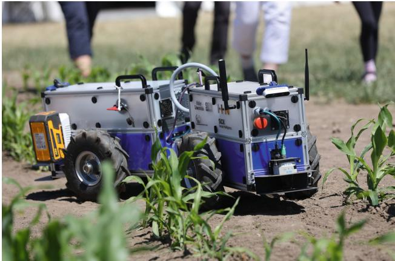  
Fig. 1. FloriBot 4.0 at the Field Robot Event 2024.

# 1.1 Applications and Advantages

The benefits of this technology are particularly evident in demanding application scenarios where maneuverability, stability and energy efficiency are required. In logistics, the compact design combined with a small turning circle enable maneuvering in confined spaces such as warehouses or production halls. One prominent example is the award-winning MAXOLUTION $\textsuperscript { \textregistered }$ Urban Logistics Assistant from SEW-EURODRIVE [1]. This vehicle was specially developed for the use in urban logistics systems and is characterized by its high energy efficiency and maneuverability.

This type of robot also offers clear advantages in agriculture, as demonstrated by the HUSQVARNA AUTOMOWER $\circled{8}$ 535 AWD [2]. Another example of a robot that can be used in agriculture is the FloriBot 4.0 shown in Fig. 1, which was developed at Heilbronn University of Applied Sciences for the participation in the Field Robot Event [3].

Here, the advantages of individually driven wheels and passive articulated steering are used to ensure precise navigation even in challenging terrain. In conjunction with the electrification of the drives, this vehicle architecture can also lower operating costs and reduce the ecological footprint [4].

A key feature of this vehicle class is the passive articulated steering, which does not require a separate drive for the articulation. This simplified design offers several advantages:

• Cost and energy efficiency: Dispensing with an active steering mechanism not only reduces manufacturing costs, but also energy consumption, as there are fewer moving parts, and no additional drives are required.   
Maneuverability and agility: Despite a long vehicle base that ensures stability, the passive articulated steering allows tight turning radiuses and precise maneuvering [5].

A good example of the second point is the FloriBot 4.0. With a vehicle length of $1 . 6 \mathrm { ~ m ~ }$ and a minimum turning circle of $0 . 7 5 \mathrm { ~ m ~ }$ , this robot can navigate efficiently in narrow rows of crops. This enables it to move from one row to the next without having to perform additional turning maneuvers.

Despite their advantages, these systems place high demands on the control system. The combination of complex kinematics and non-linear dynamics, especially when reversing, makes controlling such robots a particular challenge. This problem is comparable to controlling a vehicle with a trailer, where errors in the control system can lead to dangerous jackknifing. This requires innovative approaches in control technology to ensure the robustness and reliability of these systems.

Against that background, this paper aims to improve the control of individual wheel drive robots with passive articulated steering by using reinforcement learning. An agent is developed that can perform inverse kinematic calculations and minimize the risk of control errors. By applying modern algorithms such as Twin Delayed Deep Deterministic Policy Gradient (TD3), an approach is pursued that goes beyond the possibilities of classic control methods. The aim is to fully exploit the advantages of this vehicle architecture and make it usable for new applications. A new approach is chosen here, which does not plan the trajectories appropriately but corrects control commands.

# 2 Challenges

Controlling a mobile robot with four individually driven wheels and passive articulated steering poses a complex challenge, particularly due to the system’s non-holonomic constraints. These bindings limit the movement possibilities of the robot, as certain directions of movement can only be achieved indirectly through a combination of control commands. In the following, the general kinematic properties and the specific challenges of backward driving are analyzed.

Non-holonomic constraints limit the robot’s freedom of movement along paths that are determined by its speed and orientation. This means that the robot cannot move in any direction, but that certain movements, such as lateral movement, can only be realized by complex combinations of control commands. In the stationary state, robots with individual wheel drive and passive articulated steering can turn on the spot until the minimum or maximum articulation angle is reached. This feature can be useful for tight curve radii but makes it more difficult to control the robot overall.

# 2.1 Reversing Problem

Reversing is a special challenge due to the non-holonomic bindings and the resulting limited maneuverability as well as the complex control task. This is comparable to reversing a car and trailer combination where mistakes in steering input can lead to jackknifing, which means the vehicle folds up, resulting in damage to both the vehicle and the trailer. This is illustrated in Fig. 2. The robot should travel on the circular path but the speed commands following this path are leading to jackknifing.

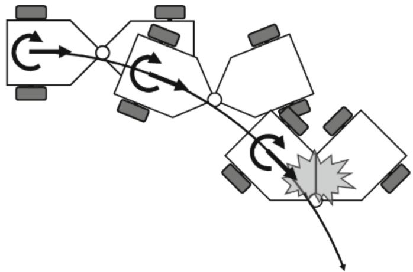  
Fig. 2. Jackknifing.

The problems mentioned above illustrate why robust and precise control is crucial for robots with passive articulated steering. Especially in reverse mode, advanced control approaches are required to ensure the stability and maneuverability of the system. Classic control methods reach their limits here, which makes the use of learning-based approaches such as reinforcement learning attractive.

# 3 Approach

Approaches like [6–8] usually deal with the trajectory tracking problem. However, this has already been solved for robots with holonomic drive concepts in a classical way.

The idea of this work is to use a reinforcement learning agent as a controller for the kinematics to make a non-holonomic robot behave more like a holonomic one. Therefore, control inputs that lead to jackknifing are corrected. This could also be used to simplify the control of trailer vehicles. The desired behavior is shown in Fig. 3.

# 3.1 Tests with a Simple Differential Drive Robot

At the beginning of this work, a test of the approach was carried out to evaluate the feasibility of the chosen control approach. For this purpose, a digital twin of a simple robot with differential drive was implemented in Matlab and the inverse kinematics was learned using a Deep Deterministic Policy Gradient (DDPG) agent. The direct kinematics of such a robot served as a model. Figure 4 shows such a robot. It consists of two independently driven standard wheels, shown in gray, which are located on one axis and a free-running omnidirectional wheel, shown as a light gray circle. Castor wheels are usually used for this purpose.

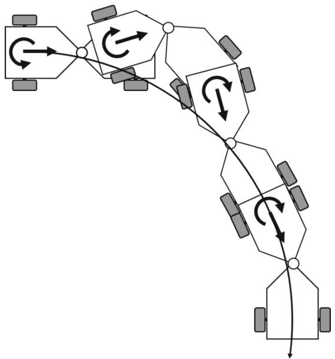  
Fig. 3. Anti-Jackknifing.

Direct kinematics was used to simulate the robot in the environment. This can be derived as follows. As shown in Fig. 4 the movement of the robot is controlled by the speeds of the wheels:

$$
\omega _ { \mathrm { w h e e l s } } = [ \omega _ { \mathrm { l } } , \omega _ { \mathrm { r } } ] ^ { \mathrm { T } }
$$

with $\omega _ { \mathrm { l } }$ angular speed of the left wheel and $\omega _ { \mathrm { r } }$ angular speed of the right wheel.

The speed of the robot can be represented in a vector of general speed $\dot { \pmb q }$ which includes the translational and rotational speeds of the front robot module:

$$
\dot { \pmb q } = \left[ \begin{array} { c } { \dot { x } _ { \mathrm { R } } } \\ { \omega _ { \mathrm { R } } } \end{array} \right]
$$

with $\dot { x } _ { \mathrm { R } }$ the linear velocity and $\omega _ { \mathrm { R } }$ the angular velocity of the robot’s front module.

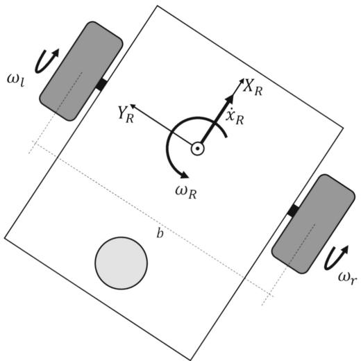  
Fig. 4. Simple Differential Drive Robot.

According to [9], the direct kinematics then results in:

$$
\dot { \pmb q } = \left[ \begin{array} { c c } { \frac { r } { 2 } } & { \frac { r } { 2 } } \\ { - \frac { r } { b } } & { \frac { r } { b } } \end{array} \right] \pmb { \omega } _ { \mathrm { w h e e l s } }
$$

with the radius $r$ , of the wheels and the track width $b$ , (distance between the wheels on the axle) of the robot.

A DDPG agent was used as this is an algorithm from the field of deep reinforcement learning that can be used to control complex dynamic systems [10]. The agent should learn the kinematics by setting the wheel speed so that the robot reaches a given speed. The action space consists of the angular velocities of the two wheels. The state space was represented by the generalized velocities of the robot as shown in Eq. (2) and the speed commands $\dot { x } _ { \mathrm { C M D } }$ and $\omega _ { \mathrm { C M D } }$ which the robot should reach as well as the angular velocities of the wheels.

The following reward function was developed for this problem:

$$
r = 2 5 \cdot \mathrm { e } ^ { - 5 0 \cdot e r r _ { \dot { x } _ { \mathrm { R } } } { } ^ { 2 } } + 2 5 \cdot \mathrm { e } ^ { - 5 0 \cdot e r r _ { \omega _ { \mathrm { R } } } { } ^ { 2 } } - 1 5 \cdot e r r _ { { \dot { x } _ { \mathrm { R } } } } { } ^ { 2 } - 1 5 \cdot e r r _ { \omega _ { \mathrm { R } } } { } ^ { 2 } + 5
$$

The reward function used was designed to promote precise tracking behavior by strongly rewarding small deviations of $e r r _ { \dot { x } _ { \mathrm { R } } }$ and $e r r _ { \omega _ { \mathrm { R } } }$ and quadratically penalizing larger errors. It combines exponential reward terms, which react sensitively to small errors, with quadratic penalty terms, which penalize larger deviations disproportionately. A constant offset of 5 was given as a stay alive reward.

Matlab & Simulink were used as the development environment. The Simulink circuit diagram is shown in Fig. 5. It consists of the environment, the agent, and the speed commands. The DDPG agent is based on an actor-critic architecture consisting of two neural networks, the actor network, and the critic network. The actor receives the current observations from the environment and generates control commands from them. The critic evaluates the actor’s actions using the reward function and learns a value function that predicts the expected cumulative reward value for each state and action. In this case, the agent can use the actions to specify the two angular velocities of the wheels.

In the environment, the robot is modeled by the inverse kinematics (3). Furthermore, the reward function (4) is also preserved here. The environment provides the DDPG agent with the current observations and rewards for the actions at each time step.

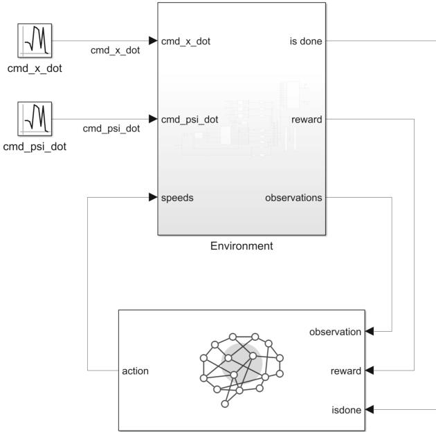  
Fig. 5. Simulink circuit diagram

The critic network shown in Fig. 6 consists of the main path and the action path. The main path receives the observation data as input. This data is first processed in a layer called obsInLyr, where the dimensions of the observation data determine the size of the layer. The data then passes through a series of fully connected layers, each with 32 neurons. In between, ReLU layers are inserted, which apply a non-linear activation function to improve the network’s decision making. The action path processes the action data in a similar way to the main path. The data passes through a feature input layer called actInLyr, followed by fully connected layers, each with 32 neurons and three ReLU layers. The output of the last fully connected layer in the action path actOutLyr is then passed to the addition layer, where it is combined with the main path.

Like the main path from the critic network, the action network also receives the observation data as input. As shown in Fig. 7 data is processed in a feature input layer, where the dimensions of the observation data determine the size of the layer. The data then passes through a series of fully connected layers, each with 32 neurons. ReLU layers are inserted in between to improve the network’s decision making.

In contrast to the critic network, the processing does not result in a single Q-value, but in the output of a potential action. The last fully connected layer therefore has the same number of output neurons as the dimensions of the action data. Finally, a scaling layer is applied to transform the output into the desired action area.

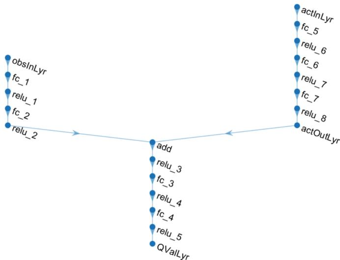  
Fig. 6. Critic Network of the DDPG Agent

Due to the very simple relationships, the DDPG agent was able to learn the inverse kinematics very quickly, as shown in Fig. 8. This was very promising for the further procedure. With a learning rate for the critic of $1 0 ^ { - 3 }$ and for the agent of $1 0 ^ { - 5 }$ , the agent only needed about 30 episodes with 6000 steps each to achieve a satisfactory result.

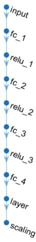  
Fig. 7. Action Network of the DDPG Agent.

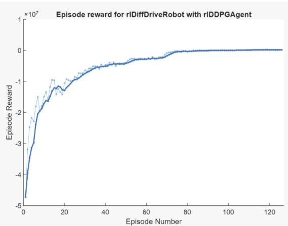  
Fig. 8. Training Curve of Test Approach.

# 4 Kinematics of the Robot

As shown in the previous chapter, kinematics is very important in creating the environment for the agent. As shown in [11] the kinematics of the robot with individual wheel drive and passive articulated steering are based on those of the robot with differential drive but are much more complex.

As shown in Fig. 9 the movement of the robot is controlled by the speeds of the four individual driven wheels which are shown in gray.

$$
\omega _ { \mathrm { w h e e l s } } = [ \omega _ { \mathrm { f l } } , \omega _ { \mathrm { f r } } , \omega _ { \mathrm { r l } } , \omega _ { \mathrm { r r } } ] ^ { \mathrm { T } }
$$

with $\omega _ { \mathrm { f l } }$ angular speed of the front left wheel, $\omega _ { \mathrm { f r } }$ angular speed of the front right wheel, $\omega _ { \mathrm { r l } }$ angular speed of the rear left wheel and $\omega _ { \mathrm { r r } }$ angular speed of the rear right wheel.

The speed of the robot can be represented in a vector of general speed $\dot { \pmb q }$ which includes the translational and rotational speeds:

$$
\dot { \pmb q } = \left[ \begin{array} { c } { \dot { x } _ { \mathrm { R } } } \\ { \omega _ { \mathrm { R } } } \end{array} \right]
$$

with $\dot { x } _ { \mathrm { R } }$ the linear velocity and $\omega _ { \mathrm { R } }$ the angular velocity of the robot’s front module.

The connection between the speeds of the wheels $\omega _ { \mathrm { w h e e l s } }$ and the robot movement is described by the Jacobian matrix $J$ :

$$
\omega _ { \mathrm { w h e e l s } } = J \cdot \dot { \boldsymbol { q } }
$$

The Jacobian matrix fully describes the kinematics of the system. This matrix depends on the geometric parameters of the robot.

The Jacobian matrix for the given robot is calculated as:

$$
\begin{array} { r } { \pmb { J } = \left[ \begin{array} { c c } { \frac { 1 } { r } } & { - \frac { b } { 2 r } } \\ { \frac { 1 } { r } } & { \frac { b } { 2 r } } \\ { \frac { \cos ( \alpha ) } { r } - \frac { b \sin ( \alpha ) } { a r } \frac { b \cos ( \alpha ) } { 2 r } + \frac { a \sin ( \alpha ) } { 2 r } } \\ { \frac { \cos ( \alpha ) } { r } + \frac { b \sin ( \alpha ) } { a r } \frac { a \sin ( \alpha ) } { 2 r } - \frac { b \cos ( \alpha ) } { 2 r } } \end{array} \right] . } \end{array}
$$

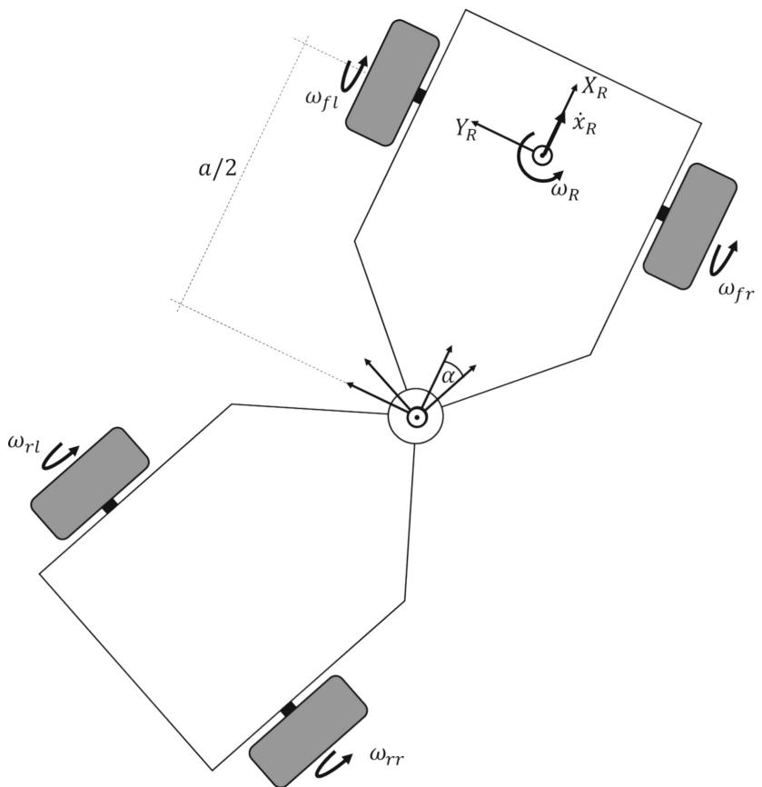  
Fig. 9. Individual Wheel Drive Mobile Robots with Passive Articulated Steering.

with the radius $r$ , of the wheels, the track width $^ b$ , (distance between the wheels on one axle), the wheelbase $a$ , (distance between the axles) and $\alpha$ , the angle of the articulated joint.

Multiplying the Jacobian matrix by the speed vector $\dot { \pmb q }$ gives the speed of the individual wheels:

$$
{ \left[ \begin{array} { l } { \omega _ { \mathrm { f l } } } \\ { \omega _ { \mathrm { f r } } } \\ { \omega _ { \mathrm { r l } } } \\ { \omega _ { \mathrm { r r } } } \end{array} \right] } = { \left[ \begin{array} { l l } { \frac { 1 } { r } } & { - { \frac { b } { 2 r } } } \\ { \frac { 1 } { r } } & { \frac { b } { 2 r } } \\ { { \frac { \cos ( \alpha ) } { r } } - { \frac { b \sin ( \alpha ) } { a r } } } & { { \frac { b \cos ( \alpha ) } { 2 r } } + { \frac { a \sin ( \alpha ) } { 2 r } } } \\ { { \frac { \cos ( \alpha ) } { r } } + { \frac { b \sin ( \alpha ) } { a r } } } & { { \frac { a \sin ( \alpha ) } { 2 r } } - { \frac { b \cos ( \alpha ) } { 2 r } } } \end{array} \right] } \cdot { \left[ \begin{array} { l } { { \dot { x } } _ { \mathrm { R } } } \\ { \omega _ { \mathrm { R } } } \end{array} \right] } .
$$

This equation represents the inverse kinematics of an individual wheel drive robot with passive articulated steering.

The Jacobian matrix $J$ has more rows than columns in this case and is therefore overdetermined. To derive the direct kinematics, the Moore-Penrose pseudo inverse of the Jacobian matrix is used to calculate the general velocities from the wheel velocities.

The solution is obtained by minimizing the quadratic error, which leads to the conversion:

$$
\dot { \pmb q } = \pmb J ^ { + } \cdot \pmb { \omega } _ { \mathrm { w h e e l s } } .
$$

The direct kinematics is used to simulate the robot.

# 5 Using a TD3 Agent with RNN for Control

The previously chosen approach using the DDPG agent, which proved successful for the differential drive robot, did not provide the desired results when applied to the individual wheel drive robot with a passive articulated steering. The added complexity of the passive joint and the non-holonomic constraints introduced significant challenges for the agent to learn effective control policies, suggesting that the DDPG algorithm alone may not be sufficient to handle the increased system dynamics and interaction complexities in this configuration. For this reason, a TD3 Agent was used, which came closer to the solution. TD3 was developed to address specific weaknesses of DDPG, in particular the tendency to overestimate Q-values, which can lead to unstable learning processes. TD3 achieves this by using two Q-functions. The two Q-functions are trained in parallel, using the smaller of the two Q-values for updating the target values to avoid overestimation. It also updates the policy less frequently than the Q-functions, resulting in a more stable learning progress. The TD3 agent also adds noise to the target action value to increase policy robustness and prevents overfitting to specific Q-value spikes.

These improvements make TD3 more robust and effective in complex environments compared to DDPG. [12] compares the performance of DDPG and TD3 in the Walker2D scenario and shows that TD3 has a faster and more stable learning curve, indicating more effective exploration and policy optimization.

The use of a recurrent neural network (RNN) was crucial for success, as the robot with individual wheel drive and passive articulated steering exhibits dynamics that appear to depend on temporal dependencies. Although the assumption was that this is also a process that only depends on the current state, but the agent only began to learn the desired behavior using an RNN. An RNN allows the agent to maintain a memory of past observations and actions, effectively capturing the temporal dependencies and allowing the strategy to better predict and adapt to the dynamics of the system over time. The reward function also could not be adopted directly from the test scenario.

However, the same development environment was used with Matlab & Simulink. The structure of the Simulink model, as shown in Fig. 5, remained unchanged, but the configuration of the agent block and the environment was changed significantly. The agent block has been updated to use a TD3 agent instead of the previously used DDPG agent. In addition, the environment block now contains the new environment that reflects the kinematics of the robot with individual wheel drive and passive articulated steering. This adaptation allowed the simulation to better capture the complex dynamics created by the articulated joint and paved the way for improved policy training and control results. Despite these changes, the overall architecture of the simulation retained its modular and flexible design, allowing the system components to be easily adapted to the new agent and environment.

In the environment, the robot is modeled by the inverse kinematics (9). Furthermore, the reward function is also preserved here. The environment provides the TD3 agent with the current observations and rewards for the actions at each time step.

Similar to the test with the simple differential drive robot the action space consists of the angular velocities of the wheels but this time there are four wheels. The state space was represented by the generalized velocities of the robot as shown in Eq. (6) and the speed commands $\dot { x } _ { \mathrm { C M D } }$ and $\omega _ { \mathrm { C M D } }$ which the robot should reach as well as the angular velocities of the wheels and the angle of the articulated joint.

# 5.1 Reward Function

The reward function could also not be directly adopted from the test with a simple differential drive robot. The idea of rewarding small deviations was adopted, but the punishment was abolished. Also, the exponential function was changed to a logical function to generate more continuous rewards. An important step was also not to propagate the error of the angular velocity $e r r _ { \omega _ { \mathrm { R } } }$ . Instead, the speed commands are now used to calculate a required articulated joint angle $\alpha _ { \mathrm { C M D } }$ . That the agent should set. It should do this at the correct translational speed, which in turn automatically leads to the desired angular velocity. The environment for the simple robot did not require a termination condition, as it cannot destroy itself. This is different for the robot with individual wheel drive and passive articulated steering. Here, a maximum articulation angle was defined as a termination condition. If this is reached, a penalty is also deducted from the reward.

# 5.2 Network Architecture

The critic network shown in Fig. 10 which is used for both critics consists of two input paths, the main path, and an action path, that are eventually concatenated and processed together. It is like the DDPG agent’s network beside the LSTM layer and that it is a little shorter but wider. The main path processes sequence input data in a fully connected layer with 256 neurons. Similarly, the action path processes a sequence input through its own fully connected layer with 256 neurons.

The outputs from these two paths are concatenated in a layer, resulting in a combined feature vector. The concatenated data then passes through a ReLU activation layer for non-linear transformation, followed by another fully connected layer with 256 neurons. A second ReLU layer further refines the representation.

Next, the processed data is put into an LSTM layer with 256 hidden units to capture temporal dependencies in the sequence data. Finally, the LSTM output passes through a fully connected layer with a single neuron, providing the final network output.

The actor network shown in Fig. 11 is like the DDPG agent’s network beside the LSTM Layer and that it is a little shorter but wider. It’s a sequence model with a sequence input layer, followed by two fully connected layers with 256 neurons and ReLU activations. An LSTM layer with 256 units processes temporal dependencies before a fully connected output layer and a Tanh activation scales the output.

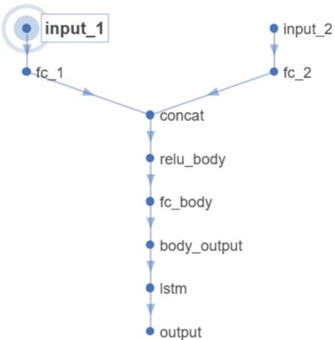  
Fig. 10. Critic Network of the TD3 Agent.

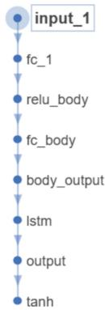  
Fig. 11. Action Network of the TD3 Agent.

# 5.3 First Results

For the moment, the training curve which is shown in Fig. 12 does not look nearly as good as the test results of the simple robot with differential drive. The main reason for this is that there is a termination condition that aborts the episode as soon as the maximum articulated joint angle is reached. The environment is designed in a way that driving commands can be generated, which inevitably leads to their execution very close to the abort condition. In addition, reversing is extremely difficult under certain conditions. This means that episodes can be canceled very early, which in turn leads to a lower episode reward. This in turn leads to the curve progression shown.

One problem that is not visible in the graph is that some of the actions can vary significantly. In a real robot, this would lead to jerking or even the destruction of the robot.

However, in many cases the agent achieves its goal and minimizes errors and is thus learning a policy that includes kinematics and reverse driving as well as anti-jackknifing.

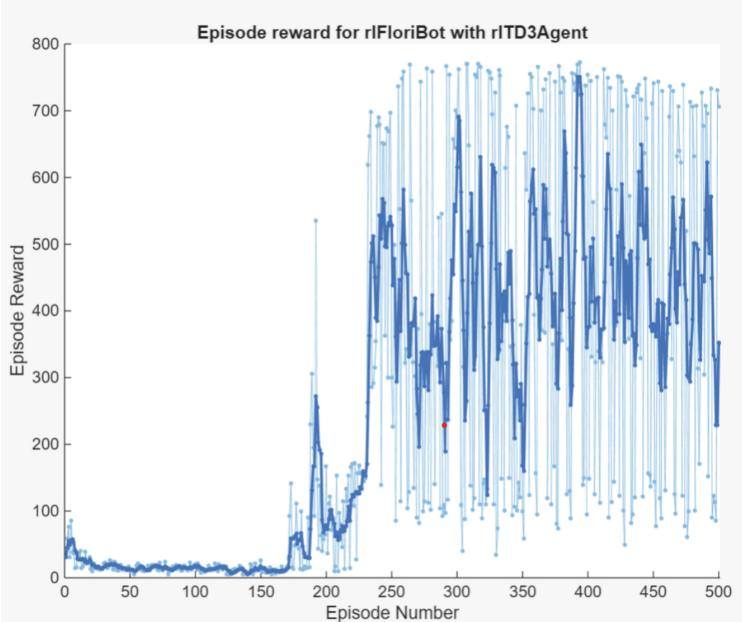  
Fig. 12. Training Curve.

# 6 Conclusion

The control of individual wheel drive robots with passive articulated steering poses a significant challenge due to the complex kinematics and nonlinear dynamics, especially in reverse mode. This paper has shown that the combination of a Twin Delayed Deep Deterministic Policy Gradient (TD3) agent and a recurrent neural network (RNN) is a promising approach to solve this problem.

The first tests with a model of a simple robot with differential drive have shown that the DDPG algorithm can develop robust control strategies. These results provide a valuable basis for the transfer to more complex systems. The extension to a TD3 agent with an RNN made it possible to model temporal dependencies that appear to be important for controlling a robot with passive articulated steering. This leads to a significant improvement in control stability, especially in reverse mode.

The approach is highly robust against interference from a wide variety of driving commands. The TD3 agent should also be able to control the robot with differential drive, which would allow the approach to be flexibly adaptable to different vehicle configurations. This underlines the potential of the system for practical use in real applications.

Despite the promising results, there are several areas that require future research and development. The approach has so far only been tested in simulations. Transferring it to real systems is a crucial next step to confirm its applicability under practical conditions. The reward function can be further refined to take more account of specific aspects of control such as energy efficiency or maneuverability. The developed methodology could be extended to systems with multiple trailers or other complex vehicle architectures to demonstrate its versatility. The real-time capability of the approach and its integration into the vehicle control hardware need to be evaluated to enable industrial applications. But at least it is now possible for me to drive backwards with a robot with individual wheel drive and passive articulated steering without any problems.

# References

1. SEW-EURODRIVE GmbH & Co KG: Logistikkapsel für mobile Assistenzsysteme. SEW-EURODRIVE. https://www.sew-eurodrive.de/automatisierung/fabrikautomatisierung/ mobile-assistenzsysteme/logistikkapsel/logistikkapsel.html. Accessed 30 Jan 2025   
2. Husqvarna: Automower® 535 AWD – Robotic Lawn Mower. Husqvarna. https://www.hus qvarna.com/us/robotic-lawn-mowers/automower-535awd/. Accessed 30 Jan 2025   
3. van Straten, G.: Field robot event, Wageningen, 5–6 June 2003. Comput. Electron. Agric. 42(1), 51–58 (2004). https://doi.org/10.1016/S0168-1699(03)00120-0   
4. Kuratorium für Technik und Bauwesen in der Landwirtschaft (KTBL): Verwendung erneuerbarer Antriebsenergien in landwirtschaftlichen Maschinen. KTBL, Darmstadt (2023). https://www.ktbl.de/fileadmin/user_upload/Artikel/Energie/Antriebsenergien/ 12643_Antriebssysteme.pdf. Accessed 30 Jan 2025   
5. Dudzinski, P.: Lenksysteme für Nutzfahrzeuge. In: VDI-Buch. 2. Aufl. Springer, Berlin (2005). https://doi.org/10.1007/b137568   
6. Deng, R., Zhang, Q., Gao, R., Li, M., Liang, P., Gao, X.: A trajectory tracking control algorithm of nonholonomic wheeled mobile robot. In: 2021 6th IEEE International Conference on Advanced Robotics and Mechatronics (ICARM), pp. 823–828. IEEE, Chongqing (2021). https://doi.org/10.1109/ICARM52023.2021.9536154   
7. Aldughaiyem, A., Bin Salamah, Y., Ahmad, I.: Control design and assessment for a reversing tractor-trailer system using a cascade controller. Appl. Sci. 11(22), 10634 (2021). https://doi. org/10.3390/app112210634   
8. Zhao, T., Huang, W., Xu, P., Zhang, W., Li, P., Zhao, Y.: A simple curvature-based backward path-tracking control for a mobile robot with N trailers. Actuators 13(7), 237 (2024). https:// doi.org/10.3390/act13070237   
9. Martins, N.A., Bertol, D.W.: Wheeled Mobile Robot Control: Theory, Simulation, and Experimentation. Studies in Systems, Decision and Control, Bd. 380. Springer, Cham (2022). https:// doi.org/10.1007/978-3-030-77912-2   
10. Lillicrap, T.P., et al.: Continuous control with deep reinforcement learning. arXiv preprint arXiv:1509.02971 (2015). https://doi.org/10.48550/arXiv.1509.02971   
11. Bauer, B., Diesse, M., Heverhagen, T., Wittenberg, C.: Ein alternatives Antriebskonzept für einen mobilen Roboter – Der Knicklenker ohne aktives Stellglied. In: Tagungsband AALE 2018, pp. 127–133. VDE Verlag GmbH, Berlin (2018)   
2. Shen, X.: Comparison of DDPG and TD3 algorithms in a Walker2D scenario. In: Proceedings of the 2023 International Conference on Data Science, Advanced Algorithm and Intelligent Computing (DAI 2023). Advances in Intelligent Systems Research, Bd. 3, pp. 148–155. Atlantis Press, Paris (2024). https://doi.org/10.2991/978-94-6463-370-2_17