# MARCEL: Mobile active rover chassis for enhanced locomotion

Arthur Bouton $\textcircled{1}$ | Yang Gao $\textcircled { 1 0 }$

Surrey Space Centre, Department of Electrical and Electronic Engineering, University of Surrey, Guildford, UK

# Correspondence

Arthur Bouton, Surrey Space Centre,   
Department of Electrical and Electronic   
Engineering, University of Surrey, Guildford, UK.   
Email: arthur.bouton@gadz.org and arthur. bouton@jpl.nasa.gov

# Present address

Arthur Bouton, NASA's Jet Propulsion Laboratory, California, US.

Funding information UK Research and Innovation

# Abstract

To extend planetary exploration beyond the current limitations of wheeled vehicles while preserving reliability, simplicity, and efficiency, actuation can be judiciously incorporated into the locomotion system. Based on a static analysis, we propose a new four-wheeled chassis concept for planetary rovers that can traverse more challenging terrain with the help of two internal active joints. These joints are arranged as follows: a vertical pivot articulates the chassis around its center while a bogie allows the rear wheels to rotate around the longitudinal axis of the vehicle. We also introduce a control method that uses a two-stage procedure to produce an interpretable controller based on a policy devised by reinforcement learning. This way, we eliminate the black box made of a neural network and facilitate the transfer from simulation to reality. The resulting controller efficiently harnesses the internal mobility of the chassis to climb over obstacles in a sequenced manner while relying only on proprioceptive data provided by the chassis. A rover prototype named MARCEL has been built and tested experimentally. Contrary to any state-of-the-art six-wheeled passive chassis, the proposed locomotion system and its associated control has proven to be able to overcome solid step obstacles as tall as the diameter of the wheels with a $9 0 ^ { \circ }$ edge and a friction coefficient as low as O.5. This simple but capable design will enable future missions to explore more challenging areas while providing better guarantees in the face of unforeseen difficulties that could arise.

# KEYWORDS

actuated chassis design, hybrid locomotion, planetary rover, reinforcement learning, surface mobility, terrainability, wheeled robot

# 1 | INTRODUCTION

Autonomy and capacity of adaptation are critical for planetary exploration on a distant world (Gao & Chien, 2017). Unexpected obstacles can arise at any time and lead to a mission termination if the probe cannot offer a suitable response.

Among all the surface mobility concepts that have been considered for planetary exploration (Fiorini, 2000; Thoesen & Marvi, 2021), wheeled systems remain the most energy-efficient way of traveling long distances while relying on a simple and robust technology (Seeni et al., 2010). The continuity of the contacts with the ground also makes wheeled locomotion appreciably stable. This is why wheeled rovers have been preferred so far for the exploration of sandy and rocky landscapes such as on the Moon or Mars.

For a system composed of four wheels, the chassis needs to comprise at least one internal degree of freedom to be able to adjust the relative height of the wheels according to the shape of the ground beneath it and thereby sustain maximum traction at all times. From there, any additional wheel increases the number of degrees of freedom required. Those joints can be either actuated or left passive. In the latter case, the chassis freely conforms to the ground under the effect of gravity to ensure the continuity of the contact of all wheels with the ground.

Wheeled planetary rovers tend to use passive chassis for simplicity and lightness. Passive suspensions are designed to distribute the load as evenly as possible when rolling on a flat surface while accommodating for irregularities. However, such suspensions are not designed to deal with terrain featuring more than sparse rocks or to face significant wheel sinkage. In case of an unexpected situation, they can only rely on wheel traction, which offers very limited capacity of adaptation, as illustrated by the premature end of NASA's Spirit rover mission in 2010 (Sanderson, 2010). Many passive six-wheeled chassis designs have been investigated. However, none of them can overcome a step obstacle as tall as the wheels if the friction coefficient is lower than 0.65 (Thueer et al., 2006). As the inventor of the popular rockerbogie mechanism specifies himself, in spite of the optimization work carried out on the suspension geometry, rovers such as the Sojourner cannot climb vertical walls on both sides with a friction coefficient lower than 0.68 (Bickler, 1998). This outcome is reasserted in Michaud et al. (2006), in which the mars exploration rover (MER) chassis is tested using the Mars Rover Chassis Evaluation Tools (RCET) and appears to require a friction coefficient of at least O.7 to be able to climb over such an obstacle. In Benamar et al. (2009), the authors focus on maximizing the obstacle clearance of a passively articulated six-wheeled rover via the torque control of its wheels. However, they could not make it climb a step obstacle the same size as the wheels with a friction coefficient lower than 0.8. Nevertheless, the friction coefficient value on rocks is estimated to be around 0.5 or less (Michaud et al., 2006), which makes all the aforementioned systems unfit to cross a rocky obstacle shaped like a step. Moreover, passive suspension designs cannot be optimized for every obstacle shape simultaneously and a chassis particularly good at crossing step obstacles is likely to underperform in other situations, as it has been underlined by Nayar et al. (2019).

It is also possible to combine passive adaptation to the ground with active reconfiguration. Motors controlling the angle of the bogie segments, initially considered for deployment of the rover after landing (Patel et al., 2010), can be used to shift the center of mass (CoM) of the rover to assist the crossing of step obstacles. Using the six additional actuated joints, the maximum step height that a sixwheeled rover equipped with three bogies has managed to climb in simulation with a friction coefficient of 0.5 is 1.5 the radius of the wheels (Skonieczny & D'Eleuterio, 2010). With four wheels instead of six, the Sample Return Rover (SRR) (lagnemma et al., 2000) and the

Scarab (Wettergreen et al., 2010) rover leverage the combination of passive and active joints with far fewer actuators. Both are based on a similar kinematic model, they have four wheels and a passive revolute joint constrained by a differential mechanism between both pairs of wheels on each side. In addition, they are provided with two actuated joints controlling independently the height of the chassis relative to the wheels on each side. This way, it is possible to change the global elevation of the chassis and its roll angle. The latter allows the CoM to be moved from one side or another, which can help improve the stability and the load distribution when driving sideways on slopes. However, these rovers cannot act on the load balance between the front and the rear wheels. Also, the alteration of the load distribution by leaning the chassis on one side can only be achieved simultaneously with a reduction of the stability margin of the rover (Papadopoulos & Rey, 1996), which may pose a risk when dealing with obstacles and abrupt changes in ground geometry. Moreover, the modification of the load distribution is coupled with the relative position of the wheels, which does not facilitate the negotiation of obstacles.

Alternatively, fully actuated suspensions generally adopt a wheel-on-limb structure in which each wheel can move independently relative to the main body. In addition to the rotation around a steering axis, each wheel's relative motion might be restricted to a plane, which leads to 3-degrees of freedom (DoF) per limb (Grand et al., 2004; Leppänen et al., 1998), without counting the driving rotation of the wheel. Otherwise, platforms using 4-DoF limbs (Cordes et al., 2018; Reid et al., 2016) allow the wheels to move in the three dimensions while being independently steered. Beyond that, we find redundant kinematic models, with 6 (Wilcox et al., 2007) or even 7 (Reid et al., 2021) DoF per limb. Such systems provide the possibility to literally walk out of blocked situations. However, all those joints are never critically needed simultaneously, especially on sandy and rocky terrain such as on the Moon and Mars. Therefore, most of the time those numerous joints and their associated actuators constitute an expensive deadweight. As relative wheel displacements are suitable in most cases, some internal motions should be fused together to reduce the number of independent actuators used. Moreover, these systems have to carry their own weight constantly, which represents significant energy waste.

To reduce the amount of actuation while keeping a control over the stance and load distribution on wheels, the Complios (Bouton et al., 2020) combines structural compliance with a wheel-on-limb kinematics. This way, it requires only one motor per limb and can autonomously cross complex obstacles (Bouton et al., 2017). However, its mechanism, involving a lot of cables and springs, is still way too complex to be realistically considered for space applications.

This paper introduces a new planetary rover chassis called MARCEL, which name stands for Mobile Active Rover Chassis for Enhanced Locomotion. It has been designed to be able to adapt to a broader range of situations than any passive suspension, from challenging arrangements and shapes of rocky obstacles to critical wheel sinkage in loose soil, while minimizing the involved complexity. In this paper, we focus on its ability to cross solid steep obstacles.

To achieve high versatility with as few actuators as possible, MARCEL is propelled by only four motorized wheels, while the chassis is articulated with two actuated revolute joints, as illustrated in Figure 2. The first joint's axis is vertical and located at the center of the chassis, so as to articulate the front with the rear part of the chassis. The second joint, at the back, has its axis horizontal and orthogonal to the rear wheel axle, so as to form a bogie for the rear two wheels.

In the past, several rover designs combining joints around the yaw and roll axes have been suggested. The platform OpenWHEEL (Fauroux et al., 2006), Zoë (Seegmiller & Wettergreen, 2011), and DuAxel (McGarey et al., 2019) all three adopted passive vertical revolute joints above both front and rear wheel axles. These joints are meant to comply with the speed differential applied to the wheels, which are fully in charge of the steering. Contrary to Zoë, DuAxel's joints are equipped with a brake to prevent yaw drift. Using these two yaw joints, the concept of leveraging wheel repositioning and roll actuation to sequence the crossing of a step obstacle was first proposed in Fauroux et al. (2006), although the suggested control was open-loop and the sensing feedback was left as an open question. In Vidoni et al. (2015), the collocated arrangement of the yaw and roll joints at the center of the chassis is examined and compared with other steering configurations. Although the centered yaw articulation was proven to be superior in terms of stability and maneuverability on side-slopes, the centered passive roll joint was shown to pose a stability risk. Indeed, the possibility for the vehicle to freely rotate around the latter breaks the stability polygon in two smaller support triangles, one for each half of the chassis.

Preliminary analyses conducted in Section 2 examine the static equilibrium of a rover when one or two wheels are faced with an obstacle. The conclusions drawn from these analyses then allow us to justify the organization of MARCEL's chassis in Section 3.1. The rest of Section 3 goes through the implementation details of the prototype: the sensors used, the actuation of the bogie and the control of the wheels. Section 4 presents the reinforcement learning framework used to devise a way of controlling the active chassis when the rover has to cross steep obstacles. Section 5 then describes how to derive an interpretable controller that reproduces with as few parameters as possible the optimal behavior obtained by reinforcement learning. Finally, the simpler interpretable controller is tested experimentally in Section 6.

Overall, the contributions of this paper and the methodology used to develop the controller are summarized in Figure 1.

# 2 | PRELIMINARY STATIC ANALYSES

# 2.1 | Internal joint and load distribution

A rigid system resting on four wheels is statically indeterminate. The addition of a free joint in the structure lifts the indeterminacy and the overall load distribution on wheels is no longer dependent on slight relative variations in ground height. The nature and position of the extra joint relative to the wheels and CoM of the rover determine how the weight will be distributed on the four wheels when at rest on a given ground geometry. For example, a bogie consisting of a revolute joint placed midway between two wheels, with its rotation axis horizontal and orthogonal to the common wheel axle, ensures that the vertical forces applied on these two wheels remain roughly even for moderate height differences.

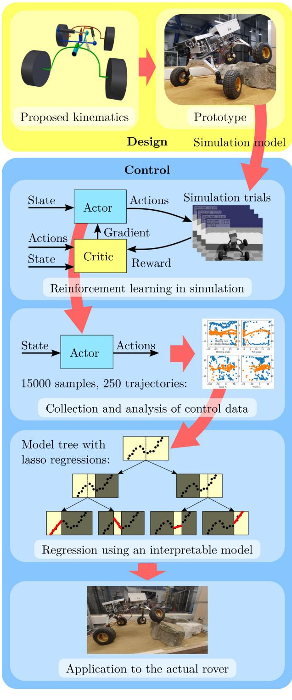  
FIGURE 1 Summary of the methodology and contributions of the paper. From the proposed kinematic design, supported by static analysis, a prototype has been built. Based on the actual features of the prototype, a simulation model is used to train a neural network controller by reinforcement learning to leverage the actuated joints of the chassis to cross steep obstacles. The control outputs of the neural network controller are then collected and analyzed. The obtained input-output data are used to train a linear model tree to reproduce the outputs of the neural network in an interpretable way. The resulting controller is finally applied and tested on the actual prototype.

Now, if instead of leaving the joint free we add a controlled source of effort, for example, providing a torque around the axis of the revolute joint, this will result in a shift of the static equilibrium. In the case of a bogie, the vertical forces on its wheels will no longer be evenly balanced and will start to vary in opposite directions, proportionally to the torque applied. As a result, the vertical forces on the other wheels of the chassis will change as well so as to maintain the equilibrium of moments. Therefore, a torque applied between two halves of the chassis increases the load on two diagonally opposite wheels, while the load on both other wheels is reduced, as depicted in Figure 2b.

consider the three-dimensional static equilibrium of the whole rover and its four wheels while it is faced with a vertical obstacle. In this section, we consider the case in which the rover is facing an obstacle with only one wheel at a time. We use a Coulomb friction model with a friction coefficient $\mu$ between the wheels and the ground that is assumed to be the same for every contact. The obstacle is characterized by a vertical surface right in front of the wheel, so that the axis of the friction cone between the wheel and the obstacle coincides with the forward axis $\vec { x }$ , as illustrated in Figure 3b. The other wheels are assumed to rest on a flat ground, with a vertical contact normal. Because the CoM of the rover is above wheel centers, as wheels start to climb up the vertical surface, the projection of the CoM on the support polygon moves away from the obstacle, reducing the friction coefficient needed to climb. Therefore, the instant we consider here, for which the rover is still horizontal, represents the most critical point to pass, which defines the limit friction coefficient when starting from a flat stance.

# 2.2 | Unilateral obstacles

To analyze the effect of an internal torque applied between two halves of the chassis when it comes to cross obstacles, we

The chassis is supposed to be provided with a revolute joint aligned with the forward direction $\vec { x }$ of the rover, like the bogie pictured in Figure 2. This joint allows the front part of the chassis which holds both front wheels to rotate with the rear part holding both rear wheels. The joint's rotation axis is centered between the wheel, at a height $z _ { b }$ relative to the ground. A torque t can be applied in this joint between both parts of the chassis. We define T as the torque exerted by the front part to the rear part of the chassis around the forward direction $\vec { x }$ .We do not consider the "steering joint" here and the front and rear wheels are always aligned. Then, we define $I _ { x }$ and $I _ { y }$ as respectively the longitudinal and transversal half distances between the wheels.

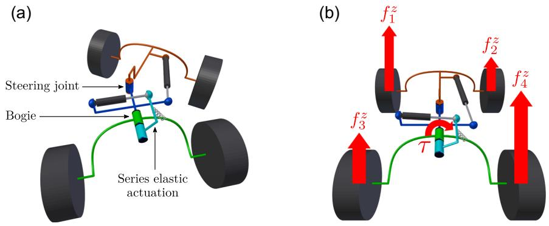  
FIGURE 2 Kinematic diagram of the chassis. The steering joint splits the chassis in two halves: the front part in red and the rear part in blue. The latter holds the bogie represented in green. The cyan body depicts the intermediate part of the series elastic actuation that exerts the torque t between the bogie and the rest of the chassis. (a) shows a configuration for which the steering joint steers the rover to the right, altering in the meantime the longitudinal distance between the wheels. (b) illustrates the modification of the load distribution on wheels with the application of the torque t, applied by the rear part of the chassis to the bogie and chosen here positive around the longitudinal axis of the bogie pointing towards the direction of advance.

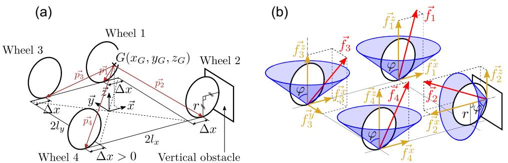  
I friction cones at each wheel contact point (b).

We then look for the smallest friction coefficient $\mu$ that allows the rover to sustain a static equilibrium while the wheel in contact with the obstacle is not resting on the horizontal ground at all. In this case, each wheel has exactly one point of contact with the environment, as depicted in Figure 3b. Let $\mathbf { f _ { i } } = [ f _ { i } ^ { x } , f _ { i } ^ { y } , f _ { i } ^ { z } ]$ be the contact forces applied on the wheel i, decomposed in the direct frame for which $\vec { x }$ coincides with the forward direction of the rover and $\vec { z }$ with the vertical direction, as shown in Figure 3a. When the wheel $k \in [ 1 , 4 ]$ is faced with the obstacle, the static equilibrium can be written as the following optimization problem:

$$
\mathsf { s u b j e c t t o } \quad \sum _ { i = 1 } ^ { 4 } \mathbf { f } _ { \mathbf { i } } = M \mathbf { g }
$$

$$
\sum _ { i = 1 } ^ { 4 } { \bf \nabla } \mathsf { p } _ { \mathrm { { i } } } \ \times \ \mathsf { f } _ { \mathrm { { i } } } = 0
$$

$$
I _ { y } \left( f _ { 3 } ^ { z } - f _ { 4 } ^ { z } \right) + z _ { b } \left( f _ { 3 } ^ { y } + f _ { 4 } ^ { y } \right) + \tau = 0
$$

$$
\mu \geq 0
$$

$$
f _ { j } ^ { x 2 } + f _ { j } ^ { y 2 } \leq \mu ^ { 2 } f _ { j } ^ { z 2 } , \quad \forall j \in [ 1 , 4 ] \backslash \{ k \}
$$

$$
f _ { k } ^ { \vee 2 } + f _ { k } ^ { z 2 } \le \mu ^ { 2 } f _ { k } ^ { \vee 2 }
$$

$$
f _ { j } ^ { z } \geq 0 , \forall j \in [ 1 , 4 ] \backslash \{ k \}
$$

$$
f _ { k } ^ { x } \leq 0
$$

where $\pmb { \mathrm { g } }$ is the acceleration of gravity and $M$ is the total mass of the rover, which applies at the $\mathsf { C o M } \mathsf { G }$ of coordinates $( x _ { G } , y _ { G } , z _ { G } )$ relative to the center of the wheels when they are at their initial position, as depicted in Figure 3a.

${ \bf p } _ { \mathrm { i } }$ the geometric vector going from the CoM to the contact point of the wheel i with the ground or the obstacle, i.e.:

$$
\begin{array} { r l } & { \mathbf { p } _ { 1 } = \left[ \begin{array} { l } { - x _ { G } + I _ { x } - \Delta x } \\ { - y _ { G } + I _ { y } } \\ { - z _ { G } } \end{array} \right] + \left[ \begin{array} { l } { r } \\ { 0 } \\ { r } \end{array} \right] \delta _ { 1 k } \quad \mathbf { p } _ { 2 } = \left[ \begin{array} { l } { - x _ { G } + I _ { x } + \Delta x } \\ { - y _ { G } - I _ { y } } \\ { - z _ { G } } \end{array} \right] + \left[ \begin{array} { l } { r } \\ { 0 } \\ { 0 } \\ { r } \end{array} \right] \delta _ { 2 k } } \\ & { \mathbf { p } _ { 3 } = \left[ \begin{array} { l } { - x _ { G } - I _ { x } + \Delta x } \\ { - y _ { G } + I _ { y } } \\ { - z _ { G } } \end{array} \right] + \left[ \begin{array} { l } { r } \\ { 0 } \\ { r } \end{array} \right] \delta _ { 3 k } \quad \mathbf { p } _ { 4 } = \left[ \begin{array} { l } { - x _ { G } - I _ { x } - \Delta x } \\ { - y _ { G } - I _ { y } } \\ { - z _ { G } } \end{array} \right] + \left[ \begin{array} { l } { r } \\ { 0 } \\ { 0 } \\ { r } \end{array} \right] \delta _ { 4 k } } \end{array}
$$

with $\delta _ { i k }$ the Kronecker delta such that $\delta _ { i k } = 1$ if ${ \dot { \boldsymbol { \mathsf { I } } } } = { \boldsymbol { \mathsf { k } } }$ and 0 otherwise.

Equations (1b) and (1c) account for the equilibrium of respectively the forces and moments applied to the rover. Equation (1d) adds the constraint describing the torque equilibrium in the revolute joint of the bogie. Equations (1f) and (1g) stand for Coulomb's friction law between the wheels and respectively the ground and the obstacle. Equations (1h) and (1i) stand for the unilateral contact condition of the wheels in contact respectively with the ground and the obstacle.

We solve this optimization problem using Sequential Least Squares Programming (SLSQP) (Kraft, 1988) and trace the minimum friction coefficient required to be able to overcome the obstacle in Figure 4. Note that this is the minimum limit value: the friction coefficient needs to be at least slightly greater for the wheel traction to be able to carry the rover beyond the static equilibrium and make it start to move over the obstacle. We observe in Figure 4 that the application of an internal torque can significantly reduce the friction needed. This means that this torque can help the rover to deal with challenging situations in which wheels normally tend to slip and fail to transmit the necessary traction. In particular, we deduce here that a bogie with a $2 5 \mathsf { N m }$ maximum torque should allow a rover with the features specified in Table 1 to cross a vertical obstacle with a friction coefficient as low as 0.5 with all four wheels if it deals with the obstacle one wheel at a time. The torque has to be adapted according to the position of the obstacle: a positive torque t facilitates the crossing of obstacles with the front right and rear left wheels, while a negative torque helps the front left and rear right wheels.

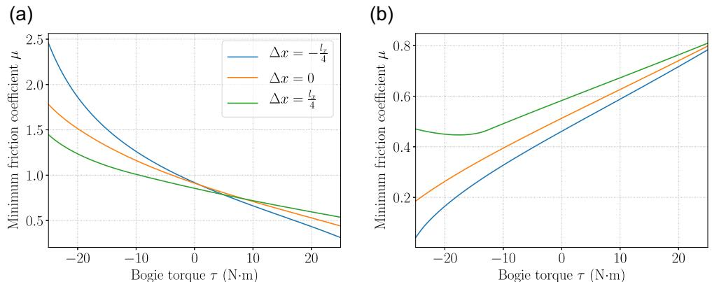  
symmetry around the vertical axis. $\Delta _ { x }$ de a relativ variation the wheel positios, as depicted  ur.Obstacle  cntac wh wheel 2, and (b) obstacle in contact with wheel 4.

TABLE 1 Parameters used for the static analysis.   

<table><tr><td>Ix</td><td>ly</td><td>r</td><td>M</td><td>XG</td><td>YG</td><td>ZG</td><td>Zb</td></tr><tr><td>290 mm</td><td>305 mm</td><td>105 mm</td><td>24.52 kg</td><td>31.15 mm</td><td>-1.02 mm</td><td>330 mm</td><td>390 mm</td></tr></table>

Note: They have been obtained by applying a nonlinear regression to the load variation measured under each wheel in different configurations.

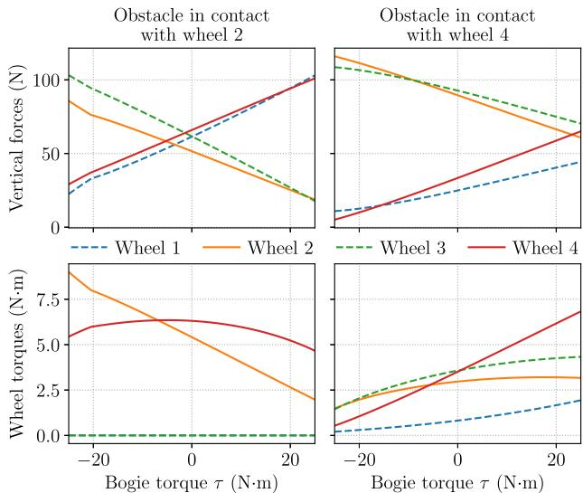  
FIGURE 5 Distribution of the rover load and wheel torques depending on the internal torque t when dealing with a vertical obstacle blocking one of the front wheels or one of the rear wheels while $\Delta x = 0$ .

Figure 5 shows how the load distribution is modified with the application of the bogie torque t and thus substantiates the analysis made in Section 2.1 and depicted in Figure 2b. Meanwhile, we also observe how the wheel torque required by the wheel dealing with the obstacle can be significantly decreased, therefore leaving more space for driving traction within the friction limit.

The minimum friction coefficient needed for each wheel to cross the obstacle is also greatly influenced by the position of the CoM. For instance, a shift of the CoM to the left advantages the right wheels and a shift to the front advantages the rear wheels. Drastically changing the position of the CoM while crossing an obstacle is generally hardly practicable with a planetary rover whose weight is carefully optimized, though. However, a slight relative displacement of the wheels can also partly influence the static equilibrium and play a role in helping one wheel or another to overcome an obstacle, especially when it is combined with the internal torque. Indeed, let us define $\Delta x$ as a position deviation of each wheel along the forward direction $\vec { x }$ . $\Delta x$ is added to the $\vec { x }$ coordinate of wheels 2 and 3, and subtracted to the $\vec { x }$ coordinate of wheels 1 and 4, as illustrated in Figure 3a. Consequently, if $\Delta x > 0$ the left wheels get closer to each other and the right wheels spread, and vice versa, while the CoM stays put relative to the center of the wheels. This slight modification of the wheel configuration can be seen as an approximation of the effect of small rotations from a vertical hinge joint placed at the center of the chassis, as the steering joint depicted in Figure 2a. Figure 4 shows the effect of a $\Delta x$ of one-eighth of the wheelbase in both directions. We observe that, like the bogie torque but to a lesser extent, the wheel reconfiguration also advantages the wheels of one diagonal or the other depending on the sign of $\Delta x$ .

# 2.3 | Bilateral obstacles

Now, let us consider the case in which two wheels come in contact with the obstacle simultaneously, that is, the rover approaches frontally a wide vertical obstacle that blocks both front wheels and then both rear wheels. In this case, the friction required to climb the obstacle with two wheels at a time is minimized when the load is evenly balanced between left and right wheels. Therefore, an internal torque cannot help here and should be set to zero. Assuming that the CoM of the rover is centered between the left and right wheels, the condition of adhesion to the obstacle can then be simplified analytically to the following purely geometric inequalities:

$$
( I _ { x } - x _ { G } + r _ { f } ) \mu ^ { 2 } + r _ { f } \mu - I _ { x } - x _ { G } > 0
$$

$$
( I _ { x } + x _ { G } - r _ { r } ) \mu ^ { 2 } - r _ { r } \mu - I _ { x } + x _ { G } > 0
$$

where Equations (2a) and (2b) stand respectively for the climbing of the front wheels and the rear wheels. We distinguish here the radius $r _ { f }$ and $r _ { r }$ of respectively the front and rear wheels to investigate to what extent the geometric parameters of the rover could be optimized to facilitate the crossing of an obstacle approached that way.

Note that Equations (2a) and (2b) are derived from the rover faced with the obstacle from a horizontal stance, that is, the bottom of front and rear wheels horizontally aligned. Once the climbing movement is initiated over the obstacle, the rotation of the rover in the sagittal plane moves the ground projection of the CoM further away from the wheels that are climbing the obstacle in either case, then decreasing the friction coefficient needed for the rest of the motion. Therefore, Equations (2a) and (2b) really provide the limiting condition to cross such an obstacle two wheels at a time from a horizontal stance.

However, we consider here the advantageous situation where the front wheels fall back to the ground at the same height as the rear wheels before the latter come in contact with the obstacle. In the more likely scenario where the front wheels are at a higher position during the climbing of the rear wheel, for example, while dealing with a step-like obstacle, the required friction coefficient is much greater, depending on the height of the obstacle, because the CoM is closer above the rear wheels. Therefore, it is to emphasize that Equations (2a) and (2b) are based on an optimistic case and most other situations would require greater friction coefficients to be overcome.

For any set of wheel radius, there is an optimal position of the CoM that minimizes the friction coefficient required for the rover to cross the bilateral obstacle with both pairs of wheels successively. Based on Equations (2a) and (2b), Figure 6 shows the minimum friction coefficients that can be obtained, as well as the corresponding optimal position of the CoM, for various sets of wheel radius. We then observe that even with extreme and unrealistic dimensions, it is physically impossible to design a four-wheeled rover that can cross the obstacle with a friction coefficient as low as 0.5 while relying only on the traction of its wheels. Even reaching a friction coefficient of 0.8 would imply disproportionate and impractical wheel sizes. Indeed, beyond the fact that such proportions would no longer make sense in relation to the size of the rover and the obstacle, it should be noted that larger wheels require greater torques to generate the same traction, while too small wheels are much more prone to sinkage and entrapment.

Therefore, it is essential for a four-wheeled rover to be able to reconfigure itself to sequence the crossing of such obstacles so as to deal with it one wheel at a time. This way, each step of the crossing can be brought down to the case of an unilateral obstacle, as in Section 2.2, for which the use of an internal torque can significantly help.

# 3 | MARCEL: CHASSIS DESIGN AND PROTOTYPE

# 3.1 | Chassis mechanism

MARCEL's chassis mechanism consists of a minimal set of internal active joints that provides the rover with a way to address most of the situations that can be encountered in a rocky and sandy landscape. It bases exclusively on revolute joints for the sake of robustness and simplicity.

Although six-wheeled chassis have been preferred for planetary rovers up to now, MARCEL is a four-wheeled system. Indeed, achieving the same level of versatility with six wheels would have required many more actuators. Instead, we aim to achieve a trade-off. With fewer wheels but an active chassis, what is lost in traction distribution is compensated by the assistance offered by the internal actuation. Also, situations requiring such assistance are occasional and four wheels are sufficient most of the time. We are therefore trading the dead weight of extra wheels that are only relevant occasionally for an extra consumption of energy from the active chassis only when it is really needed. Furthermore, the rover is now given the capabilities to address more challenging situations when they arise. Meanwhile, the reduction of the number of motorized wheels compensate for the extra actuation weight in the chassis so as to achieve an optimal terrainability to weight ratio. Moreover, using four wheels gives room for larger wheels, which can achieve greater drawbar pull and gradeability while consuming less power due to less motion resistance from wheel sinkage in soft soil (Apostolopoulos, 2001).

As seen in Section 2.2, the capacity of a four-wheeled rover to cross an obstacle blocking a single wheel can be greatly assisted by the application of torque between two halves of the chassis. This is why MARCEL is provided with a bogie whose revolute joint is actuated with torque control. The exact position of this joint will be decided and justified later in this section. Controlling the torque of the bogie instead of its angular position allows the chassis to conform by itself to the ground geometry while providing just enough torque when necessary. This way, the load distribution can be smoothly adapted while maintaining the contact and traction of all wheels regardless of relative variations in ground height.

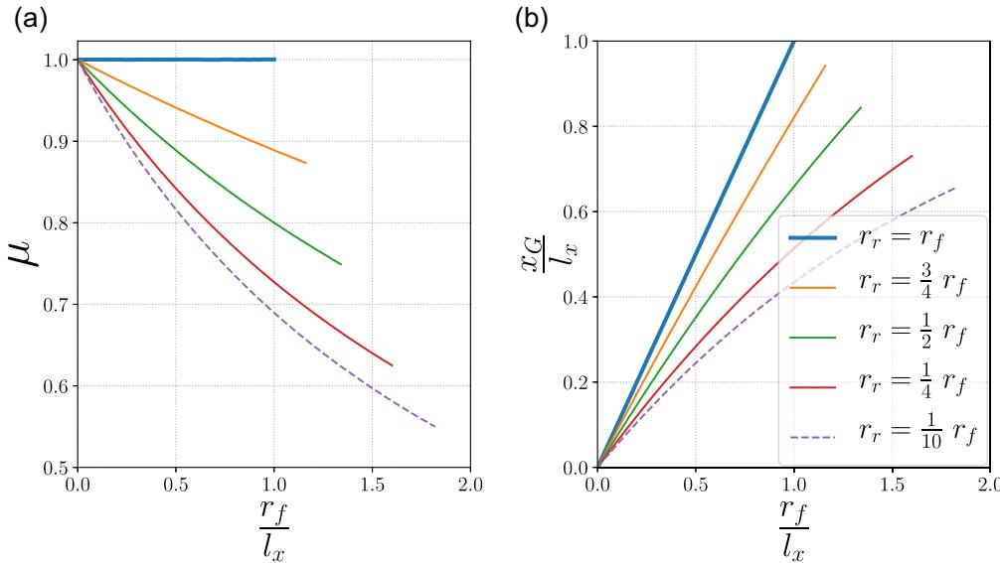

However, when at least two adjacent wheels are simultaneously faced with a difficulty, it might become necessary to reconfigure the relative wheel positions, as highlighted in Section 2.3. This is why MARCEL's chassis also articulates around a vertical revolute joint which is powered by a stiff actuation and allows the rover to rotate the front of the chassis relative to the back. This joint is placed at the very center of the chassis so as to maximize the longitudinal displacement of each wheel when it rotates. This way, it can offer substantial rearrangements of whichever wheels are currently faced with an obstacle. Moving the relative wheel positions allows the rover to bring itself into a situation it can deal with using the assistance of the aforementioned bogie torque. The reconfiguration then offers the possibility to sequence the crossing of complex obstacles by isolating the difficulty on one wheel at a time, as suggested previously in Bouton et al. (2017). Moreover, as seen in Section 2.2, relative wheel displacements can also play a role in reducing the friction required to overcome the obstacles in combination with the bogie torque.

When the vertical center joint rotates, it also changes the alignment of the wheels so that their axles converge in an instant center of rotation for the rover. Therefore, this joint can fulfill two purposes at once: in addition to the wheel reconfiguration it provides to address challenging situations, it also allows the rover to steer when it is not in grip with obstacles. This way, the rover can steer using only one actuated joint, instead of requiring a motorized axis above at least two wheels. In addition to the weight saved by the reduction of the number of actuators, it secures the revolute joint further away from any dust projection occurring while rolling. Indeed, regolith is known to be particularly detrimental to mechanisms due to its volatility and abrasiveness (Gaier, 2005). Moreover, such a steering configuration has been shown to provide better stability and maneuverability on uneven and side-slope terrains (Vidoni et al., 2015).

As the chassis is already split in half by the vertical joint, which can now be referred to as the steering joint, the internal torque discussed earlier in this section has to be applied between the two halves consisting respectively of the front and the rear parts of the chassis. Besides, the steering joint occupies the center of the chassis. Therefore, the bogie can only be located between the front wheels and the steering joint, or between the latter and the rear wheels. We have chosen to place the bogie at the rear to leave room for the payload, embedded computer, and navigation sensors to fit at the front while ensuring a balanced load for the rover. The resulting kinematics is depicted in Figure 2.

A bogie articulated around the roll axis of the vehicle is preferable to prevent the torque generated by the wheels to interfere with the load distribution. Indeed, in the case of dualrockers that have the same direction of rotation axis as the wheels, the torque from the wheels is directly propagated to the bogie, which can lead to the unloading of one front wheel, or worse, the uncontrolled spinning of one rocker. However, a longitudinal bogie like MARCEL's brings about lateral slip when conforming to abrupt changes in ground geometry if its axis of rotation does not intersect the wheel axle. The axis of this bogie should then be preferably as close as possible to the wheel axle to mitigate lateral frictions on the wheels. As the latter recommendation is in the meantime detrimental to the ground clearance, a compromise has to be made.

Also, MARCEL's kinematic design does not allow it to incline its body according to the slope of the terrain like the SRR (lagnemma et al., 2000) or the Scarab (Wettergreen et al., 2010), nor does it allow it to move its CoM forward or backward like more complex platforms can. However, this combination of actuated joints allows the rover to adopt a crawling gait that increases the drawbar pull and prevents sand entrapment when traversing soft soils. Indeed, the steering joint and the bogie torque can be coordinated to alternately move forward two diagonally opposite wheels at a time while the other two are used to push on the ground to provide thrust to propel the chassis. Contrary to the "push-pull" or "inch-worming" motion (Andrade et al., 1998; Benamar et al., 2004; Creager et al., 2015; Wettergreen et al., 2010), MARCEL's crawling gait takes advantage of the load transfer to the stationary wheels via the torque applied to the bogie to reduce the pressure on the moving wheels. This way, the compaction resistance in front of these wheels is mitigated and the rover can produce higher drawbar pull (Bouton & Gao, 2022). As a result, this crawling gait turns out to outperform energetically systems that can incline their body or reposition their CoM when climbing a $3 0 ^ { \circ }$ slope made of loose lunar simulant (Bouton et al., 2023). This motion also allows the rover to extricate itself from sand entrapment, as demonstrated in Figure 7.

Although both joints are actuated, we can point out that they are arranged in such a way that they do not have to actively carry the weight of the rover during normal operation on smooth terrain. Beyond the energy saving, it also means that the chassis would still be able to operate even if both joints were left passive. The adaptation capacity would be lost, but the bogie would distribute the load evenly on the rear wheels and the steering rotation would still be able to be led by the speed synchronization of wheels described later in Section 3.4.

In practice, both joints are actuated by worm-geared DC motors to mitigate energy dissipation when they are required to maintain an angle. Those are controlled by PI controllers at a frequency of $_ { 2 0 } \mathsf { H z }$ . The wheels are powered by four independent DC motors subject to PI speed controllers. All the motors are driven by $\boldsymbol { \mathsf { 1 2 } } \boldsymbol { \mathsf { V } } .$ .

The main features of MARCEL prototype are gathered in Table 2.

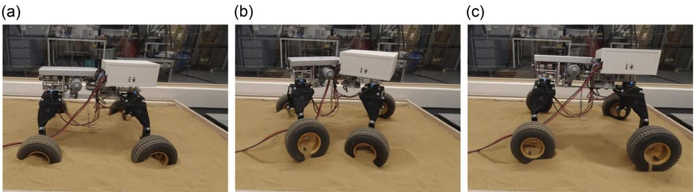  
IUARC./ TH4stmvOrRs.

TABLE 2 Features of MARCEL prototype.   
FIGURE 8 The rover prototype MARCEL.   

<table><tr><td>Wheelbase</td><td>58 cm</td></tr><tr><td>Wheel track</td><td>61 cm</td></tr><tr><td>Wheel diameter</td><td>21 cm</td></tr><tr><td>Ride height</td><td>33 cm</td></tr><tr><td>Overall height</td><td>55 cm</td></tr><tr><td>Weight</td><td>24.5 kg</td></tr><tr><td>Maximum forward speed</td><td>78 cm/s</td></tr><tr><td>Maximum steering angle</td><td>40°</td></tr><tr><td>Maximum steering angle rate</td><td>15%/s</td></tr><tr><td>Maximum bogie torque</td><td>35 Nm</td></tr></table>

# 3.2 | Sensors and electronics

To determine how to use its internal actuation in response to the immediate environment, MARCEL relies only on proprioceptive sensors.

First and foremost, MARCEL's chassis is equipped with two sixaxis force torque sensors whose role is to inform about the interaction forces with the environment while the rover is moving forward on an unknown terrain. These sensors are embedded in the frame of the chassis at the front and at the back, as shown in Figure 8, such that they are the only part linking either the front wheels or the rear wheels with the rest of the chassis. This way, the two sensors provide an image of the interaction forces between the wheels and the ground via the internal stresses running through the chassis. Indeed, assuming that the wheels do not transmit moment at their contact interface with the ground, there are three force components applied on each wheel. Therefore, the 12 independent measurements provided by both force torque sensors is sufficient to represent the force distribution on the four wheels.

Fitted in the electronics box at the front of the rover, a dual-axis inclinometer provides the roll and pitch angles of the front body of the chassis. In addition, the bearing angle is given by a tiltcompensated magnetic compass. The latter sensor would obviously

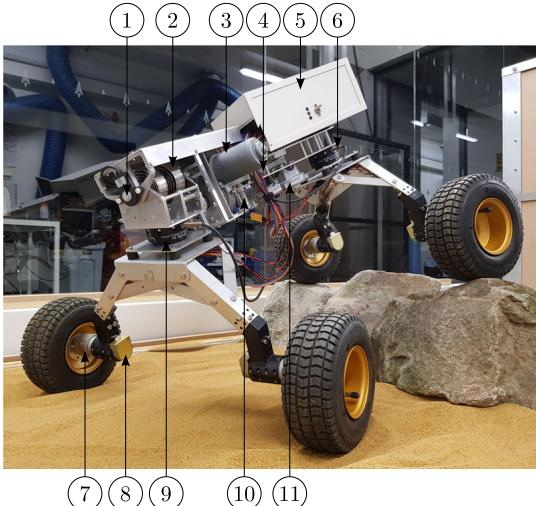

(1) Pivot axis of the bogie   
(2) Springs of the series elastic actuation of the bogie   
(3) Worm-geared motor driving the torque applied to the bogie   
(4) Belt drive of the steering joint (reduction ratio 3:1)   
(5) Electronics box   
(6,9) 6-axis force torque sensors   
(7) Geared motor of the wheel   
(8) Incremental encoder monitoring the wheel speed   
(10) Pivot axis of the steering joint   
(11) Worm-geared motor driving the rotation of the steering joint

not work on the Moon or Mars, as they have no magnetic field. For simplicity, it is replacing here any visual odometry system that is assumed to provide the bearing angle of the rover relative to its desired heading direction.

The chassis is also provided with seven encoders. One absolute encoder measures the angle of the steering joint. Two other absolute encoders are dedicated to the bogie mechanism, measuring respectively the rotation of the bogie's shaft relative to the bogie itself and to the chassis frame. Their use is clarified in the next section. Lastly, four incremental encoders are used for the speed feedback control of each wheel.

The wheel speed controllers are implemented on two microcontrollers Arduino Uno, in charge of two wheels each. Meanwhile, a microcontroller Teensy 3.2 is dedicated to the feedback control of both motors of the chassis's internal actuation. The higher-level control that decides the response to the obstacles and deals with the synchronization of the wheel speeds is managed by a single-board computer Raspberry Pi $^ { \mathrm { ~ 3 ~ } \mathrm { ~ B + ~ } }$ using the middleware ROS (Robot Operating System) (Quigley et al., 2009).

# 3.3 | Series elastic actuation

MARCEL's bogie is operated by series elastic actuation, which is a reliable and energy-efficient way of achieving high-fidelity torque control (Laffranchi et al., 2009; Pratt et al., 2002). Instead of directly controlling the angular position of the bogie, the worm-geared motor regulates the compression of two springs attached to that bogie. The torque applied between the bogie and the rest of the chassis can then be deduced and controlled according to the known stiffness of the springs. Using a nonbackdrivable motor upstream the springs allows the rover to mitigate the energy dissipation while maintaining constant torque.

Series elastic actuation can be made very compact and achieve high power density when made with bespoke components, especially custom-designed springs (Paine et al., 2015; Tsagarakis et al., 2017). However, as the design of such springs is out of the scope of our study, we use here two off-the-shelf flat spiral springs. These are combined in an antagonistic way and are initially preloaded to half their maximum load to avoid fatigue due to alternate stress. The resulting stiffness is then the sum of both springs' stiffness. We note $K _ { s p r i n g s } = 2 6 5 ~ \mathsf { N } \mathsf { m m } / \mathsf { \Lambda }$ this stiffness.

Figure 9 shows how the series elastic actuation is implemented on MARCEL prototype. The inner end of the spiral springs is fixed to the shaft whose rotation is controlled by the worm-geared motor. The other end of the springs, at the exterior of the spiral, is attached (1) Toothed pulley and belt of the steering joint 8 (2) Worm-geared motor (reduction ratio 81:1) (3) Additional spur gears (reduction ratio 3:1) (4) Absolute encoder measuring $\theta _ { s h a f t } - \theta _ { b o g i e }$ $K _ { s p r i n g s }$ (7) Absolute encoder measuring $\theta _ { s h a f t }$ (8) Rear 6-axis force torque sensor (9) Shock absorbers

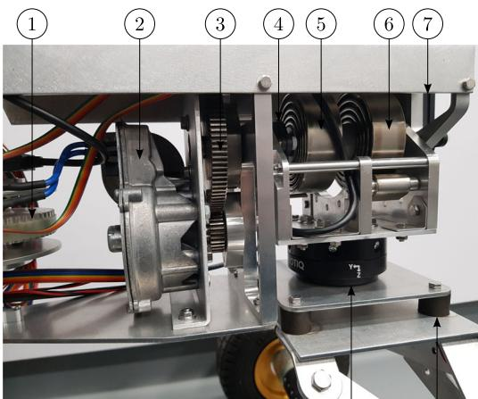  
FIGURE 9 Close-up on the bogie's seris elastic actuation.

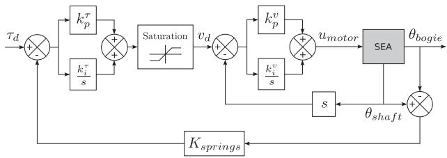  
FIGURE 10 Control diagram of the bogie's series elastic actuation.

to either side of the bogie frame. The latter can otherwise rotate freely around the aforementioned shaft via a pair of ball bearings. Therefore, this shaft constitutes the rotation axis of the bogie's revolute joint while it is also used to transmit the torque to the bogie via the springs.

To control the torque applied to the bogie, we use two nested feeback control loop, as depicted in Figure 0, where $\theta _ { s h a f t }$ and $\theta _ { b o g i e }$ are respectively the rotation angles of the inner shaft and the bogie relative to the chassis. The inner feedback loop regulates the rotation speed of the shaft relative to the chassis with a PI controller. Meanwhile, the outer feedback loop regulates the bogie torque by adjusting the desired rotation speed of the shaft with a PI controller according to the difference between the desired torque and the torque deduced from the angle of the shaft relative to the bogie frame. This staged control scheme allows us to insert a saturation to bound the rotation speed of the shaft to safeguard the system from instabilities and unharnessed jerks that could arise from sudden movements of the bogie. The maximum rotation speed of the shaft is set to $3 0 ^ { \circ } / s$ .

# 3.4 | Wheel speed control

When the steering joint rotates, the speed of each wheel is synchronized so that the rover can drive on a flat surface with theoretically no skidding, neither lateral nor tangential.

If the rover stays put on a flat surface while rotating its chassis, the transverse plane should be preserved as a plane of symmetry, which gives us the geometric locus of the steering joint during the maneuver, as illustrated in Figure 11a. Therefore, if we impose no lateral wheel velocity while the center of the steering joint moves along its locus, we find that the tangential velocity of the wheel i, with $i \in [ 1 , 4 ] ,$ should be at every instant:

$$
{ v _ { s t e e r i n g , i } = \left( ( - 1 ) ^ { \frac { i ( i + 1 ) } { 2 } } I _ { x } \tan \frac { \beta } { 2 } + ( - 1 ) ^ { \frac { i ( i - 1 ) } { 2 } } I _ { y } \right) \frac { \dot { \beta } } { 2 } } ,
$$

where $\beta$ is the steering angle, defined positive when it leads the rover to the right, while $I _ { x }$ and $I _ { y }$ are respectively the longitudinal and transversal distances of the wheels from the steering joint.

Moreover, when the steering angle $\beta$ is nonzero, the speed of left and right wheels has to be modulated proportionally to the forward velocity of the rover to account for the speed differential required to maintain rolling without skidding. Let $V _ { r o v e r }$ be the forward velocity of thoveepiu.efin such that the tangential velocity to apply to every wheel $i \in [ 1 , 4 ]$ is $V _ { r o v e r } \times c _ { d i f f e r e n t i a l , i }$ when turning at a constant rate can be written:

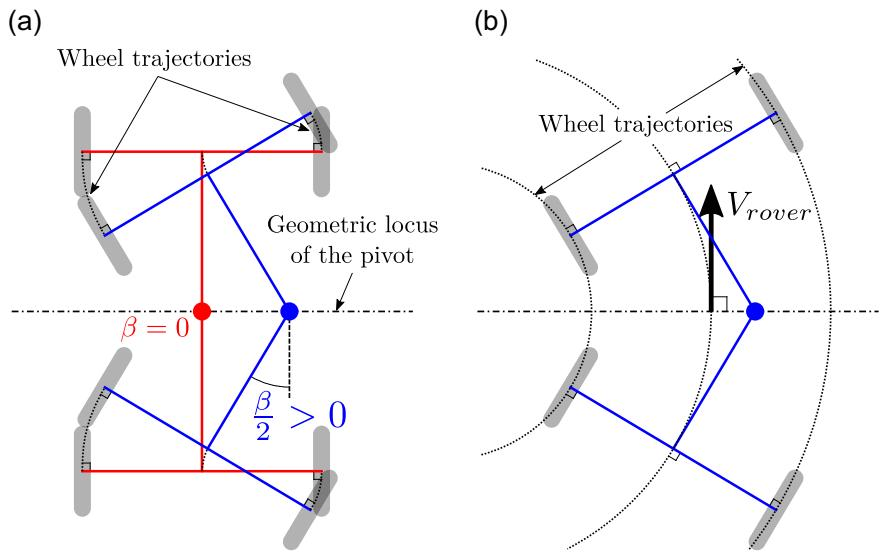  
FIGURE 11 Rotation of the steering joint while the robot is at a standstill (a) and forward velocity of the rover when the steering angle is fixed (b). The rover is represented from a top view.

$$
c _ { d i f f e r e n t i a l , i } = 1 - ( - 1 ) ^ { i } \frac { I _ { \gamma } } { I _ { x } } \tan \left( \frac { \beta } { 2 } \right) .
$$

By superimposition of the velocities, the resulting speed to apply to each wheel $\mathsf { i }$ for any arbitrary rotation of the steering joint and forward velocity of the rover is then, with $r$ the wheel radius:

$$
\omega _ { i } = \frac { V _ { r o v e r } \times c _ { d i f f e r e n t i a l , i } + V _ { s t e e r i n g , i } } { r } .
$$

However, if the forward velocity $V _ { r o v e r }$ of the rover is low while the steering angle rotation $\dot { \boldsymbol { \beta } }$ is large enough, one or two wheels can start to roll backward during the maneuver. This might jeopardize the rover progression during critical phases of obstacle climbing. Instead, to avoid any wheel from rolling backward, we add just enough forward velocity to the whole rover while maintaining the kinematic constraints for rolling without skidding.

The minimal velocity to apply to the rover to prevent any wheel from rolling backward is then:

$$
\overline { { V } } _ { r o v e r } = \operatorname* { m a x } _ { i \in [ 1 , 4 ] } \frac { - V _ { s t e e r i n g , i } } { C _ { d i f f e r e n t i a l , i } } .
$$

Equation (5) is then used with the forward velocity $\overline { { V } } _ { r o v e r }$ to deduce the speed to apply to each wheel.

# 4 | REINFORCEMENT LEARNING FRAMEWORK

# 4.1 | Algorithm

Using a motion planning algorithm to generate a sequence of controls that allows the rover to cross a challenging obstacle is difficult due to the complexity of wheel interactions. In addition, it tends to be unreliable due to the limited knowledge of the actual terrain geometry and properties around the rover. Indeed, terrain mapping suffers from inaccuracy in both the ground geometry modeling and the position of the rover and its wheel contacts relative to the generated map. Efforts have been made to predict the future configuration of a vehicle despite the occlusions and possible deformations (Ho et al., 2016). Nevertheless, once the rover is directly in contact with a surface, the exteroceptive sensors are blind to this area and the corresponding map and position of the wheel contacts cannot be updated.

Instead, we propose to derive control laws based directly on the proprioceptive measurements that capture the current interaction of the rover with the ground and the obstacle. For this purpose, we leverage a reinforcement learning algorithm that can consider a variety of situations and shape a controller that, once trained, is able to advise the most likely optimal control to apply for any set of inputs without going through any planning again. Among the State-of-the-Art algorithms to train a policy consisting of continuous control values, we use1 the Twin Delayed Deep Deterministic policy gradient algorithm (TD3) (Fujimoto et al., 2018), which is an off-policy version of the classic "actor-critic" framework. By being off-policy, the training can reuse any past experience independently of the policy used to collect them and therefore be much more sample efficient. This is important as collecting experience from the dynamic simulation is the most computationally heavy part of the algorithm. The off-policy update of the actor from uncorrelated stored experience data is made possible by the use of a state-action value function, also called Q-function, for the critic which is then derivable relative to the actions. Compared to the deep deterministic policy gradient algorithm (DDPG) (Lillicrap et al., 2015), the TD3 algorithm adds three implementation tricks to increase the stability and performance with consideration of function approximation error.

TABLE 3 Hyperparameters used for the training. Symbols in brackets refer to the notation from the original paper (Fujimoto et al., 2018).   

<table><tr><td>State space dimension</td><td>17</td></tr><tr><td>Action space dimension</td><td>2</td></tr><tr><td>Discount factor (y)</td><td>0.99</td></tr><tr><td>Soft target update factor (t)</td><td>5 × 10-3</td></tr><tr><td>Policy update delay (d)</td><td>2</td></tr><tr><td>Target policy regularization noise (e)</td><td>N(0, 0.05)</td></tr><tr><td>Bounds of the target policy regularization noise (c)</td><td>0.2</td></tr><tr><td>Size of the replay buffer</td><td>106</td></tr><tr><td>Minibatch size</td><td>128</td></tr><tr><td>Learning rate</td><td>10-4</td></tr><tr><td>Number of training iterations between each trial</td><td>200</td></tr></table>

Here we prefer the TD3 algorithm instead of a stochastic policy gradient counterpart such as the soft actor-critic (SAC) (Haarnoja et al., 2018), which is also off-policy, because of its independence regarding the exploration method used during training. Indeed, we have noticed in our case that using an ad hoc exploration strategy can significantly help avoiding local optima and speed up the training. The hyperparameters used are indicated in Table 3.

The actor-critic framework relies on two function approximators: the actor, which gives the controls, or actions, to apply depending on the state of the rover, and the critic, which tells in our case how good it is to take any given action in any state. The critic is shaped by dynamic programming according to the amount of reward obtained after each choice of actions. Meanwhile, the actor is adjusted in the direction that improves the state-action value given by the critic, that is, in the direction of the gradient of the critic relative to the actions. In other words, the critic is gradually trained by the experience of the visited states and the actions taken in each of these states, while the actor's improvements are guided by the curvature of the critic. In practice, both of them consist of a neural network based on two fully connected hidden layers of 512 neurons each and rectified linear units (ReLU) as activation function. The critic network ends with a single linear unit that provides the state-action value, while the actor network closes with two neurons, one for each control value of the internal actuation. The outputs of the actor network are squashed with the hyperbolic tangent function so as to meet the bounds of the control range.

As listed by the inputs in Figure 12, the state of the rover, that is, all the variables that are used to decide what action to take, consists of the 6 measurements from both force torque sensors of the chassis, the angular position of both internal mobilities, both inclination angles of the front part of the chassis and the bearing angle of the rover relative to its desired course. The inputs of the critic network are the same as the actor network, but augmented with both action variables, that is, the steering angle rate $\dot { \boldsymbol { \beta } }$ and the bogie torque t.

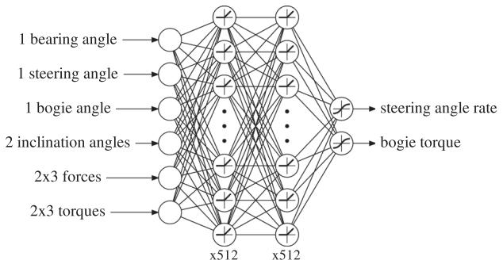  
FIGURE 12 Diagram of the actor neural network trained by reinforcement learning.

# 4.2 | Simulations

The algorithm is trained using dynamic simulations² based on Open Dynamics Engine. It uses a pyramidal approximation of the Coulomb friction cone and the contacts are subject to error reduction and constraint force mixing to simulate the stiffness and damping of the tires. The position of the CoM of both front and rear parts of the chassis has been experimentally estimated with the help of a nonlinear regression based on the Levenberg-Marquardt algorithm (Moré, 1978) applied to the load variation measured under each wheel in different configurations. The slight flexibility of the chassis where the force torque sensors and shock absorbers are, that is, above the wheels at the front and the rear, is simulated with six-axis stiffness and damping. This allows us to deduce correct values of the forces and torques expected to be measured at these two positions. The values used to model the contacts and flexibilities are specified in Table 4.

At each new training trial, the rover is put in front of a step obstacle with an approach angle uniformly randomized between $- 5 ^ { \circ }$ and $5 ^ { \circ }$ . The step is as tall as the diameter of the wheels and wide enough so that the rover cannot get round it. If the rover deviates laterally by more than $0 . 6 \mathsf { m }$ during the trial, or if it tips over, the trial stops and the rover restarts in front of the obstacle. The trial also ends if the rover reaches a forward distance of $1 . 5 \mathsf { m }$ ,distance at which all four wheels are ensured to have passed the step for any initial orientation. Otherwise, if the rover is stuck for too long, the trial halts after a time limit of $6 0 s$ The rover advances at $4 \mathrm { c m } / s$ and the setpoints for both the steering angle rate and the bogie torque are updated every $0 . 5 s$ To prevent the algorithm from overlearning from a repeated synchrony between the control timesteps and the moment the rover comes in contact with the obstacle, the starting time of the control updates is randomly shifted according to a uniform distribution as wide as the control period.

TABLE 4 Parameters of the simulation model.   

<table><tr><td>Contacts</td><td>Friction coefficient</td><td>0.5</td></tr><tr><td></td><td>Error reduction parameter</td><td>0.4</td></tr><tr><td>Chassis</td><td>Constraint force mixing</td><td>5 × 10-3 m N-1 s-1</td></tr><tr><td>flexibilities</td><td>Linear stiffness along and y</td><td>20 N/mm</td></tr><tr><td></td><td>Linear stiffness along Z</td><td>100 N/mm</td></tr><tr><td></td><td>Linear damping</td><td>0.5 mm-1 s</td></tr><tr><td></td><td>Angular stiffness</td><td>10³ N m/rad</td></tr><tr><td></td><td>Angular damping</td><td>1 N m/rad-1 s</td></tr></table>

# 4.3 | Reward function

The reinforcement learning algorithm aims at maximizing the sum of the reward values to be obtained between each control update, discounted in time by a factor y so as to prioritize shorter-term reward. Therefore, this is the reward function which guides the whole training and shapes the resulting optimal policy.

The core of the reward R attributed to each state transition to train the rover to cross the obstacle is simply the forward distance Δx traveled by the center of the chassis between two control updates. The exact point from which the traveled distance is measured corresponds to the intersection between the axes of the steering joint and the bogie joint. This way, we mitigate the influence of superfluous joint movements on the reward and thus prevent the algorithm from exploiting useless movements of the chassis that provide reward without helping the rover to move forward. This quantity is divided by the forward velocity V of the rover and the control period T to scale the maximum reward that can be obtained to 1.

In addition, we penalize the lateral deviation lyl of the rover, so as to incite it to stay as close as possible to its initial trajectory while negotiating the obstacle. We also penalize the amount of torque used to deter the rover from using more energy than necessary and bring the torque to zero when it is not needed. The last two terms of the reward are scaled down by a factor of 0.5 tuned experimentally after comparing different runs of the algorithm. Moreover, we add a $^ { - 1 }$ penalty to the reward of a transition if during this time a part other than the wheels has touched the obstacle. This way, we ensure that the rover does not rub or hinge on a chunk of the chassis that is not meant to take part in the locomotion and could be damaged.

Finally, if the trial ends because the rover has deviated too much laterally or has tipped over, a penalty of respectively $^ { - 2 }$ or $^ { - 5 }$ is added to the last transition.

The reward R of a transition can then be written:

$$
R = \frac { \Delta x } { V \times T } \ – \ 0 . 5 | y | \ – \ 0 . 5 \frac { | \tau | } { \tau _ { m a x } } \ - \ \delta _ { c o l i s i o n } - \ 2 \delta _ { | y | \geq y _ { m a x } } - \ 5 \delta _ { t i p o v e r }
$$

with $\delta _ { c o n d i t i o n } = 1$ if condition is true and 0 otherwise.

# 4.4 | Exploration strategy

To efficiently explore the state-action space, we use a custom exploration strategy derived from the classic e-greedy exploration, in which actions have a probability e to be randomly drawn from a uniform distribution or are otherwise inferred from the current policy. In our variation of this strategy, we maintain the randomly selected actions until we switch back to the current policy, which happens with a probability slightly higher than the probability of a new random draw. This way, we still leverage an uniform distribution to ensure a wide exploration, but in a less erratic way, in which each action taken randomly gets more chance to show its effect even if it needs several control timesteps to be effective. The resulting exploration strategy can be formulated as a three-state Markov process, as illustrated in Figure 13, in which the involved probabilities are specified.

As it can be seen in Figure 14, the custom e-greedy exploration strategy allows the rover to efficiently gather relevant experience to build a policy that can overcome the obstacle. However, this wide exploration strategy does not provide enough experience data close to the current optimal policy to allow the algorithm to fine-tune the control outputs so as to perfect the final policy. This is why the training is then extended with a lower learning rate of $1 0 ^ { - 8 }$ and a Gaussian exploration, which consists in adding a Gaussian noise to the output of the neural network, with a standard deviation equal to $1 \%$ of the maximum value the controls can take. As shown in Figure 14, it allows the algorithm to improve slightly further the efficiency of the policy. The resulting policy for a perpendicular approach to the obstacle can be seen in Figure 17.

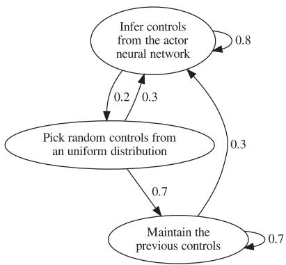  
FIGURE 13 Custom E-greedy exploration strategy used during the first part of the training, represented as a Markov process. Numbers indicate the probability of each transition at each control timestep.

# 5 | TRANSPOSITION TO INTERPRETABLE MODEL

# 5.1 | Data analysis

The actor neural network, once trained, provides us with the recommended control to apply in any situation, that is, for any set of inputs. Although it outputs each control setpoint from as many independent evaluations of the neural network, the optimal sequences of actions are intrinsically contained in the suggestions made. However, this neural network is a black box governed by an extensive amount of anonymous parameters whose roles and influences are unpredictable. Neural networks are powerful universal function approximators and they are ideal to shape the controller before we have any idea of what form the optimal policy should have. Now that we can be given the required outputs for any arbitrary inputs, we can search for a more specifically tailored controller that can produce the same behavior with a minimal set of parameters. We therefore aim at devising a new controller that performs as well as the neural network while being interpretable and simple enough to be tuned manually.

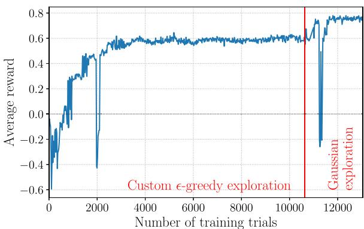  
FIGURE 14 Evolution of the average reward per evaluation trial, that is, using the state of the networks at different stages of the training while omitting exploration.

To forge the new controller, we base on a large collection of samples composed of plausible sets of inputs and their associated outputs given by the actor neural network. These samples are generated by simulation trials of the rover climbing over the obstacle for different values of approach angle and time shift of the control updates. This way, we focus on regions of the state space that make sense and can actually be encountered in practice, knowing that the neural network could return a value for any given set of inputs, even inconceivable. All in all, we gathered 15,000 samples from 250 different trajectories.

Once we have these samples, we first examine the latent correlations between all the variables, inputs and outputs, to find out if the dimension of the state space can be reduced. Indeed, while shaping the policy, we have used all the proprioceptive information that was available to the rover and that we deemed relevant, but it might turn out that some information is not essential for the final controller. Then, reducing the input dimension allows us to reduce the complexity of the new controller from the outset and to mitigate the computation time needed to obtain it. The correlation matrix of the inputs and outputs over all the samples is shown in Figure 15. We first look for correlations between expressly the inputs and the outputs (in the blue rectangle in Figure 15) that are very close to zero. Those would correspond to inputs that do not relate to the outputs and are therefore not helpful to determine the latter. We do not spot such variables in our case. Then, we look for correlations between the inputs themselves that are close to 1 or $^ { - 1 }$ .Those correspond to inputs that appear to be redundant in practice. This is the case of the forces from respectively the front and the rear force torque sensors (highlighted in red in Figure 15). Therefore, we choose to keep only the forces $f _ { x } , f _ { y }$ ,and $f _ { z }$ from the front of the chassis. This way, the dimension of the new input space becomes 14 instead of 17.

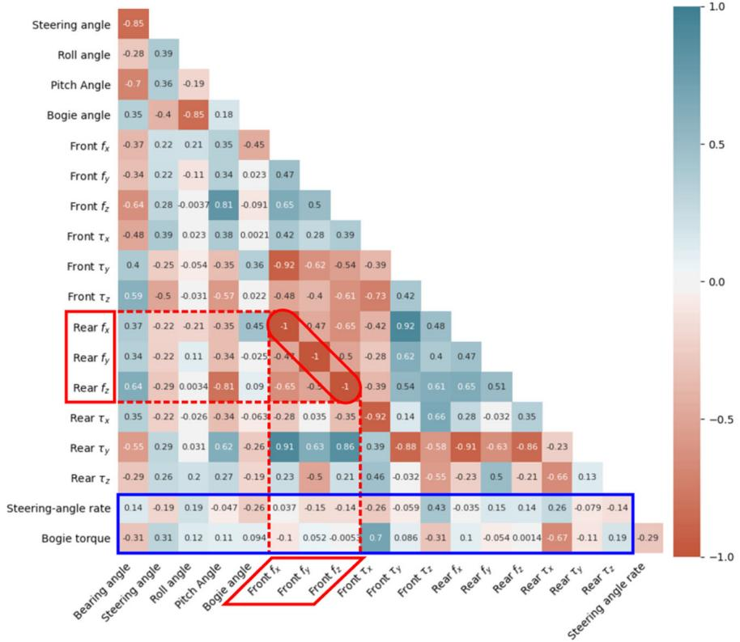  
FIGURE 15 Correlation matrix of the inputs and outputs of the neural network controller over multiple trials of the rover climbing the step under different initial conditions. The blue rectangle delineates the correlations between the inputs and the outputs. The red rectangles point out the most highly correlated inputs (values are the result of a rounding to two decimal places).

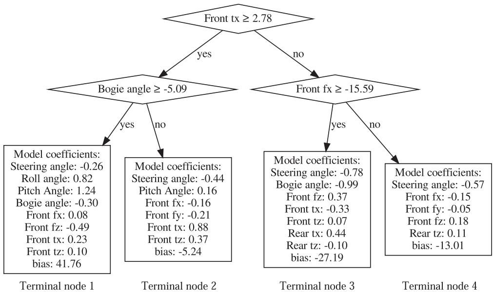  
FIGURE 16 Linear model tree providing the steering angle rate control.

As we want to keep our controller easily interpretable, we avoid using other dimensionality reduction techniques that blend and distort the input space.

# 5.2 | Model tree regression

To reproduce the outputs of the trained actor neural network, we fit a lasso model tree³ to all the samples gathered along various trajectories. A model tree is a regression tree for which each leaf, or terminal node, provides the prediction output with a chosen regression method, such as a linear regression (Karalic, 1992). To reduce the final number of parameters of the model, we use a lasso regression, which is a linear regression with a L1 regularization, that is, a linear penalty on the coefficients of the regression. This way, the coefficients of features with the smallest influences are attracted to zero, retaining only the most significant features for each regression.

There is a different tree for each output, that is, one tree for the control of the steering angle rate and one for the bogie torque. To train the lasso model trees, the input space is gradually subdivided by selecting the feature and threshold that minimize the split loss. The latter is computed as the sum of the squared errors and regularization terms of the resulting lasso regressions on both sides of the split. To determine the optimal set of hyperparameters to use, the maximum depth of each tree is increased and the L1 regularization coefficient decreased until the resulting controller allows the rover to cross the obstacle for every approach angle and time shift that have been used to collect the training samples. In the end, with an L1 regularization coefficient of 1, a depth of two splits for the steering angle rate and none for the bogie torque, that is, a single lasso regression, have been found to be enough to produce a suitable controller. The corresponding tree and regression coefficients are given in Figure 16 and Table 5. For the control of the steering joint, for example, when the rover is idle and both the torque and the force measured along $\vec { x }$ by the front force torque sensor are below the thresholds in the diamond-shaped nodes of the tree in Figure 16, the resulting steering angle rate is governed by the terminal node 3. It means that the desired angle rate to be given at the moment to the steering joint is obtained by linear combination of the inputs and coefficients listed in the box of the terminal node 3. A change in the measured efforts or the bogie angle relative to the thresholds would then trigger a change of linear coefficients and inputs according to the new selected terminal node.

In the process, we drastically reduced the number of parameters from 272,898 for the neural network to a total of only 41 parameters with the combined linear regressions. Furthermore, the resulting controller is easily interpretable: the role and influence of each parameter, either a threshold or a coefficient applied directly to one of the input features, can be identified immediately.

TABLE 5 Linear regression parameters of the bogie torque control.   

<table><tr><td>Bearing angle</td><td>Roll angle</td><td>Front fx</td><td>Front τx</td><td>Front tz</td><td>Rear Tx</td><td>Rear tz</td><td>Bias</td></tr><tr><td>-0.04</td><td>0.23</td><td>-0.11</td><td>0.73</td><td>0.09</td><td>-0.06</td><td>-0.07</td><td>0.69</td></tr></table>

# 6 | HARDWARE IMPLEMENTATION ANDVALIDATION

# 6.1 | Formal step obstacle

We first test the autonomous controller on a formal step obstacle, that is, an escarpment with a $9 0 ^ { \circ }$ edge separating two planar ground levels. The height of the escarpment is exactly $2 1 \mathsf { c m }$ which corresponds to the diameter of the wheels. All the surfaces are hard. The rover starts on a vinyl flooring, while the obstacle is made of medium-density fibreboards. We measure experimentally a friction coefficient of 0.47 between the wheels and the obstacle and 0.52 on the ground floor. In the simulation, the friction coefficient is 0.5 everywhere. The step is wider than the rover's wheel track and it is approached frontally so that both front wheels are faced simultaneously with the vertical surface. This structured obstacle scenario allows us to directly compare the performance with other systems tested in similar conditions (Benamar et al., 2009; Michaud et al., 2006; Thueer et al., 2006).

As shown at the beginning of the video available at https://www. youtube.com/watch?v $^ { \prime } { = }$ HjO0BNGB7ql, without the internal actuation of the chassis, that is, with the steering joint locked straight and the desired bogie torque set to zero so as to emulate a passive bogie, none of the wheels can climb such a step. Indeed, whatever pose the rover starts in, approaching with an angle or not, the front wheels already on the obstacle or not, the contacts are too slippery to allow the rover to make any progress using only wheel traction, as predicted in Section 2.

To mitigate the interference from the stick-slip effect, the rover's forward velocity is divided by two during the real experiment, while the model tree controller outputs new setpoints at a frequency of $4 \mathsf { H z }$ For convenience, the rover receives electrical power from an external source. Nevertheless, a $3 \kappa \varrho$ weight is added at the front, inside the electronics box, to account for the battery and a hypothetical payload weight. Figure 17 shows snapshots of both the strategy obtained in simulation with the trained neural network and the experimental trial where the prototype is controlled according to the outputs of the linear model trees. The first thing we can notice is the fidelity with which the sequence of actions is reproduced, even though it is a continuous control deduced from continuous variable measurements. Also, the results confirm that a maximum of $2 5 \mathsf { N m }$ torque applied to the bogie is just enough to allow a four-wheeled rover with such a mass distribution to climb a vertical surface with a friction coefficient of 0.5, as predicted in Section 2.2.

When both front wheels meet the obstacle, at the moment corresponding to Figure 17a, we can point out that the combination of the bogie torque and the repositioning of the rear wheels via the steering joint allows one of the front wheel to be lifted over the obstacle without even requiring traction from this wheel. As observed in the first plot of Figure 18b, this behavior is ensured by the terminal node 1 of the model tree represented in Figure 16. As explained by the tree, the latter node is triggered when there is a torsional unbalance between the front wheels but the bogie is not askew. Once the first wheel has reached the top of the obstacle, the combined changes of mainly the interaction forces on the front wheels and the tilting of the chassis result in the linear model characterized by Table 5 to command the drop of the torque applied to the bogie. In the meantime, the steering joint pushes the first wheel that has overcome the obstacle further ahead before the next wheel addresses it, as seen in Figure 17b. We notice that terminal node 3, in addition, to be the default active node when there is no obstacle, is also in charge of the climbing of the next two wheels. Indeed, these diagonally opposite wheels require a similar assistance from the chassis, as it can be observed at moments (b) and (d) in the two top graphs of Figure 18. In particular, we notice that the action of the steering joint also helps by increasing the normal pressure of the wheel that is rolling up on the obstacle.

All in all, this continuous control manages to unfold a trajectory in the state space that sequences the crossing of each wheel one after another, even though none of the wheels could overcome the obstacle by itself.

# 6.2 | Rocks and sand

To test the robustness of the controller beyond the hypothesis of hard soil and even surfaces, the rover is placed in a sandbox filled with ES-3 martian soil simulant (Brunskill et al., 2011) and faced with real rocks as tall as the wheels. The linear model tree controller tested previously is then applied again without any change. In the same way, the rover is left to advance and adapt to the obstacles in full autonomy.

The first arrangement of rocks reproduces the difficulty posed by a wide escarpment. Snapshots of the trial are shown in Figure 19. Once again, the controller successfully assists the crossing of each wheel at the right times, taking advantage of both the reconfiguration of the relative wheel positions and the adjustment of the bogie torque. At the moment corresponding to Figure 19b, we can notice how slippery the rocks actually are and for a short time we witness the impossibility for the wheels to climb without further assistance. Then, the internal forces measured in the chassis tell the controller to trigger an appropriate response to overcome the difficulty, enabling successively both rear wheels to climb the obstacle.

The active chassis and its controller are also tested when faced with a large rock blocking only half of the way, as shown in Figure 20.

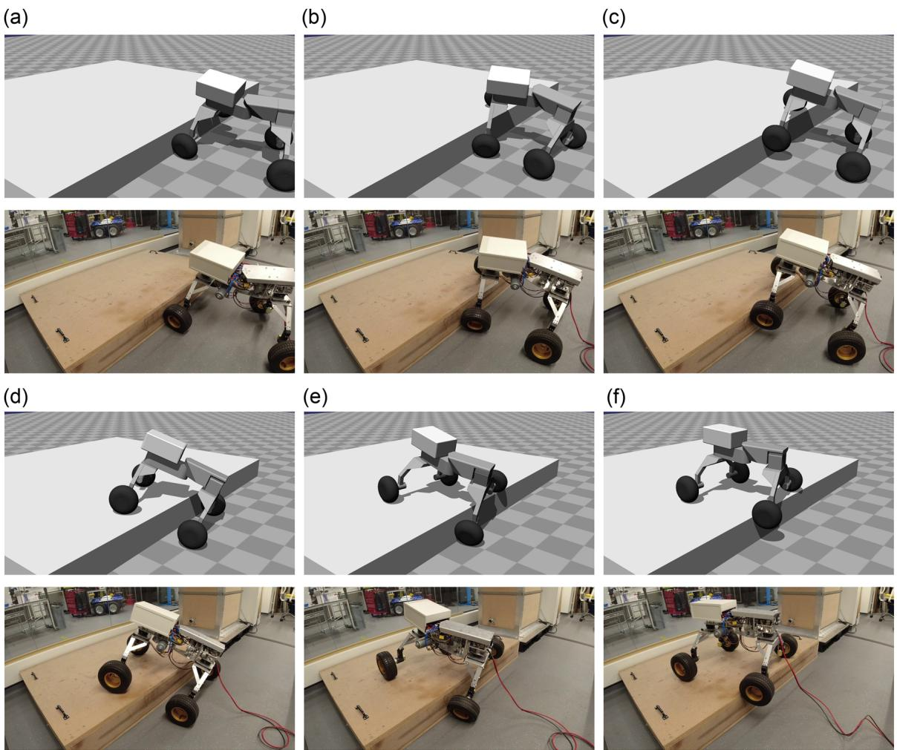  
FIUA ole. $\scriptstyle = { \frac { } { } }$ HjO0BNGB7ql.

After the rear wheel first fails to get to the top of the obstacle because of the front wheel falling back in the meantime, the rover is seen following a trajectory in the state space that prepares the chassis to leverage its steering joint as soon as the amount of internal forces at play are suitable, as seen in Figure 20b. This then allows the rear wheel to climb over the steep surface while the front wheel is pushing backward to produce enough thrust.

The first capability is provided by an angular series elastic actuation that is able to apply a torque between two halves of the chassis. The second one is performed by an actuated pivot at the center of the chassis that also allows the rover to steer. In this mechanism, the joints do not have to actively carry the weight of the rover for it to operate on smooth ground geometries. The internal actuation can be triggered only when needed, to address the most challenging situations.

# 7 | SUMMARY AND CONCLUSIONS

This paper presents a new four-wheeled rover chassis concept and its prototype named MARCEL. With only two actuated revolute joints, the proposed design is able to deal with both loose soil and steep obstacles. This design is justified by a static analysis that emphasizes the importance of two capabilities:

The modification of the load distribution on wheels.   
The relative displacement of the longitudinal wheel positions.

This paper also presents a two-stage procedure to devise an interpretable controller that is able to harness the internal actuation of the chassis to allow the rover to cross challenging obstacles. The first stage consists of shaping a capable control policy out of a neural network by reinforcement learning. Samples of corresponding inputs and outputs from this controller are then collected along a variety of trajectories and analyzed. Now that the desired behavior is known, a simpler bespoke model can be trained based on these samples to reproduce the outputs of the neural network. Using a lasso model tree, we have been able to boil down the essence of the control policy to a controller fully described by only 41 parameters. In consequence, the latter controller, which is independent of the higher-level path planning, is easily interpretable and simple enough to be fine-tuned afterward if needed.

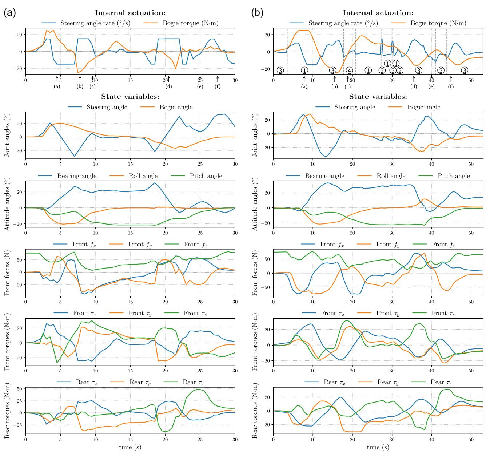  
arrows point to their corresponding times. (a) Simulation and (b) experiment.

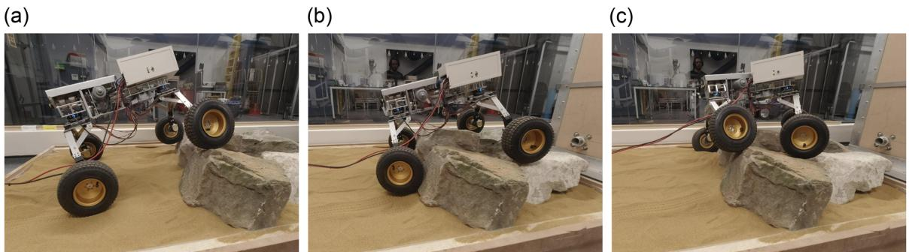  
FIGURE MARCEL traversing a bilateral bstacle maderocks using the inear model tree conrol.

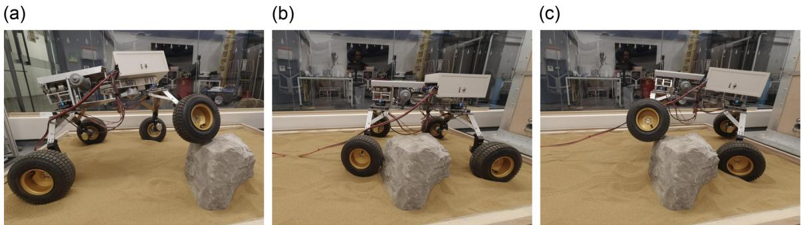  
FIGURE 20 MARCEL crossing an unilateral rocky obstacle using the linear model tree controller.

MARCEL and its controller have been tested in different conditions. First, it has been tested in a structured scenario with hard surfaces to prove that it can overcome step-like obstacles as tall as the diameter of the wheels with a $9 0 ^ { \circ }$ edge and a friction coefficient as low as 0.5. It has also been tested on rocky and sandy terrain, with rocks either in front of one wheel or in front of both sides at the same time.

From this work and the results obtained, we have learned that:

Two well-chosen actuated joints can provide enough agility to allow a four-wheeled chassis to adapt to and overcome large, solid obstacles.   
The control of chassis's actuation can rely entirely on proprioceptive information consisting especially of internal force and torque measurements to manage the crossing of unknown and unforeseen obstacles.   
A controller made of juxtaposed linear functions of the inputs is able to provide appropriate torque and speed setpoints to operate the chassis throughout all the sequence of actions needed to traverse the obstacles. It is also robust enough to operate in sand and deal with arbitrary rock shapes.

In the future, the controller could be extended to deal with an even broader range of situations, including, for example, crossing negative obstacles such as a ditch in the ground. The use of model trees allows different controllers that are devised independently to be straightforwardly combined together as long as their domains of application lie in distinct regions of the state space. In such a case, the trees can be simply fused together around a discriminative criterion on the inputs. Otherwise, the resort to exteroceptive sensors, such as a depth camera, to provide a classification that supervises the switching between controllers could also be examined. Another interesting investigation would be to try to train the controller while relying only on the actuation of either the steering joint or the bogie. Deprived from the assistance of one joint, the rover will not be able to climb a step obstacle as tall as the wheels, but provided that we run enough simulations, we can observe what is the maximum obstacle size that can be overcome in both cases. This would give further indications of the impact of each joint taken individually and advise us of the performance cost of removing one actuator from the design. As for the mechanical design, one possible direction for further improvement is to look for ways to make the series elastic actuation lighter and smaller by taking advantage of a better integration in the chassis.

# ACKNOWLEDGMENT

This work is supported by grant EP/R026092 (FAIR-SPACE Hub) through UKRI under the Industry Strategic Challenge Fund (ISCF) for Robotics and Al Hubs in Extreme and Hazardous Environments.

# DATA AVAILABILITY STATEMENT

The data that support the findings of this study are available from the corresponding author upon reasonable request.

# ORCID

Arthur Bouton $\textcircled{1}$ http://orcid.org/0000-0002-7010-9445   
Yang Gao $\textcircled{1}$ http://orcid.org/0000-0002-2150-5986

# REFERENCES

Andrade, G., Benamar, F., Bidaud, P. & Chatila, R. (1998) Modeling wheelsand interaction for optimization of a rolling-peristaltic motion of a marsokhod robot. In: International Conference on Intelligent Robots and Systems (pp. 576-581).   
Apostolopoulos, D.S. (2001) Analytical configuration of wheeled robotic locomotion. The Robotics Institute of Carnegie Mellon University Technical Report CMU-RI-TR-01-08.   
Benamar, F., Grand, C., Besseron, G. & Plumet, F. (2004) Performance evaluation of locomotion modes of an hybrid wheel-legged robot for self-adaptation to ground conditions. In: ASTRA'04, 8th ESA Workshop on Advanced Space Technologies for Robotics and Automation.   
Benamar, F., Jarrault, P., Bidaud, P. & Grand, C. (2009) Analysis and optimization of obstacle clearance of articulated rovers. In: 2009 IEEE/RSJ International Conference on Intelligent Robots and Systems (pp. 41284133). IEEE.   
Bickler, D. (1998) Roving over mars.Mechanical Engineering, 120(4), 74-77.   
Bouton, A. & Gao, Y. (1998) Crawling locomotion enabled by a novel actuated rover chassis. In: 2022 IEEE International Conference on Robotics and Automation (ICRA). IEEE (forthcoming).   
Bouton, A., Grand, C. & Benamar, F. (2017) Obstacle negotiation learning for a compliant wheel-on-leg robot. In: 2017 IEEE International Conference on Robotics and Automation (ICRA) (pp. 2420-2425). IEEE.   
Bouton, A., Grand, C. & Benamar, F. (2020) Design and control of a compliant wheel-on-leg rover which conforms to uneven terrain. IEEE/ASME Transactions on Mechatronics, 25(5), 2354-2363.   
Bouton, A., Reid, W., Brown, T., Daca, A., Sabzehi, M. & Nayar, H. (2023) Experimental study of alternative rover configurations and mobility modes for planetary exploration. In: 2023 IEEE Aerospace Conference. IEEE.   
Brunskill, C., Patel, N., Gouache, T.P., Scott, G.P., Saaj, C.M., Matthews, M. & Cui, L. (2011) Characterisation of martian soil simulants for the exomars rover testbed. Journal of Terramechanics, 48(6), 419-438.   
Cordes, F., Kirchner, F. & Babu, A. (2018) Design and field testing of a rover with an actively articulated suspension system in a mars analog terrain. Journal of Field Robotics, 35(7), 1149-1181.   
Creager, C., Johnson, K., Plant, M., Moreland, S. & Skonieczny, K. (2015) Push-pull locomotion for vehicle extrication. Journal of Terramechanics, 57, 7180.   
Fauroux, J.-C., Chapelle, F. & Bouzgarrou, B. (2006) A new principle for climbing wheeled robots: serpentine climbing with the open wheel platform. In: 2006 IEEE/RSJ International Conference on Intelligent Robots and Systems (pp. 3405-3410). IEEE.   
Fiorini, P. (2000) Ground mobility systems for planetary exploration. In: Proceedings 2000 ICRA. Millennium Conference. IEEE International Conference on Robotics and Automation. Symposia Proceedings (Cat. No. 00CH37065) (vol. 1, pp. 908-913). IEEE.   
Fujimoto, S., Hoof, H. & Meger, D. (2018) Addressing function approximation errorinactor-criticmethods. In International onference on Machine Learning (pp. 1587-1596). PMLR.   
Gaier, J.R. (2005) The effects of lunar dust on eva systems during the apollo missions. (NASA/TM-2005-213610).   
Gao, Y. & Chien, S. (2017) Review on space robotics: toward top-level science through space exploration. Science Robotics, 2(7), eaan5074. https://doi.org/10.1126/scirobotics.aan5074.   
Grand, C., Benamar, F., Plumet, F. & Bidaud, P. (2004) Stability and traction optimization of a reconfigurable wheel-legged robot. The International Journal of Robotics Research, 23(10-11), 10411058.   
Haarnoja, T., Zhou, A., Abbeel, P. & Levine, S. (2018) Soft actor-critic: offpolicy maximum entropy deep reinforcement learning with a (pp. 1861-1870). PMLR.   
Ho, K., Peynot, T. & Sukkarieh, S. (2016) Nonparametric traversability estimation in partially occluded and deformable terrain. Journal of Field Robotics, 33(8), 11311158.   
lagnemma, K.D., Rzepniewski, A., Dubowsky, S., Pirjanian, P., Huntsberger, T.L. & Schenker, P.S. (2000) Mobile robot kinematic reconfigurability for rough terrain. In: Sensor Fusion and Decentralized Control in Robotic Systems III (vol. 4196, pp. 413-420). International Society for Optics and Photonics.   
Karalic, A. (1992) Linear regression in regression tree leaves. In: Proceedings of ECAI-92. Citeseer.   
Kraft, D. (1988) A software package for sequential quadratic programming.   
Laffranchi, M., Tsagarakis, N.G., Cannella, F. & Caldwell, D.G. (2009) Antagonistic and series elastic actuators: a comparative analysis on the energy consumption. In: 2009 IEEE/RSJ International Conference on Intelligent Robots and Systems (pp. 5678-5684). IEEE.   
Leppänen, I., Salmi, S. & Halme, A. (1998) Workpartner-hut-automations new hybrid walking machine. In: 1st International Conference on Climbing and Walking Robots, Brussels (pp. 391-394).   
Lilicrap, T.P., Hunt, J.J., Pritzel, A. Heess, N. Erez, T., Tassa, Y., Silver, D.& Wierstra, D. (2015) Continuous control with deep reinforcement learning. arXiv preprint arXiv:1509.02971.   
McGarey, P., Reid, W. & Nesnas, I. (2019) Towards articulated mobility and efficient docking for the duaxel tethered robot system. In: 2019 IEEE Aerospace Conference (pp. 1-9). IEEE.   
Michaud, S., Richter, L., Thüer, T., Gibbesch, A., Huelsing, T., Schmitz, N., et al. (2006) Rover chassis evaluation and design optimisation using the rcet. In: 9th ESA Workshop on Advanced Space Technologies for Robotics and Automation (ASTRA 2006). Swiss Federal Institute of Technology (ETHZ), Autonomous Systems Lab.   
Moré, J.J. (1978) The Levenberg-Marquardt algorithm: implementation theory. Iumial nalyis (.0. S   
Nayar, H., Kim, J., Chamberlain-Simon, B., Carpenter, K., Hans, M. Boettcher, A., Meirion-Griffith, G., Wilcox, B. & Bittner, B. (2019) Design optimization of a lightweight rocker-bogie rover for ocean worlds applications. International Journal of Advanced Robotic Systems, 16(6), 1729881419885696.   
Paine, N., Mehling, J.S., Holley, J., Radford, N.A., Johnson, G., Fok, C.-L. & Sentis, L. (2015) Actuator control for the nasa-jsc valkyrie humanoid robot: a decoupled dynamics approach for torque control of series elastic robots. Journal of Field Robotics, 32(3), 378-396.   
Papadopoulos, E. & Rey, D.A. (1996) A new measure of tipover stability margin for mobile manipulators. In: Proceedings of IEEE International Conference on Robotics and Automation (vol. 4, pp. 3111-3116). IEEE.   
Patel, N. Slade, R. & Clemmet, J. (2010) The exomars rover locomotion subsystem. Journal of Terramechanics, 47(4), 227242.   
Pratt, J., Krupp, B. & Morse, C. (2002) Series elastic actuators for high fidelity force control. Industrial Robot: An International Journal.   
Quigley, M., Conley, K., Gerkey, B., Faust, J., Foote, T., Leibs, J., Wheeler, R., Ng, A.Y., et al. (2009) Ros: an open-source robot operating system. In: ICRA workshop on open source software (vol. 3, p. 5). Kobe, Japan.   
Reid, W., Meirion-Griffith, G., Karumanchi, S., Emanuel, B., Chamberlain-Simon, B., Bowkett, J. & Garrett, M. (2021) Actively articulated wheel-on-limb mobility for traversing Europa analogue terrain. In: Field and Service Robotics (pp. 337-351). Springer.   
Reid, W., Pérez-Grau, F.J., Göktoan, A.H. & Sukkarieh, S. (2016) Actively articulated suspension for a wheel-on-leg rover operating on a martian analog surface. In: 2016 IEEE International Conference on Robotics and Automation (ICRA) (pp. 5596-5602). IEEE.   
Sanderson, K. (2010) Mars rover spirit (2003-10): Nasa commits robot explorer to her final resting place. Nature, 463(7281), 600-601.   
Seegmiller, N. & Wettergreen, D. (2011) Control of a passively steered rover using 3-d kinematics. In: 2011 IEEE/RSJ International Conference on Intelligent Robots and Systems (pp. 607-612). IEEE.   
Seeni, A., Schäfer, B. & Hirzinger, G. (2010) Robot mobility systems for planetary surface exploration-state-of-the-art and future outlook: a literature survey. Aerospace Technologies Advancements, 492, 189-208.   
Skonieczny, K. & D'Eleuterio, G.M. (2010) Improving mobile robot step-climbing capabilities with center-of-gravity control. In: International Design Engineering Technical Conferences and Computers and Information in Engineering Conference (vol. 44106, pp. 1531-1538).   
Thoesen, A. & Marvi, H. (2021) Planetary surface mobility and exploration: a review. Current Robotics Reports (pp. 1-11).   
Thueer, T., Krebs, A. & Siegwart, R. (2006) Comprehensive locomotion performance evaluation of all-terrain robots. In: 2006 IEEE/RSJ International Conference on Inteligent Robots and Systems (pp. 4240 4245) IEEE   
Tsagarakis, N.G., Caldwell, D.G., Negrello, F., Choi, W., Baccelliere, L. Loc, V.-G., Noorden, J., Muratore, L., Margan, A., Cardellino, A., et al. (2017) Walk-man: a high-performance humanoid platform for realistic environments. Journal of Field Robotics, 34(7), 12251259.   
Vidoni, R., Bietresato, M., Gasparetto, A. & Mazzetto, F. (2015) Evaluation and stability comparison of different vehicle configurations for robotic agricultural operations on side-slopes. Biosystems Engineering, 129, 197211.   
Wettergreen, D., Moreland, S., Skonieczny, K., Jonak, D., Kohanbash, D. & Teza, J. (2010) Design and field experimentation of a prototype lunar prospector. The International Journal of Robotics Research, 29(12), 15501564.

Wilcox, B.H., Litwin, T., Biesiadecki, J., Matthews, J., Heverly, M., Morrison, J., Townsend, J., Ahmad, N., Sirota, A. & Cooper, B. (2007) Athlete: a cargo handling and manipulation robot for the moon. Journal of Field Robotics, 24(5), 421-434.

How to cite this article: Bouton, A. & Gao, Y. (2023) MARCEL: mobile active rover chassis for enhanced locomotion. Journal of Field Robotics, 40, 15041524.   
https://doi.org/10.1002/rob.22188