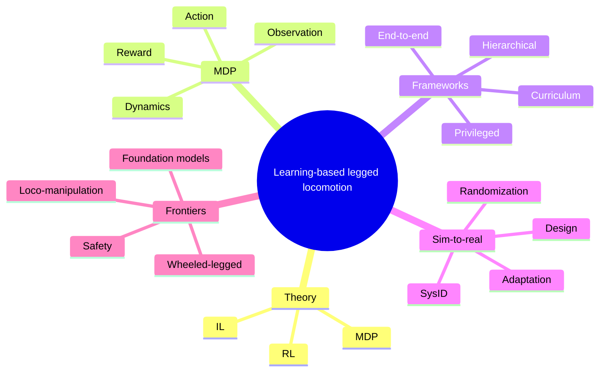

# Learning-based legged locomotion 文献阅读笔记

## 1. Paper Snapshot

- Title: `Learning-based legged locomotion: State of the art and future perspectives`
- Authors: `Sehoon Ha, Joonho Lee, Michiel van de Panne, Zhaoming Xie, Wenhao Yu, Majid Khadiv`
- Year: `2025`
- Venue: `The International Journal of Robotics Research (IJRR), Vol.44(8), 1396-1427`
- Paper type: `综述论文 (review paper)`
- Research domain: `腿足机器人 / 强化学习 / 模仿学习 / 运动控制`
- Main problem:
  - 这篇综述试图回答：在学习型腿足运动控制中，哪些问题是真正关键的，研究者通常怎样组织 observation、reward、action、learning framework 和 sim-to-real 路线。
- Core contribution:
  - 从“研究设计框架”而不是“单一算法”的角度总结 learning-based legged locomotion。
  - 将核心问题组织为 `MDP` 组成、训练框架、sim-to-real、control-learning 结合和未来前沿。
- Suitable use cases of this paper:
  - 综述入门
  - 写 related work
  - 梳理 observation / reward / action 的文献脉络
  - 了解 sim-to-real 与 privileged learning 的研究趋势

## 2. Overall Structure of the Paper

### 2.1 文章结构

1. `Introduction`
   - 解释 learning-based legged locomotion 为什么在近几年迅速发展。
2. `Theoretical background`
   - 用 `MDP`、`RL`、`DRL`、`behavior cloning / imitation learning` 建立统一术语。
3. `Components of MDP for locomotion`
   - 从 `dynamics`、`observation`、`reward`、`action space` 四个面总结 locomotion 任务建模。
4. `Learning frameworks`
   - 总结 `end-to-end`、`curriculum`、`hierarchical`、`privileged learning` 等训练组织方式。
5. `Sim-to-real transfer`
   - 总结系统设计、系统辨识、域随机化、域自适应等路线。
6. `Combining control and learning`
   - 讨论 model-based control 与 learning-based control 的互补与耦合方式。
7. `From quadrupeds to bipeds`
   - 讨论从四足向双足 / humanoid 的扩展。
8. `Unsolved problems and research frontiers`
   - 总结未来的重要研究方向。
9. `Societal impact`
   - 讨论武器化、就业替代、环境代价等问题。
10. `Conclusions`
   - 回收全文。

### 2.2 全文逻辑链

`领域为何兴起 -> 用什么理论描述 -> locomotion 任务如何建模 -> 训练如何组织 -> 怎么过 sim-to-real -> control 和 learning 如何结合 -> 如何扩展到更复杂平台 -> 未来问题在哪里`

## 3. Mind Map

### 3.1 Markdown Tree

- Learning-based legged locomotion
  - Historical enablers
    - hardware
    - simulator
    - deep RL
  - Theoretical background
    - MDP
    - RL
    - IL
  - MDP components
    - dynamics
    - observation
    - reward
    - action space
  - Learning frameworks
    - end-to-end
    - curriculum
    - hierarchical
    - privileged
  - Sim-to-real
    - good system design
    - system identification
    - domain randomization
    - domain adaptation
  - Combining control and learning
  - Quadruped to biped
  - Frontiers
    - unsupervised skill discovery
    - differentiable simulators
    - safety
    - wheeled-legged
    - loco-manipulation
    - foundation models

### 3.2 Mermaid Mindmap

## 4. 章节精读笔记

### 4.1 Section 3.2 Observation

#### 核心观点

作者指出，在 `MDP` 中，`observation` 的设计是决定策略学习效果的关键问题之一。因为机器人与环境状态并不能被完整、无噪地直接观测到，策略真正能利用的只是带噪声的传感器测量，因此“如何从观测中恢复有效状态表示”是 learning-based locomotion 的核心问题。

#### 本节作用

这一节相当于整篇综述中的一个“输入设计分类框架”。作者把 locomotion 中常见的输入分成三类：

- `proprioception`
- `exteroception`
- `task-related inputs`

这为后续理解不同 locomotion 方法提供了统一视角：  
不同方法的差异，不仅体现在算法名称上，也体现在 policy 输入的信息结构上。

### 4.2 Section 3.2.1 Proprioception（本体感知）

#### 段落 1：概念定义 + 传统输入方式

##### 段落主旨

本体感知 (`Proprioception`) 是指提供机器人内部状态信息的一组传感器。作者列出的典型传感器包括：

- `IMU (Inertial Measurement Unit, 惯性测量单元)`
- `Joint Encoders (关节编码器)`
- `Contact Sensors (接触传感器)`

但在足式机器人中，这些原始测量值通常不会直接输入策略，因为存在噪声、不准确和估计偏差。更常见的做法是通过 `state estimator (状态估计器)` 先恢复关键状态，例如：

- `base pose`
- `base twist`
- `joint position`
- `joint velocity`

这些估计后的状态通常被 DRL 文献称为 `proprioceptive states`。

##### 重点概念提炼

- `Proprioception`：机器人内部状态感知
- `Raw measurements`：原始传感器读数
- `State estimator`：状态估计器
- `Proprioceptive states`：估计后的、可供策略使用的内部状态表示

##### 学术含义

这一段说明：  
在机器人 RL 中，“本体感知”并不简单等于“传感器原始值”，而更常常指经过状态估计后的低维状态表示。  
这反映了传统机器人控制与学习控制之间的一个融合点：

`原始传感器 -> 状态估计 -> 策略决策`

##### 相关参考文献（按该段描述梳理）

- `Lee J, Hwangbo J, Wellhausen L, et al. (2020) Learning quadrupedal locomotion over challenging terrain. Science Robotics 5(47): eabc5986.`
- `Nahrendra IMA, Yu B and Myung H (2023) Dreamwaq: learning robust quadrupedal locomotion with implicit terrain imagination via deep reinforcement learning. In: 2023 IEEE International Conference on Robotics and Automation (ICRA). IEEE, 5078–5084.`
- `Yang R, Zhang M, Hansen N, et al. (2021) Learning vision-guided quadrupedal locomotion end-to-end with cross-modal transformers. arXiv preprint arXiv:2107.03996.`
- `Yu W, Yang C, McGreavy C, et al. (2023b) Identifying important sensory feedback for learning locomotion skills. Nature Machine Intelligence 5(8): 919–932.`

#### 段落 2：新趋势——直接使用原始传感器序列

##### 段落主旨

近期研究开始不再完全依赖预先估计的位姿和速度，而是尝试直接使用 `IMU measurements sequences` 和 `joint encoder data`。这代表了从“显式状态估计”向“学习式状态恢复”的转变。

##### 重点概念提炼

- `RNN-based state estimator`：基于循环神经网络的状态估计器
- `Model-based estimator`：传统基于模型的状态估计器
- `Privileged training`：训练时使用额外信息增强策略鲁棒性

##### 该段中的具体文献贡献

- `Ji et al. (2022a)`
  - 使用 `RNN-based state estimator`
  - 直接从原始 `IMU` 和编码器序列中恢复：
    - `base velocity`
    - `contact states`
- `Lee et al. (2024)`
  - 使用 `privileged training strategy`
  - 有效利用原始传感器数据序列，提高策略的鲁棒性

##### 学术含义

这一段体现出一个重要趋势：

传统管线：

`原始传感器 -> 解析式状态估计 -> 策略`

正在逐渐演化为：

`原始传感器序列 -> 学习式状态恢复 / 时序表示 -> 策略`

这意味着 RL policy 的输入设计正在从“人工构造状态”转向“可学习的时序状态表示”。

##### 相关参考文献

- `Ji G, Mun J, Kim H, et al. (2022a) Concurrent training of a control policy and a state estimator for dynamic and robust legged locomotion. IEEE Robotics and Automation Letters 7(2): 4630–4637.`
- `Lee J, Bjelonic M, Reske A, et al. (2024) Learning robust autonomous navigation and locomotion for wheeled-legged robots. Science Robotics 9(89): eadi9641. DOI: 10.1126/scirobotics.adi9641.`

#### 段落 3：为什么必须加入历史信息（history）

##### 段落主旨

作者强调：对于真实机器人，仅使用当前时刻观测通常是不够的。原因在于机器人系统具有：

- `hardware latencies`
- `partial observations`
- `state estimation errors`

因此，真实系统往往呈现 `non-Markovian characteristics`。为了缓解这些问题，策略输入几乎总是要加入 `short history buffer` 或 `memory`。

##### 重点概念提炼

- `Non-Markovian characteristics`：当前状态不足以完整描述未来演化
- `History buffer`：历史观测缓存
- `Policy with memory`：带记忆的策略
- `Dynamics randomization`：动力学随机化

##### 本段中的逻辑链条

1. 真实机器人存在延迟、噪声和信息缺失  
2. 当前观测不再严格满足 `Markov` 性  
3. 因此需要历史信息来隐式恢复隐藏状态  
4. 历史本体状态还能帮助识别：
   - `foot-terrain interactions`
   - `external disturbances`

##### 该段中的具体文献贡献

- `Yu et al. (2023b)`
  - 指出 `joint positions`、`base pose`、`base linear/angular velocities` 是鲁棒运动技能的重要输入
- `Lee et al. (2020)`
  - 强调 `proprioceptive state history` 和 `joint command history`
- `Ji et al. (2022a)`
  - 说明历史输入有助于接触状态和运动状态恢复
- `Haarnoja et al. (2019)`
  - 强调历史信息对处理非马尔可夫系统的重要性
- `Li et al. (2024b)`
  - 说明历史本体状态有助于推断足地交互与外扰
- `Peng et al. (2018b)`
  - 证明在 `dynamics randomization` 条件下，带记忆策略优于无记忆策略

##### 学术含义

这一段非常关键，因为它不是在说“history 有帮助”，而是在说：

`在真实 locomotion 中，history 几乎是必需的。`

这意味着 observation 设计正在从静态 `state vector` 走向 `temporal observation design`。

##### 相关参考文献

- `Yu W, Yang C, McGreavy C, et al. (2023b) Identifying important sensory feedback for learning locomotion skills. Nature Machine Intelligence 5(8): 919–932.`
- `Lee J, Hwangbo J, Wellhausen L, et al. (2020) Learning quadrupedal locomotion over challenging terrain. Science Robotics 5(47): eabc5986.`
- `Ji G, Mun J, Kim H, et al. (2022a) Concurrent training of a control policy and a state estimator for dynamic and robust legged locomotion. IEEE Robotics and Automation Letters 7(2): 4630–4637.`
- `Haarnoja T, Zhou A, Hartikainen K, et al. (2019) Soft actor-critic algorithms and applications. arXiv preprint arXiv:1812.05905.`
- `Li Z, Peng XB, Abbeel P, et al. (2024b) Reinforcement learning for versatile, dynamic, and robust bipedal locomotion control. arXiv preprint arXiv:2401.16889.`
- `Peng XB, Andrychowicz M, Zaremba W, et al. (2018b) Sim-to-real transfer of robotic control with dynamics randomization. In: 2018 IEEE International Conference on Robotics and Automation (ICRA). IEEE, 3803–3810.`

### 4.3 Section 3.2.2 Exteroception（外感知）

#### 段落 1：定义与传统路线

##### 核心内容

外感知 (`Exteroception`) 是机器人获取周围环境信息的传感层，尤其在非平地 locomotion 中非常重要。传统足式机器人常采用 `explicit mapping` 作为预处理，再供控制器或策略使用。典型方式包括：

- `Elevation mapping`
- `Voxel mapping`

早期感知驱动 locomotion 工作经常将高度图或局部地形采样结果作为策略输入。

##### 相关文献

- `Miki T, Wellhausen L, Grandia R, et al. (2022b) Elevation mapping for locomotion and navigation using gpu. In: 2022 IEEE/RSJ International Conference on Intelligent Robots and Systems (IROS). IEEE, 2273–2280.`
- `Oleynikova H, Taylor Z, Fehr M, et al. (2017) Voxblox: incremental 3d euclidean signed distance fields for on-board MAV planning. In: 2017 IEEE/RSJ International Conference on Intelligent Robots and Systems (IROS). IEEE, 1366–1373.`
- `Besselmann MG, Puck L, Steffen L, et al. (2021) Vdb-mapping: a high resolution and real-time capable 3d mapping framework for versatile mobile robots. In: 2021 IEEE 17th International Conference on Automation Science and Engineering (CASE). IEEE, 448–454.`
- `Miki T, Lee J, Hwangbo J, et al. (2022a) Learning robust perceptive locomotion for quadrupedal robots in the wild. Science Robotics 7(62): eabk2822.`
- `Xie Z, Da X, Babich B, et al. (2022) Glide: generalizable quadrupedal locomotion in diverse environments with a centroidal model. In: International Workshop on the Algorithmic Foundations of Robotics. Springer, 523–539.`

##### 段落意义

传统路线的核心思想是：

`先把原始环境数据加工成结构化几何表示，再送入控制器 / 策略。`

#### 段落 2：直接使用原始环境感知输入

##### 核心内容

近期工作减少了对显式 mapping 的依赖，转而将 `depth images` 或 `point clouds` 直接输入策略。作者指出，驱动力主要来自两类任务：

- 高动态任务：如 `parkour`、障碍物避让
- 高分辨率感知任务：如 `stepping stones`

这种做法的优势包括：

- 响应更快
- 感知链路更直接
- 减少 mapping failure 带来的误差传播

##### 相关文献

- `Zhuang Z, Fu Z, Wang J, et al. (2023) Robot parkour learning. arXiv preprint arXiv:2309.05665.`
- `Yang R, Zhang M, Hansen N, et al. (2021) Learning vision-guided quadrupedal locomotion end-to-end with cross-modal transformers. arXiv preprint arXiv:2107.03996.`
- `Duan H, Malik A, Gadde MS, et al. (2022) Learning dynamic bipedal walking across stepping stones. In: 2022 IEEE/RSJ International Conference on Intelligent Robots and Systems (IROS). IEEE, 6746–6752.`
- `Zhang C, Rudin N, Hoeller D, et al. (2023) Learning agile locomotion on risky terrains. arXiv preprint arXiv:2311.10484.`

##### 段落意义

这标志着环境输入从“中间表示驱动”走向“原始感知驱动”，研究范式更偏向 end-to-end learning。

#### 段落 3：RGB、语义与潜在表征

##### 核心内容

作者指出，除了几何信息，`RGB` 图像还能提供：

- `texture`
- `color`
- `scene semantics`

因此它可以用于更高级别的导航与环境理解，例如：

- 人行道导航
- 语义避障
- 地形类别识别
- `traversability estimation`

此外，也可以先学习 `compressed representation` 或 `latent space`，再输入策略，以减轻高维视觉输入的负担。

##### 相关文献

- `Sorokin M, Tan J, Liu CK, et al. (2022) Learning to navigate sidewalks in outdoor environments. IEEE Robotics and Automation Letters 7(2): 3906–3913.`
- `Yang Y, Meng X, Yu W, et al. (2023c) Learning semantics-aware locomotion skills from human demonstration. In: Conference on Robot Learning. PMLR, 2205–2214.`
- `Margolis GB, Fu X, Ji Y, et al. (2023) Learning to see physical properties with active sensing motor policies. arXiv preprint arXiv:2311.01405.`
- `Hoeller D, Wellhausen L, Farshidian F, et al. (2021) Learning a state representation and navigation in cluttered and unstructured environments. IEEE Robotics and Automation Letters 6(3): 5081–5088.`
- `Yang R, Yang G and Wang X (2023b) Neural volumetric memory for visual locomotion control. In: Proceedings of the IEEE/CVF Conference on Computer Vision and Pattern Recognition, 1430–1440.`

##### 段落意义

该段说明外感知已经不再只是“看地形几何”，而是在逐渐过渡到：

`几何感知 -> 语义感知 -> 表征学习辅助决策`

### 4.4 Section 3.2.3 Task-related inputs（任务相关输入）

#### 核心内容

除了本体感知和外感知，策略还可接收与任务本身相关的信息作为输入。作者指出，这类信息更像 `goals` 而不完全是 observation，但为了叙述简洁仍放在 observation 章节中。具体包括：

- `velocity commands`
- `pose commands`
- `learned task embeddings`
- `phase / trajectory parameters`
- `future reference trajectories`
- `planned footholds`

#### 相关文献与对应作用

- `Rudin N, Hoeller D, Bjelonic M, et al. (2022a) Advanced skills by learning locomotion and local navigation end-to-end. In: 2022 IEEE/RSJ International Conference on Intelligent Robots and Systems (IROS). IEEE, 2497–2503.`
  - 将 `pose command` 作为输入
- `Peng XB, Guo Y, Halper L, et al. (2022) Ase: large-scale reusable adversarial skill embeddings for physically simulated characters. ACM Transactions on Graphics 41(4): 1–17.`
  - 使用参考运动的 latent skill embedding
- `Haarnoja T, Tang H, Abbeel P, et al. (2018a) Latent space policies for hierarchical reinforcement learning. In: International Conference on Machine Learning. PMLR, 1851–1860.`
  - latent space 用于指导低层行为
- `Iscen A, Caluwaerts K, Tan J, et al. (2018) Policies modulating trajectory generators. In: Conference on Robot Learning. PMLR, 916–926.`
  - 在结构化动作空间中引入 phase / trajectory information
- `Lee J, Hwangbo J, Wellhausen L, et al. (2020) Learning quadrupedal locomotion over challenging terrain. Science Robotics 5(47): eabc5986.`
  - 在策略输入中使用与任务相关的 phase / trajectory information
- `Ma Y, Farshidian F, Miki T, et al. (2022) Combining learning-based locomotion policy with model-based manipulation for legged mobile manipulators. IEEE Robotics and Automation Letters 7(2): 2377–2384.`
  - 将机械臂末端规划轨迹作为额外输入
- `Gangapurwala S, Geisert M, Orsolino R, et al. (2022) Terrain-aware legged locomotion using reinforcement learning and optimal control. IEEE Transactions on Robotics 38(5): 2908–2927.`
  - 使用 `planned footholds / trajectories` 作为 reference
- `Jenelten F, He J, Farshidian F, et al. (2024) Dtc: deep tracking control. arXiv preprint arXiv:2403.07853.`
  - 使用 planned footholds / trajectories
- `Hoeller D, Rudin N, Sako D, et al. (2023) Anymal parkour: learning agile navigation for quadrupedal robots. Science Robotics 9(88): eadi7566.`
- `Zhuang Z, Fu Z, Wang J, et al. (2023) Robot parkour learning. arXiv preprint arXiv:2309.05665.`
- `Cheng X, Shi K, Agarwal A, et al. (2023c) Extreme parkour with legged robots. arXiv preprint arXiv:2309.14341.`
  - 这些工作更偏向直接学习单一独立策略，而不依赖参考轨迹

#### 段落意义

这一小节本质上讨论的是：

`策略到底是纯反应式控制器，还是带目标引导 / 参考引导的控制器？`

作者实际上总结了两条路线：

- `Reference-guided policy`
- `Single independent policy`

### 4.5 Section 3.3 Reward

#### 核心观点

作者指出，`reward` 是 RL 中最直接的行为定义器。它决定机器人会把什么样的行为当作“好行为”。

#### 本节作用

这一节相当于在总结：当前 locomotion 文献里，研究者一般怎么把“想要的行为”编码进 reward。

#### 段落 1：Manual reward shaping

##### 核心内容

手工奖励塑形 (`manual reward shaping`) 的典型做法是把多个 reward / penalty 项线性组合起来。常见项包括：

- `velocity tracking`
- `pose tracking`
- `joint velocity`
- `joint acceleration`
- `joint torques`
- `joint mechanical power`
- `action rate`
- `action smoothness`

作者特别强调：

- 没有通用 reward 模板
- reward 设计高度依赖任务
- 常见稳定化技巧是使用 bounded functions，例如 clipping 或 exponential kernels

##### 段落意义

这说明 reward engineering 仍然是 locomotion 中非常强的人工设计环节，难点不在公式本身，而在“如何把任务目标和物理约束编码进 reward”。

##### 相关参考文献

- `Lee J, Hwangbo J, Wellhausen L, et al. (2020) Learning quadrupedal locomotion over challenging terrain. Science Robotics 5(47): eabc5986.`
- `Rudin N, Hoeller D, Reist P, et al. (2022b) Learning to walk in minutes using massively parallel deep reinforcement learning. In: Conference on Robot Learning. PMLR, 91–100.`
- `Duan H, Malik A, Gadde MS, et al. (2022) Learning dynamic bipedal walking across stepping stones. In: 2022 IEEE/RSJ International Conference on Intelligent Robots and Systems (IROS). IEEE, 6746–6752.`

#### 段落 2：Imitation reward

##### 核心内容

作者指出，由于动物和人的运动方式天然提供了参考，研究者可以直接用 motion capture、专家轨迹或优化轨迹来构造 imitation reward。相比手工 shaping，这条路线的优势在于减少了 reward engineering 的负担。

进一步地，文中把 `GAIL` 和 `AMP` 也归入这一类思路：不再只是模仿某一条轨迹，而是学习一类动作风格先验。

##### 相关文献

- `Peng XB, Abbeel P, Levine S, et al. (2018a) Deepmimic: example-guided deep reinforcement learning of physics-based character skills. ACM Transactions on Graphics 37(4): 1–14.`
- `Peng XB, Coumans E, Zhang T, et al. (2020) Learning agile robotic locomotion skills by imitating animals. arXiv preprint arXiv:2004.00784.`
- `Han L, Zhu Q, Sheng J, et al. (2023) Lifelike agility and play on quadrupedal robots using adversarial skill embeddings. arXiv preprint arXiv:2301.10906.`
- `Yang R, Chen Z, Ma J, et al. (2023a) Generalized animal imitator: agile locomotion with versatile motion prior. arXiv preprint arXiv:2310.01408.`
- `Reske A, Carius J, Ma Y, et al. (2021) Imitation learning from mpc for quadrupedal multi-gait control. In: 2021 IEEE International Conference on Robotics and Automation (ICRA). IEEE, 5014–5020.`
- `Fuchioka Y, Xie Z and Van de Panne M (2023) Opt-mimic: imitation of optimized trajectories for dynamic quadruped behaviors. In: 2023 IEEE International Conference on Robotics and Automation (ICRA). IEEE, 5092–5098.`
- `Bogdanovic M, Khadiv M and Righetti L (2022) Model-free reinforcement learning for robust locomotion using demonstrations from trajectory optimization. Frontiers in Robotics and AI 9: 6.`
- `Ho J and Ermon S (2016) Generative adversarial imitation learning. Advances in Neural Information Processing Systems 29: 4565–4573.`
- `Escontrela A, Peng XB, Yu W, et al. (2022) Adversarial motion priors make good substitutes for complex reward functions. In: 2022 IEEE/RSJ International Conference on Intelligent Robots and Systems (IROS). IEEE, 25–32.`
- `Vollenweider E, Bjelonic M, Klemm V, et al. (2023) Advanced skills through multiple adversarial motion priors in reinforcement learning. In: 2023 IEEE International Conference on Robotics and Automation (ICRA). IEEE, 5120–5126.`

### 4.6 Section 3.4 Action Space

#### 核心内容

作者指出，`action space` 的选择会直接影响：

- 探索效率
- 控制性能
- 训练难度
- sim-to-real 难度

#### 段落 1：Low-level joint commands

最常见做法是 `joint target position`，也就是综述中说的 `PD policy`。  
作者强调：

- 它在工程上最常见
- 运行频率要求较低
- sim-to-real 一般更容易

但作者也特别提醒：  
这里的 `PD policy` 不等于传统机器人学里的 position control。它不是在跟踪预先给定的时序轨迹，而是策略每一步都输出目标位置。

#### 段落 2：Torque policy

直接输出 `torque` 的优点是更自由，不受 PD 结构约束；缺点是需要更高控制频率，对部署更苛刻。

#### 段落 3：Structured action spaces

作者总结的结构化动作空间包括：

- `task-space control`
- `residual RL`
- `CPG parameter modulation`
- `COM acceleration output`

这些方法的共同点是：  
将先验结构嵌入动作空间，以提升学习效率，但代价是动作表示不再完全通用。

#### 相关参考文献

- `Peng XB and Van De Panne M (2017) Learning locomotion skills using deeprl: does the choice of action space matter? In: Proceedings of the ACM SIGGRAPH/Eurographics Symposium on Computer Animation, 1–13.`
- `Bogdanovic M, Khadiv M and Righetti L (2020) Learning variable impedance control for contact sensitive tasks. IEEE Robotics and Automation Letters 5(4): 6129–6136.`
- `Chen S, Zhang B, Mueller MW, et al. (2023) Learning torque control for quadrupedal locomotion. In: 2023 IEEE-RAS 22nd International Conference on Humanoid Robots (Humanoids). IEEE, 1–8.`
- `Duan H, Dao J, Green K, et al. (2021) Learning task space actions for bipedal locomotion. In: 2021 IEEE International Conference on Robotics and Automation (ICRA). IEEE, 1276–1282.`
- `Castillo GA, Weng B, Yang S, et al. (2023) Template model inspired task space learning for robust bipedal locomotion. In: 2023 IEEE/RSJ International Conference on Intelligent Robots and Systems (IROS). IEEE, 8582–8589.`
- `Johannink T, Bahl S, Nair A, et al. (2019) Residual reinforcement learning for robot control. In: 2019 International Conference on Robotics and Automation (ICRA). IEEE, 6023–6029.`
- `Iscen A, Caluwaerts K, Tan J, et al. (2018) Policies modulating trajectory generators. In: Conference on Robot Learning. PMLR, 916–926.`
- `Bellegarda G and Ijspeert A (2022) Cpg-rl: learning central pattern generators for quadruped locomotion. IEEE Robotics and Automation Letters 7(4): 12547–12554.`
- `Xie Z, Da X, Babich B, et al. (2022) Glide: generalizable quadrupedal locomotion in diverse environments with a centroidal model. In: International Workshop on the Algorithmic Foundations of Robotics. Springer, 523–539.`

### 4.7 Section 4 Learning Frameworks

#### 核心内容

作者总结了四类主流训练组织方式：

- `End-to-end learning`
- `Curriculum learning`
- `Hierarchical learning`
- `Privileged learning`

#### 4.7.1 End-to-end learning

最直接的方式是把整个问题当作单一 `MDP` 端到端学习。作者指出：

- `TRPO` 与 `PPO` 是最常见选择
- 原因是其保守更新和较强的最终性能
- 但如果任务太难、初始探索得不到有效信号，纯端到端会比较困难

#### 4.7.2 Curriculum learning

课程学习的核心不是“多换几个地形”，而是：

- 从易到难组织训练
- 决定何时升级
- 决定下一阶段难度是什么

作者指出，terrain difficulty、扰动大小、约束强度都可以作为 curriculum 维度。

#### 4.7.3 Hierarchical learning

分层学习适合长时域任务，比如 navigation 或 soccer。它的核心思想是把任务拆成：

- `high-level task / planner`
- `low-level skill / controller`

高层输出可以是：

- footholds
- latent skill
- trajectory plan

#### 4.7.4 Privileged learning

作者把这一节视作 rough terrain locomotion 的关键路线之一。其核心思想是：

- teacher 在仿真中看到真实部署时不可得的 privileged info
- student 只用真实可获得的传感器历史

这是一种把 `RL + imitation + representation learning` 结合起来的训练框架。

#### 相关参考文献

- `Schulman J, Levine S, Abbeel P, et al. (2015) Trust region policy optimization. In: International Conference on Machine Learning. PMLR, 1889–1897.`
- `Schulman J, Wolski F, Dhariwal P, et al. (2017) Proximal policy optimization algorithms. arXiv preprint arXiv:1707.06347.`
- `Rudin N, Hoeller D, Reist P, et al. (2022b) Learning to walk in minutes using massively parallel deep reinforcement learning. In: Conference on Robot Learning. PMLR, 91–100.`
- `Xie Z, Ling HY, Kim NH, et al. (2020b) ALLSTEPS: curriculum-driven learning of stepping stone skills. In: Computer Graphics Forum. Wiley Online Library, Vol. 39, 213–224.`
- `Peng XB, Berseth G, Yin K, et al. (2017) Deeploco: dynamic locomotion skills using hierarchical deep reinforcement learning. ACM Transactions on Graphics 36(4): 1–13.`
- `Chen D, Zhou B, Koltun V, et al. (2020) Learning by cheating. In: Conference on Robot Learning. PMLR, 66–75.`
- `Lee J, Hwangbo J, Wellhausen L, et al. (2020) Learning quadrupedal locomotion over challenging terrain. Science Robotics 5(47): eabc5986.`
- `Miki T, Lee J, Hwangbo J, et al. (2022a) Learning robust perceptive locomotion for quadrupedal robots in the wild. Science Robotics 7(62): eabk2822.`
- `Agarwal A, Kumar A, Malik J, et al. (2023) Legged locomotion in challenging terrains using egocentric vision. In: Conference on Robot Learning. PMLR, 403–415.`

### 4.8 Section 5 Sim-to-real transfer

#### 核心观点

作者认为，sim-to-real gap 不是一个附属问题，而是 learning-based locomotion 能否真正落地的核心障碍之一。

#### 本节作用

这一节相当于在回答：  
如果策略是在仿真中学出来的，为什么到了真实机器人上常常会失败？研究界通常怎么解决？

#### 4.8.1 Good system design

作者强调，一个设计得不好的训练系统会让策略学会“利用仿真器漏洞”，从而直接毁掉 sim-to-real。  
因此系统设计本身就是 sim-to-real 的第一层方法。

具体包括：

- `reward design`
- `observation and action space design`
- `domain knowledge`

文中例子包括：

- 用 `joint acceleration penalty`、`foot air time reward`、`foot impact penalty` 避免抖动、拖地、踩踏
- 用较低 `PD gain` 获得更顺从的行为
- 用对称性约束、动作风格先验、CPG 结构引导更自然的 gait

#### 4.8.2 System identification

作者指出，两个主要 gap 来源是：

- `actuator dynamics mismatch`
- `contact model mismatch`

典型做法包括：

- 学习 actuator model
- 引入更真实的 compliant contact model

#### 4.8.3 Domain randomization

作者把 domain randomization 的核心逻辑概括为：

如果策略能在足够多样的训练分布上都表现良好，那么真实环境更可能落在这个分布覆盖范围内。

在 locomotion 里，常被随机化的内容包括：

- `robot mass`
- `friction coefficient`
- `motor strength`
- `latency`
- 视觉参数和噪声模型

#### 4.8.4 Domain adaptation

与 domain randomization 相比，domain adaptation 更进一步：  
它不是简单让策略对“所有情况都鲁棒”，而是试图识别当前环境属于哪一类，然后让策略针对当前场景自适应。

作者总结了两条主要路线：

- 显式识别环境参数
- 学习隐式 latent representation 来表示环境

#### 相关参考文献

- `Tan J, Zhang T, Coumans E, et al. (2018) Sim-to-real: learning agile locomotion for quadruped robots. arXiv preprint arXiv:1804.10332.`
- `Hwangbo J, Lee J, Dosovitskiy A, et al. (2019) Learning agile and dynamic motor skills for legged robots. Science Robotics 4(26): eaau5872.`
- `Xie Z, Da X, Van de Panne M, et al. (2021) Dynamics randomization revisited: a case study for quadrupedal locomotion. In: 2021 IEEE International Conference on Robotics and Automation (ICRA). IEEE, 4955–4961.`
- `Xie Z, Clary P, Dao J, et al. (2020a) Learning locomotion skills for cassie: iterative design and sim-to-real. In: Conference on Robot Learning. PMLR, 317–329.`
- `Smith L, Kew JC, Li T, et al. (2023) Learning and adapting agile locomotion skills by transferring experience. arXiv preprint arXiv:2304.09834.`
- `Choi S, Ji G, Park J, et al. (2023) Learning quadrupedal locomotion on deformable terrain. Science Robotics 8(74): eade2256.`
- `Tobin J, Fong R, Ray A, et al. (2017) Domain randomization for transferring deep neural networks from simulation to the real world. In: 2017 IEEE/RSJ International Conference on Intelligent Robots and Systems (IROS). IEEE, 23–30.`
- `Yu W, Tan J, Liu CK, et al. (2017) Preparing for the unknown: learning a universal policy with online system identification. In: Proceedings of Robotics: Science and Systems. Cambridge, Massachusetts. DOI: 10.15607/RSS.2017.XIII.048.`
- `Yu W, Tan J, Bai Y, et al. (2020) Learning fast adaptation with meta strategy optimization. IEEE Robotics and Automation Letters 5(2): 2950–2957.`

### 4.9 Section 6 Combining control and learning

#### 核心内容

作者明确反对把 `control` 和 `learning` 看成非此即彼的两条路线。文中给出的核心判断是：

- model-based control 擅长利用动力学知识、显式处理约束
- learning-based control 擅长处理不确定性、融合复杂感知、降低在线计算负担

因此更现实的问题不是“谁替代谁”，而是“二者怎么组合”。

#### 作者给出的四类组合方式

1. `Learning control parameters`
   - 学控制器参数，而不是直接学控制器本身
2. `Learning a high-level policy`
   - 学一个高层策略，为 model-based controller 提供命令
3. `Learning for efficient model-based control`
   - 用学习方法近似 value / Hamiltonian / warm-start，降低模型控制的在线计算负担
4. `Model-based control for efficient learning`
   - 用 trajectory optimization / MPC 来指导 RL，提高样本效率

#### 段落意义

这一章的重要性在于，它把“learning-based locomotion”从纯端到端神经策略扩展成了更宽的系统设计视角。

#### 相关参考文献

- `Gangapurwala S, Geisert M, Orsolino R, et al. (2022) Terrain-aware legged locomotion using reinforcement learning and optimal control. IEEE Transactions on Robotics 38(5): 2908–2927.`
- `Viereck J and Righetti L (2021) Learning a centroidal motion planner for legged locomotion. In: 2021 IEEE International Conference on Robotics and Automation (ICRA). IEEE, 4905–4911.`
- `Reske A, Carius J, Ma Y, et al. (2021) Imitation learning from mpc for quadrupedal multi-gait control. In: 2021 IEEE International Conference on Robotics and Automation (ICRA). IEEE, 5014–5020.`
- `Bogdanovic M, Khadiv M and Righetti L (2022) Model-free reinforcement learning for robust locomotion using demonstrations from trajectory optimization. Frontiers in Robotics and AI 9: 6.`
- `Fuchioka Y, Xie Z and Van de Panne M (2023) Opt-mimic: imitation of optimized trajectories for dynamic quadruped behaviors. In: 2023 IEEE International Conference on Robotics and Automation (ICRA). IEEE, 5092–5098.`

### 4.10 Section 8 Unsolved problems and research frontiers

#### 核心内容

作者认为，当前 learning-based locomotion 虽然已经取得很大成功，但仍存在几个没有解决的核心问题：

- reward engineering 负担重
- 样本效率仍低
- 在高风险场景下的安全性仍不足
- locomotion 与 manipulation 的耦合问题才刚开始

#### 作者点出的未来方向

- `unsupervised skill discovery`
- `differentiable simulators`
- `traversing challenging environments`
- `safety`
- `hybrid wheeled-legged locomotion`
- `loco-manipulation`
- `foundation models`

#### 段落意义

这部分不是已有方法总结，而是作者对未来研究地图的归纳。它说明未来的重点，不再只是“让机器人会走”，而是：

- 更少人工设计
- 更强泛化
- 更高安全性
- 更复杂任务耦合

#### 相关参考文献

- `Sharma A, Ahn M, Levine S, et al. (2020) Emergent real-world robotic skills via unsupervised off-policy reinforcement learning. arXiv preprint arXiv:2004.12974.`
- `Schwarke C, Klemm V, Tordesillas J, et al. (2024) Learning quadrupedal locomotion via differentiable simulation. arXiv preprint arXiv:2404.02887.`
- `Zhuang Z, Fu Z, Wang J, et al. (2023) Robot parkour learning. arXiv preprint arXiv:2309.05665.`
- `Cheng X, Shi K, Agarwal A, et al. (2023c) Extreme parkour with legged robots. arXiv preprint arXiv:2309.14341.`
- `Xu Z, Raj AH, Xiao X, et al. (2024) Dexterous legged locomotion in confined 3d spaces with reinforcement learning. arXiv preprint arXiv:2403.03848.`
- `Yang T-Y, Zhang T, Luu L, et al. (2022b) Safe reinforcement learning for legged locomotion. In: 2022 IEEE/RSJ International Conference on Intelligent Robots and Systems (IROS). IEEE, 2454–2461.`
- `Lee J, Bjelonic M, Reske A, et al. (2024) Learning robust autonomous navigation and locomotion for wheeled-legged robots. Science Robotics 9(89): eadi9641.`
- `Fu Z, Cheng X and Pathak D (2023) Deep whole-body control: learning a unified policy for manipulation and locomotion. In: Conference on Robot Learning. PMLR, 138–149.`
- `Brohan A, Brown N, Carbajal J, et al. (2023) Rt-2: vision-language-action models transfer web knowledge to robotic control. arXiv preprint arXiv:2307.15818.`

## 5. 关键知识点梳理

### 5.1 本文知识主线

这篇综述可以压缩成下面这条主线：

`Observation / Reward / Action design -> State and behavior representation -> Training framework -> Sim-to-real -> Real-world deployability`

作者想表达的不是“PPO 最常见”这么简单，而是：

- 输入信息如何组织
- 动作如何表示
- 奖励如何编码
- 训练如何分阶段组织
- 仿真与真实如何对齐

这些问题共同决定了 learning-based locomotion 是否真的有效。

### 5.2 关键结论归纳

#### 结论 1

`Observation design` 是 locomotion learning 的核心。  
policy 成功与否不仅取决于算法，还取决于输入中是否同时覆盖：

- 机器人自身状态
- 周围环境信息
- 任务目标信息

#### 结论 2

本体感知不等于原始传感器值。  
在很多工作中，它更常指经过状态估计后的 `proprioceptive states`。

#### 结论 3

时序信息非常关键。  
由于真实机器人存在延迟、部分观测和估计误差，`history / memory` 在实际 locomotion 中几乎是必需的。

#### 结论 4

外感知路线正在从：

`显式建图 -> 直接感知 -> 语义感知 -> 表征学习`

逐步演化。

#### 结论 5

任务输入决定了策略是否“有目标”。  
速度命令、参考轨迹、task embedding 让策略从“会动”变成“朝着目标去动”。

#### 结论 6

reward engineering 依然是瓶颈。  
因此 imitation reward、AMP、privileged learning、domain adaptation 等方法越来越重要。

#### 结论 7

control 与 learning 的关系不是替代，而是组合。  
未来很多系统会是层次化、混合式的，而不是纯端到端神经控制。

## 6. 术语表（中英对照）

- 本体感知 — `Proprioception`
- 外感知 — `Exteroception`
- 观测 — `Observation`
- 状态估计器 — `State estimator`
- 本体感知状态 — `Proprioceptive states`
- 基座位姿 — `Base pose`
- 基座速度 / 扭转状态 — `Base twist`
- 特权训练 — `Privileged training`
- 非马尔可夫特性 — `Non-Markovian characteristics`
- 部分可观测性 — `Partial observability`
- 历史缓冲区 — `History buffer`
- 动力学随机化 — `Dynamics randomization`
- 高程图 — `Elevation mapping`
- 体素图 — `Voxel mapping`
- 深度图 — `Depth image`
- 点云 — `Point cloud`
- 语义信息 — `Semantic information`
- 可通行性估计 — `Traversability estimation`
- 潜在空间 — `Latent space`
- 任务嵌入 — `Task embedding`
- 参考轨迹 — `Reference trajectory`
- 落脚点规划 — `Planned footholds`
- 系统辨识 — `System identification`
- 域自适应 — `Domain adaptation`

## 7. Important References Mentioned in This Paper

### 7.1 基础 RL / locomotion

- `Schulman J, Levine S, Abbeel P, et al. (2015) Trust region policy optimization. In: International Conference on Machine Learning. PMLR, 1889–1897.`
- `Schulman J, Wolski F, Dhariwal P, et al. (2017) Proximal policy optimization algorithms. arXiv preprint arXiv:1707.06347.`
- `Tan J, Zhang T, Coumans E, et al. (2018) Sim-to-real: learning agile locomotion for quadruped robots. arXiv preprint arXiv:1804.10332.`
- `Hwangbo J, Lee J, Dosovitskiy A, et al. (2019) Learning agile and dynamic motor skills for legged robots. Science Robotics 4(26): eaau5872.`
- `Lee J, Hwangbo J, Wellhausen L, et al. (2020) Learning quadrupedal locomotion over challenging terrain. Science Robotics 5(47): eabc5986.`

### 7.2 感知与表示

- `Miki T, Lee J, Hwangbo J, et al. (2022a) Learning robust perceptive locomotion for quadrupedal robots in the wild. Science Robotics 7(62): eabk2822.`
- `Agarwal A, Kumar A, Malik J, et al. (2023) Legged locomotion in challenging terrains using egocentric vision. In: Conference on Robot Learning. PMLR, 403–415.`
- `Yu W, Yang C, McGreavy C, et al. (2023b) Identifying important sensory feedback for learning locomotion skills. Nature Machine Intelligence 5(8): 919–932.`

### 7.3 模仿与动作先验

- `Peng XB, Abbeel P, Levine S, et al. (2018a) Deepmimic: example-guided deep reinforcement learning of physics-based character skills. ACM Transactions on Graphics 37(4): 1–14.`
- `Peng XB, Coumans E, Zhang T, et al. (2020) Learning agile robotic locomotion skills by imitating animals. arXiv preprint arXiv:2004.00784.`
- `Escontrela A, Peng XB, Yu W, et al. (2022) Adversarial motion priors make good substitutes for complex reward functions. In: 2022 IEEE/RSJ International Conference on Intelligent Robots and Systems (IROS). IEEE, 25–32.`

### 7.4 sim-to-real 与自适应

- `Xie Z, Da X, Van de Panne M, et al. (2021) Dynamics randomization revisited: a case study for quadrupedal locomotion. In: 2021 IEEE International Conference on Robotics and Automation (ICRA). IEEE, 4955–4961.`
- `Yu W, Tan J, Liu CK, et al. (2017) Preparing for the unknown: learning a universal policy with online system identification. In: Proceedings of Robotics: Science and Systems. Cambridge, Massachusetts. DOI: 10.15607/RSS.2017.XIII.048.`
- `Yu W, Tan J, Bai Y, et al. (2020) Learning fast adaptation with meta strategy optimization. IEEE Robotics and Automation Letters 5(2): 2950–2957.`

## 8. Reusable Literature Review Paragraph

`Ha 等（2025）对 learning-based legged locomotion 进行了系统综述。与仅按算法类别梳理的综述不同，该文从 MDP 组成、训练框架、sim-to-real 迁移以及 control-learning 融合等层面组织已有研究。作者指出，腿足运动学习近年来的快速发展并不是单一算法突破的结果，而是由硬件可得性提升、高性能接触仿真器成熟以及深度强化学习在高维连续控制中的扩展能力共同推动。`

`在方法层面，文章强调 policy 的效果不仅取决于使用 PPO、TRPO 或其他算法，更深层地取决于 observation、reward、action space 与训练组织方式的共同设计。作者将 observation 划分为 proprioception、exteroception 和 task-related inputs，将 learning framework 归纳为 end-to-end、curriculum、hierarchical 和 privileged learning，并总结了系统设计、系统辨识、域随机化和域自适应等 sim-to-real 路线。这些总结为理解当前 learning-based locomotion 的主流研究范式提供了清晰框架。`
