# Control of Rough Terrain Vehicles Using Deep Reinforcement Learning

Viktor Wiberg , Erik Wallin, Tomas Nordfjell, and Martin Servin

Abstract—We explore the potential to control terrain vehicles using deep reinforcement in scenarios where human operators and traditional control methods are inadequate. This letter presents a controller that perceives, plans, and successfully controls a 16-tonne forestry vehicle with two frame articulation joints, six wheels, and their actively articulated suspensions to traverse rough terrain. The carefully shaped reward signal promotes safe, environmental, and efficient driving, which leads to the emergence of unprecedented driving skills. We test learned skills in a virtual environment, including terrains reconstructed from high-density laser scans of forest sites. The controller displays the ability to handle obstructing obstacles, slopes up to $2 7 ^ { \circ }$ , and a variety of natural terrains, all with limited wheel slip, smooth, and upright traversal with intelligent use of the active suspensions. The results confirm that deep reinforcement learning has the potential to enhance control of vehicles with complex dynamics and high-dimensional observation data compared to human operators or traditional control methods, especially in rough terrain.

Index Terms—Deep learning methods, reinforcement learning, autonomous vehicle navigation, model learning for control, robotics and automation in agriculture and forestry.

# I. INTRODUCTION

D EEP reinforcement learning has recently shown promisefor locomotion tasks, but its usefulness to learn control of heavy vehicles in rough terrain is widely unknown. Conventionally, the design of rough terrain vehicles strives to promote high traversability and be easily operated by humans. The drivelines involve differentials and bogie suspension that provide ground compliance and reduces the many degrees of freedom, leaving only speed and heading for the operator to control. An attractive alternative is to use actively articulated suspensions and individual wheel control. These have the potential to reduce the energy consumption and ground damage, yet increase traversability and tip over stability [1]–[5]. The concepts have been a reappearing topic in planetary exploration, military, construction, agriculture, and forestry applications, but not yet reached the maturity of practical use [6]. However, there is reason to believe that the full potential of the vehicles is not being utilized. The benefits of active suspension and individual wheel control can only be unlocked if the many degrees of freedom are controlled at sufficient speed, precision, and robustness. Traditional control methods are not well suited to account for the vehicle dynamics and the surrounding environment observed through highdimensional sensor data, which raises a need for alternatives.

Only in recent years has reinforcement learning (RL) emerged as a candidate approach for smart control in locomotion applications. Deep learning based control of legged locomotion demonstrate robustness over a variety of environments and learnt behaviour not seen before [7]. The success in legged locomotion indicates the capability of deep RL to learn control of wheeled ground vehicles. However, only a handful of papers deal with RL applied to wheeled ground vehicles [8], [9]. Local navigation using RL in rough terrain is addressed in [8] with improved performance over traditional planning methods. Their application to search and rescue robots considers safe traversal but discards energy consumption, explicit wheel slip, and ground damage; important aspects in agriculture and forestry. In addition, they only use a 3-dimensional, binary control signal. To the best of our knowledge, RL has not yet been applied to wheeled ground vehicles in rough terrain with high dimensional, continuous, control signals.

To test the usefulness of deep RL on vehicles in rough terrain, we use physics-based simulation to develop a controller for a novel concept forwarder, with actively articulated suspensions and individual control of its six wheels. Based on a 634-dimensional observation attainable from onboard sensors, we demonstrate learned skills on challenging terrains with steep slopes and obstacles, where performance is measured in terms of our reward signal. A reward carefully designed to encapsulate safety, energy consumption, environmental impact, and success of the overall goal; to reach a specified vehicle pose. A forestry use case is studied using a forest terrain reconstructed from high-density laser scans, where the controller is assigned a sequence of waypoints along a transport route. We assess model robustness and domain transferability by varying friction and vehicle load.

# II. BACKGROUND

Wheeled locomotion in rough terrain involves perceiving the terrain features to make up time and energy-efficient motion plans. Preferably, the motion plans are without risk of getting stuck on obstacles or damaging sensitive parts of the vehicle. Traversing the terrain involves controlling the actuators and making use of sensor data for estimating the current state. Some wheel slip is inevitable, but excessive slip is associated with ground damage and unnecessary fuel consumption. Tipping over is a rare but disastrous event, but with higher risk when the vehicle carries a load.

With active suspensions, a vehicle can distribute its load on the wheels to maximise traction or minimise ground pressure, cross otherwise impassable obstacles, and shift its centre of mass to handle inclined terrain. Individual wheel control can reduce wheel slip and shearing soil surface compared to wheeled and tracked bogies.

We address smart control applied to forestry and the Xt28 forwarder (eXtractor AB). The Xt28 has individual wheel control and actively articulated suspensions, designed for slopy, rough terrain, and the aim to reduce soil compaction and shearing. A typical forestry scenario involves an approximate route, where we assume that a global path planner provides target locations, see Fig. 11. In cut-to-length logging, the dominating method in Europe [10], targets can be manually extracted from the harvester route. Alternatively, a more general and sophisticated way is to use a trafficability map [11]. To take into consideration all the aforementioned rough terrain objectives, coupled with the many control degrees of freedom of the Xt28 is a challenging task. In this paper, we explore learning a control policy using reinforcement learning.

# A. Reinforcement Learning

Reinforcement learning is a process of interaction between an agent (controller) and its environment. An environment consists of a state space $\boldsymbol { s }$ , action space $\mathcal { A }$ , transition probabilities $p ( s ^ { \prime } | s , a )$ , and a reward function $r : S \times \mathcal { A }  \mathbb { R }$ . At each step, the agent selects an action following its policy $a \sim \pi ( \cdot , s )$ and current state $s$ , and the environment responds with a new state $s ^ { \prime }$ and reward $r = r ( s , a ) .$ . The goal of the agent is to maximize the expected future sum of discounted rewards $\mathbb { E } _ { \pi } [ R _ { t } | s _ { t } ]$ , where $\begin{array} { r } { R _ { t } = \sum _ { k = 0 } ^ { \infty } \gamma ^ { k } r _ { t + k + 1 } } \end{array}$ is called the return and the discount factor, $\gamma \in [ 0 , 1 ]$ , values the importance of short-term, compared to long-term rewards.

In the actor-critic framework, the actor contains the policy, which in deep RL is modelled as a neural network with parameters $\theta$ . The role of the actor is to sample actions from its policy, $\pi _ { \theta }$ , and adjust its parameters as suggested by the critic. The critic, or state-value function $V ^ { \pi } ( s ) = \mathbb { E } _ { \pi } [ R _ { t } | s _ { t } ]$ , evaluates the actor by giving critique to its actions. Most often the purpose of the state-value function is to compute the advantage $A ^ { \pi } ( s _ { t } , a _ { t } ) = Q ^ { \pi } ( s _ { t } , a _ { t } ) - V ^ { \pi } ( s _ { t } )$ , where the action-value function is given by $Q ^ { \pi } ( s _ { t } , a _ { t } ) = \mathbb { E } _ { \pi } [ R _ { t } | s _ { t } , a _ { t } ]$ . The advantage measures the benefit of taking a specific action $a _ { t }$ when in $s _ { t }$ compared to being in that state in general and following policy $\pi _ { \theta }$ . It yields almost the smallest possible variance in policy gradient estimates, but must be approximated in practice, e.g. using generalize advantage estimate GAE(λ) [12].

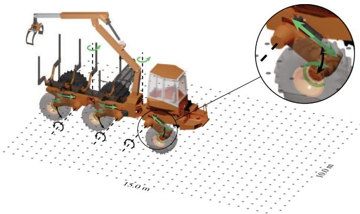  
Fig. 1. The Xt28 model with passive (black arrows) and actuated joints (green arrows). The frame of reference is located $3 0 ~ \mathrm { c m }$ behind the cabin. The local height map is represented as a $1 5 \times 1 0 \mathrm { m } ^ { 2 }$ grid with $3 0 \times 2 0$ resolution.

# B. Proximal Policy Optimization

Proximal policy optimization (PPO) is an on-policy method which attempts to keep policy updates close enough to the current policy to improve performance without the risk of collapse [13]. After collecting a batch of samples under the current policy $\pi _ { \theta _ { k } }$ , PPO performs minibatch stochastic gradient decent to find $\theta$ which maximizes the objective [14]

$$
\begin{array} { r l } & { \mathcal { L } ( s , a , \theta _ { k } , \theta ) } \\ & { \quad \quad = \operatorname* { m i n } ( \frac { \pi _ { \theta } ( a \vert s ) } { \pi _ { \theta _ { k } } ( a \vert s ) } A ^ { \pi _ { \theta _ { k } } } ( s , a ) , g ( \epsilon , A ^ { \pi _ { \theta _ { k } } } ( s , a ) ) ) , } \\ & { \quad \quad g ( \epsilon , A ) = \{ ( 1 + \epsilon ) A \quad A \geq 0  } \\ & { \quad \quad  ( 1 - \epsilon ) A \quad A < 0 . } \end{array}
$$

The loss motivates policy updates to encourage actions which lead to a positive advantage and discourage the opposite. To avoid moving too far from the old policy the objective sets a limit on the policy probability ratio by clipping it in relation to the advantage, where the clipping range is controlled by the hyperparameter $\epsilon$ . It is common to also include two additional terms in the loss function. One is an error term on value estimates which is only necessary if using a network architecture which shares parameters between policy and value function. The other is an entropy bonus with purpose to boost exploration.

# III. SIMULATION ENVIRONMENT AND CONTROL

We model the environment in terms of rigid multibodies, frictional contacts, joints, and motors using the physics engine AGX Dynamics [15]. For actuation, we use hinge and linear joints with 1D motors. A 1D motor is a speed constraint that operates along its remaining degree of freedom by applying a force/torque to meet a specified target speed.

# A. Xt28 Forwarder Model

The Xt28 vehicle, a six-wheeled articulated forwarder, is modelled from a CAD drawing of the actual vehicle as a rigid multibody system with 37 bodies and 14 actuated joints, see Fig. 1. Hinge motors act at the frame articulation and wheel joints, and linear motors control the suspension arms that are hinged to the chassis. The wheels are treated as rigid and modelled using spheres due to the computational benefit in contact detection.

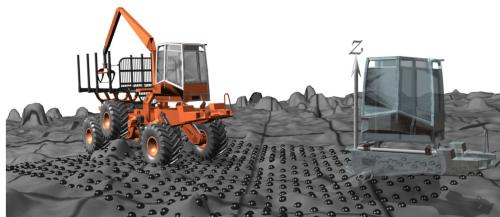  
Fig. 2. Snapshot of the vehicle and target pose given by a position and heading. The local height map follows the translation and heading of the vehicle and all heights are taken relative to the height under the reference frame.

To have the model state-space agree with the real one, we use realistic masses and limits on torque and force. The linear motors have a force limit of $2 7 0 ~ \mathrm { k N }$ and the torque limit at articulation joints and wheel motors are set to $5 0 ~ \mathrm { k N m }$ and $2 0 ~ \mathrm { k N m }$ , respectively [16]. The Xt28 model has a mass of 16 $8 0 0 \mathrm { k g }$ [2], where the centre of mass position of each body was estimated to match that of the physical vehicle.

# B. Controller

The main goal of the controller is to drive the vehicle to a target pose, given by a position and a heading. It receives directions to the target $( x , y , \Psi )$ , relative to its reference frame, as well as proprioceptive and additional exteroceptive information. The proprioceptive information consists of velocities in the vehicle frame, roll and pitch angles in world coordinates, articulation frame joint angles, and the piston displacement related to each suspension. It also receives the longitudinal wheel slip and slip angle. Longitudinal wheel slip is measured as the difference in forward and surface speed of the wheel normalized by its forward speed. The slip angle is the angle between the wheel direction and the direction it is actually travelling. Additionally, we observe the load on each wheel, normalized by vehicle weight.

The exteroceptive information consists of a local height map of $\mathrm { 1 5 \times 1 0 m ^ { 2 } }$ with $3 0 \times 2 0$ grid resolution, which follows the vehicle translation and heading, see Fig. 2. In a real world scenario, SLAM, or maps from airborne laser scans of the terrain together with a GNSS provide similar height maps. The heights are expressed relative to the reference frame and scaled to be in $[ 0 , 1 ]$ . Together these form a 634-dimensional state representation used by the controller to select a 14-dimensional action.

For the frame articulation joints and the suspensions, the controller action specifies target angles and piston positions which are passed to P controllers. The P controllers compute the appropriate target speed for each joint motor, operating within their force and torque limits. The wheel motors are controlled by setting each motor torque individually. If the angular speed exceeds $1 . 5 \mathrm { r d } / \mathrm { s }$ the torque is clamped to not accelerate it further. Each action is in $[ - 1 , 1 ]$ and mapped to available joint and torque ranges.

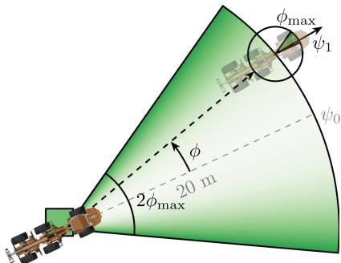  
Fig. 3. Target generation. The vehicle is initialised in the green square with random heading. The target is then placed a distance $2 0 \mathrm { m }$ away along a limited arc with heading $\psi _ { 1 }$ .

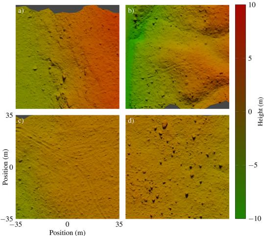  
Fig. 4. Patches from scanned terrains. a) and b) are two examples used for training, c) is used in domain sensitivity experiments, and d) in obstacle perception. The images are rendered with terrain colour according to height.

# C. Terrains

Terrains are constructed from height maps of size $7 0 \times 7 0 \mathrm { { m ^ { 2 } } }$ and $7 0 0 \times 7 0 0$ resolution, see Fig. 4. To form a continuous surface, the heights are interpolated using triangular, piecewise planar, elements into a geometric mesh. The geometry is assigned to the ground which is represented as a static rigid body.

There are two different types of terrains. One is procedurally generated from Perlin noise [17] and semi-ellipsoids to represent discrete features such as boulders. The semi-ellipsoids are [0.5, 3.5] m large, [0.25, 1.75] m tall and the terrain height difference is limited to $5 \textrm { m }$ . The procedural terrains are useful for designing training and testing scenarios on e.g. slopes or terrains with impassable objects at certain locations.

The other type is reconstructions from high-density laser scans, referred to as scanned terrains. Recently $6 0 0 \ \mathrm { \ H a }$ of forestry sites were scanned using $6 0 0 \ \mathrm { p o i n t s / m ^ { 2 } }$ around Sundsvall, Sweden [18]. The dataset is filtered to contain only ground points $\mathrm { ( \sim 1 0 0 ~ p o i n t s / m ^ { 2 } }$ ) and converted to a digital elevation model, from which we extract regular height maps.

# IV. LEARNING CONTROL

To learn a control policy we use PPO because it has proven successful in other locomotion tasks, e.g. [19], [20], is easy to parallelize, and insensitive to hyperparameter settings. The adopted implementation uses PyTorch [21] and is based on the original paper [13]. We let the simulation run at $6 0 \mathrm { H z }$ and query the controller at $f _ { \mathrm { c o n t r o l } } = 1 2 \ : \mathrm { H z }$ .

# A. Network

As the action space is continuous, a natural choice is to use a diagonal Gaussian policy, which maps state $s$ to mean actions $\mu _ { \boldsymbol { \theta } } ( s )$ represented by a neural network with parameters $\theta$ . The variance vector, $\sigma ^ { 2 }$ , is treated as a stand-alone parameter, independent of state. Thus, the probability of action $a _ { t }$ in state $s _ { t }$ is given by $\pi _ { \boldsymbol { \theta } } ( a _ { t } , s _ { t } ) = \mathcal { N } ( \mu _ { \boldsymbol { \theta } } , \sigma ^ { 2 } I )$ , where $I$ is the identity matrix.

Because part of our inputs are from 2D height maps, we process them separately with a convolutional neural network. To extract height features, we pass height maps through two layers with 16 and 32 filters of $3 \times 3$ kernel size, followed by a fully connected layer with 64 units. We argue that height based features of importance are similar for the actor and critic and let them share this part of the network. In the non-shared part, the height map features are concatenated with the rest of the observations and passed through two fully connected layers with 128 units each. For the actor, the action is produced by a linear output layer of 16 units. For the critic, the value function is produced by a linear output layer of 1 unit.

# B. Reward

We formulate a reward that encourages steady progress towards the target in an upright position, without wheel slip, and with limited ground forces, energy consumption, and damaging tyre sidewall contacts. The net reward takes the form

$$
\begin{array} { c } { r = r _ { \mathrm { t a r } } + r _ { \mathrm { p r o g } } r _ { \mathrm { r o l l } } r _ { \mathrm { s p e e d } } r _ { \mathrm { f o r c \in } } } \\ { \times \displaystyle \frac { r _ { \mathrm { h e a d } } + r _ { \mathrm { s l i p \| } } + r _ { \mathrm { s l i p \perp } } } { 3 } } \\ { + r _ { \mathrm { e n e r g y } } + r _ { \mathrm { s i d e } } , } \end{array}
$$

where the terms are explained below. The main goal of the controller is met when the vehicle is closer than $0 . 3 \mathrm { ~ m ~ }$ and $9 ^ { \circ }$ relative to the target position and heading. We define the target bonus as

$$
r _ { \mathrm { t a r } } = k _ { \mathrm { t a r } } \mathbb { 1 } ( \Psi , d _ { t } ) ,
$$

where $k _ { \mathrm { t a r } }$ is a constant set to 5 per cent of the maximum, undiscounted return and $\mathbb { 1 }$ is the indicator function which evaluates to 1 at the target and 0 otherwise.

The target reward yields a sparse signal unlikely to be discovered in early stages of training. As guidance we provide a dense reward which reflects the progress toward the target as

$$
r _ { \mathrm { p r o g } } = ( d _ { t - 1 } - d _ { t } ) f _ { \mathrm { c o n t r o l } } ,
$$

where $d _ { t } , d _ { t - 1 }$ is the current and previous distance from the vehicle to the target projected to the horizontal plane. We reason

that heading alignment is increasingly important as the vehicle approaches the target and introduce it as a reward multiplier

$$
r _ { \mathrm { h e a d } } = \exp \left[ - \frac { 1 } { 2 } \left( \frac { \Psi } { d _ { t } / k _ { \mathrm { d } } } \right) ^ { 2 } \right] ,
$$

where the constant $k _ { \mathrm { d } } = 5 \mathrm { m }$ is tuned with the turning radius of the vehicle.

In the reward shaping process we observed that a reward $r = r _ { \mathrm { t a r } } + r _ { \mathrm { p r o g } } r _ { \mathrm { h e a d } }$ is essential for learning to reach the target quickly, but does not promote efficient, safe and environmental friendly driving. Therefore, we introduce a set of additional reward multipliers with range $[ 0 , 1 ]$ . To avoid risk of overturn we define the roll reward as

$$
r _ { \mathrm { r o l l } } = \exp \left[ - \frac { 1 } { 2 } \left( \frac { \phi } { k _ { \phi } } \right) ^ { 2 } \right] ,
$$

for roll angle $| \phi | > 5 ^ { \circ }$ and 1 else, where we use $k _ { \phi } = \pi / 1 6$ . To encourage limited vehicle speeds, we use

$$
r _ { \mathrm { s p e e d } } = \operatorname* { m i n } ( 1 , \exp [ k _ { \mathrm { s p e e d } } ( v _ { \mathrm { l i m } } - | v | ) ] ) ,
$$

where $v _ { \mathrm { l i m } } = 0 . 8 ~ \mathrm { m / s }$ , and $k _ { \mathrm { s p e e d } } = 2$ is a constant manually tuned to control the rate of reward decay for speeds above $v _ { \mathrm { l i m } }$

To limit ground pressure we consider the standard deviation of normalized ground forces, $\sigma _ { \mathrm { f o r c e s } }$ . Ground pressure is at its lowest in case of an even distribution over the 6 wheels. Each wheel then carries 1/6 of the vehicle weight, and $\sigma _ { \mathrm { f o r c e s } } = 0$ We promote even weight distribution through

$$
r _ { \mathrm { f o r c e s } } = \exp \left[ - \frac { 1 } { 2 } \left( \frac { \sigma _ { \mathrm { f o r c e s } } } { k _ { \mathrm { f o r c e s } } } \right) ^ { 2 } \right] ,
$$

where $k _ { \mathrm { f o r c e s } } = 0 . 1 \mathrm { N }$

Reaching the target is not considered a success with excessive slip during the episode. Therefore we include two terms related to longitudinal slip $\lambda$ and slip angle $\alpha$ as

$$
\begin{array} { l } { { r _ { \mathrm { s l i p } \parallel } = \displaystyle \prod _ { i } ^ { n _ { w h e e l s } } \exp \left[ - \frac { 1 } { 2 } \left( \frac { \lambda _ { i } } { k _ { \lambda } } \right) ^ { 2 } \right] , \qquad k _ { \lambda } = 0 . 3 } } \\ { { r _ { \mathrm { s l i p } \perp } = \displaystyle \prod _ { i } ^ { n _ { \mathrm { w h e e l s } } } 0 . 5 \cos ( k _ { \alpha } \alpha _ { i } ) + 0 . 5 , \qquad k _ { \alpha } = 6 , } } \end{array}
$$

where $\alpha _ { i }$ is clipped at $\pm \pi / k _ { \alpha }$ such that any slip angle outside that range yields zero reward. The slip rewards are constructed as products to induce well behaved wheel motions for all wheels simultaneously. The slip and heading terms are mutually conflicting objectives. Therefore we sum them to a single multiplier, as seen in (3).

To promote smooth, efficient motions, energy consumption is included as

$$
r _ { \mathrm { e n e r g y } } = k _ { \mathrm { e n e r g y } } \frac { W _ { \mathrm { j o i n t s } } } { W _ { \mathrm { m a x } } } ,
$$

where $W _ { \mathrm { j o i n t s } }$ is the total work carried out by all actuated joints over the previous action step, $W _ { \mathrm { m a x } }$ is its upper bound, and $k _ { \mathrm { e n e r g y } } = - 1$ .

Damage to tyre sidewalls are penalized through the number of sidewall contacts $n _ { \mathrm { c o n t a c t s } }$ as

$$
r _ { \mathrm { s i d e } } = k _ { \mathrm { s w } } n _ { \mathrm { c o n t a c t s } } ,
$$

where $k _ { \mathrm { s w } } = - 0 . 2$ . We found this reward term necessary to avoid use of the sides of the tyres for traction. A contact is classified as being on the sidewall if the angle between the contact point in the wheel frame and the rotational axis is less than $6 0 ^ { \circ }$ .

A nice feature of the reward in (3) is that the maximum undiscounted return is easily calculated as the initial distance to the target, times the control frequency, plus the target reward. Although, the maximum is not attainable in practice, is serves as good reference for designing a curriculum and evaluating policy performance.

# V. TRAINING AND EVALUATION

During training, an episode starts with the vehicle being deployed on the terrain at random position, $x _ { 0 } , y _ { 0 } \left[ \mathrm { m } \right] \in \left[ - 1 , 1 \right]$ , and heading $\psi _ { 0 } \in [ 0 , 2 \pi ]$ . We let the vehicle drop to the ground and settle. To get natural variations of initial vehicle configurations we apply a simple controller to the suspensions during a simulated time period of $1 \mathrm { ~ s ~ }$ .

To enable curriculum with altered target difficulty, a target heading parameter $\phi _ { \mathrm { m a x } }$ is defined, affecting both target placement and heading. The target is placed a distance $r _ { 0 } = 2 0 ~ \mathrm { m }$ away, within an angle $\phi \in [ - \phi _ { \operatorname* { m a x } } , \phi _ { \operatorname* { m a x } } ]$ relative to the vehicle heading, see Fig. 3. To put emphasis on learning stearing, the target position along this arc is sampled from a quadratic distribution, increasing the probability toward the edges. The target heading is then sampled from a uniform distribution, $\psi _ { 1 } \in [ - \phi _ { \operatorname* { m a x } } / 2 , \phi _ { \operatorname* { m a x } } / 2 ]$ relative to $\phi$ , i.e. the angle to the target.

A training episode runs until the target is reached, or terminated after 400 or 500 steps, depending on the curriculum. Early termination occurs if the vehicle moves beyond the target, if it reaches a roll beyond $2 5 ^ { \circ }$ , or if a terminal contact is detected. A terminal contact is when any part of the chassis comes in contact with the terrain.

Training is done on 10 parallel environments on a cluster with 28 cores, where each environment uses a different terrain. After every $2 5 ~ \mathrm { k }$ steps the controller is evaluated in a separate environment on a terrain not used in training, with deterministic initial vehicle positions, target placements, and action selection based on the latest policy.

# A. Curriculum

In our experience, a curriculum is essential for the controller to reach its full potential. Our goal is to form a curriculum such that there is a solid foundation in basic driving skills after the first lesson, e.g. acceleration, turning, and speed control. The purpose of the following lessons is to specialize driving skills towards preference. To emulate natural forest environments, we focus on boulder-like obstacle avoidance, unevenness, and slopes.

Our approach is to use a fixed order boundary curriculum [19] for the terrain and target placements, where the learning process is divided into four lessons with increasing difficulty according to our intuition. In the simplest, initial lesson, the terrain is level with Perlin noise to mimic features of natural terrain. To put emphasise on sharp turns we set the target heading parameter to $\phi _ { \mathrm { m a x } } = \pi / 3$ already in the first lesson. The second lesson focuses on learning height map features to avoid impassable objects. We use the same terrain base with Perlin noise but add 8 semi-ellipsoids placed randomly between the initial vehicle position and the target. To both avoid obstacles and reach the target is challenging, so we simplified the task by setting $\phi _ { \mathrm { m a x } } = \pi / 9$ . The third level uses a similar setting with tougher Perlin noise to form a hilly/slopy terrain, but with only 6 impassable semi-ellipsoids and 6 smaller ones. In the final level, the controller practices driving on scanned terrains with $\phi _ { \mathrm { m a x } } = \pi / 3$ and 500 max steps. We chose terrain patches that appeared trafficable, yet challenging with steep slopes, boulders, and ditches, see Fig. 4.

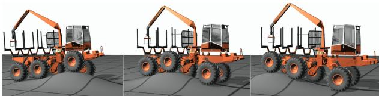  
Fig. 5. Sequential snapshots of the vehicle traversing a 1 m tall gaussian bump, avoiding chassis roll and wheel slip.

# B. Hyperparameters

For the PPO related hyperparameters we use a horizon of 1280, minibatch size of 800, and 10 epochs. We use the Adam optimizer with a gradually decreased step size between lessons. A step size of $2 5 \times 1 0 ^ { - 5 }$ is used in the first, $1 0 \times 1 0 ^ { - 5 }$ in the second and third, and $1 \times 1 0 ^ { - 5 }$ in the fourth lesson respectively. The discount is $\gamma = 0 . 9 9$ and the GAE parameter $\lambda = 0 . 9 5$ . The value function and policy both have clipping range 0.2. The value function coefficient for the loss calculation is 0.5 and the entropy coefficient 0.01.

# VI. RESULTS AND DISCUSSION

We present a controller that shows smooth progression towards the target while adapting to terrain irregularities. When turning, torques are adjusted so that the outer wheels rotate faster than the inner, thereby moving with limited slip and effort. The suspensions are used conservatively and kept in fixed position unless the vehicle is challenged by slopes or unevenness in the terrain. When faced with a Gaussian bump of $1 \textrm { m }$ height, the controller makes intelligent use of the suspensions for levelling and ground compliance, as shown in Fig. 5. The maximum slip is $1 . 5 \%$ and the average slip per wheel is only $0 . 1 5 \%$ . To see highlights of the learnt driving skills on a number of different terrains we refer to the supplementary video.

Training is done according to the curriculum in Section V-A, where the best policy in the preceding lesson is used as starting point for the next, see Fig. 6. In total, the controller is trained for $1 9 . 2 2 \mathrm { ~ M ~ }$ steps and $^ \mathrm { 1 0 8 ~ h }$ CPU hours. Learning is rapid during the first lesson except during a plateau. We found that penalizing energy consumption was key to develop strategies to limit speed and keep progressing, but it also eliminated jerky and unnecessary movements.

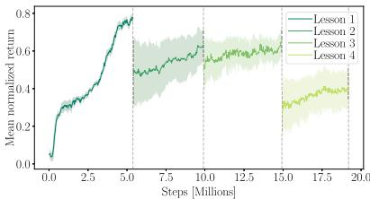  
Fig. 6. Learning curves over four consecutive curriculum lessons with increasing difficulty. The controller was evaluated every $2 5 \ \mathrm { k }$ steps over 20 episodes with deterministic action selection.

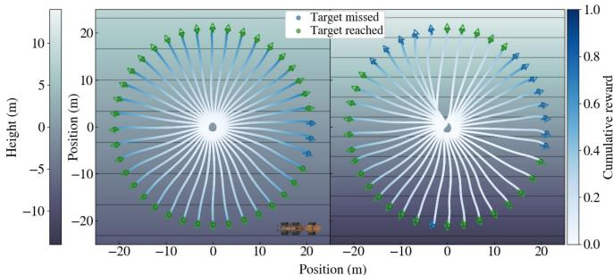  
Fig. 7. Comparison of controller performance on two terrains with 18 and $2 7 ^ { \circ }$ incline. The arrows show target placements. A target is reached when the vehicle is closer than $0 . 3 \mathrm { ~ m ~ }$ and $9 ^ { \circ }$ relative to the target position and heading. The vehicle is true to scale.

# A. Sloped Terrains

The controller shows the ability to traverse steep slopes and uses different strategies depending on the slope direction. We use two perfectly even terrains with $1 8 ^ { \circ }$ and $2 7 ^ { \circ }$ incline, and place the vehicle around the centre, with equally spaced heading in 40 directions following a full rotation, see Fig. 7. The success rates are $9 2 . 5 \%$ and $65 \%$ with undiscounted mean normalized return $0 . 6 4 \pm 0 . 0 9$ and $0 . 4 0 \pm 0 . 1 3$ for the $1 8 ^ { \circ }$ and $2 7 ^ { \circ }$ terrains, respectively. As reference, the terrains are rated as 4/5 and 5/5 in difficulty according to the terrain classification system for forestry work in nordic countries [22]. On side slope, the controller utilizes one of the claimed benefits of the Xt28 and adjusts the suspensions to shift the centre of mass and maintain an upright position in an attempt to minimize ground forces, wheel slip, and roll. We note that the maximum side slope which allows for complete levelling is $2 7 . 5 ^ { \circ }$ due to the range limits of the suspensions. Even so, the mean rolls are $1 . 9 3 \pm 0 . 9 4 ^ { \circ }$ and $3 . 8 3 \pm 2 . 5 9 ^ { \circ }$ , respectively, including the unfavourable initial configurations. Although the success rate is not as high for the steeper terrain, there are no complete failures, and the missed targets are typically due to side slip. Curiously, it is more demanding to drive downhill than uphill. The loss in reward is mainly due to the inability to maintain speed below the upper limit.

# B. Obstacle Perception

If faced with objects of different sizes, the controller shows an ability to distinguish between passable and impassable ones and places the wheels to avoid sidewall contacts. To see the strategies we test the controller on a terrain similar to those with semi ellipsoids used in training, see Fig. 8. Targets and initial vehicle positions are the same as for the sloped terrains, resulting in a $90 \%$ success rate and undiscounted mean normalized return of $0 . 6 2 \pm 0 . 1 5$ over 40 episodes. Impassable objects that appear within the range of the local height map are well reflected in the value function estimates, far before reaching the problematic location. States with impassable objects straight ahead are expected to result in poor performance unless easy to circumvent, at which the trajectory is planned by taking out turns enough to avoid contact and reach the target placement. Smaller objects are easily overcome without significant loss in reward due to efficient use of the suspensions. Because some episodes are practically impossible and require going in reverse, a driving skill not practised during training, we cannot expect full success. The four episodes with terminal chassis-ground contacts occur when the vehicle is directly facing large objects and is unable to choose which way to turn.

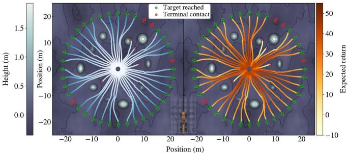  
Fig. 8. Motion trajectories on procedurally generated terrain with semiellipsoids representing boulders. The trajectories are coloured by normalized cumulative reward in [0,1] (left) and the learnt value function estimates (right). The controller displays the ability to perceive by driving around impassable objects and over smaller. The vehicle and local height map is true to scale.

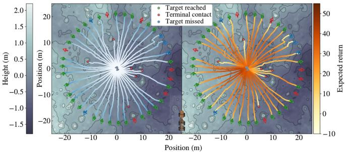  
Fig. 9. Obstacle perception on a scanned rough terrain. The trajectories are coloured by normalized cumulative reward (left) and value function estimates (right).

To test if the learnt skills generalize to natural environments we repeat our previous experiment on a terrain patch extracted from the real data set. The selected area (Fig. 4 d) contains the highest density of large boulders $\mathrm { ~ > ~ } 1 \mathrm { ~ m ~ }$ tall) from the $6 0 0 \ \mathrm { H a }$ test site and poses a severe challenge. The target is reached $70 \%$ of episodes with a mean normalized return of $0 . 4 8 \pm 0 . 1 4$ , see Fig. 9. The results are similar to the artificial terrains, where the controller surpasses smaller boulders, circumvents others, and the majority of unsuccessful episodes is due to chassis-ground collisions. We note that most terminal contacts occur when the target is in the vicinity of a large boulder or when several boulders obstruct the passage, e.g. east in Fig. 9. Without a clear passage, the expected return is immediately small, indicating that the controller recognizes when put to a task it cannot successfully complete. To further study the value function is valuable if we want to enhance obstacle perception. However, when it comes to obstacle avoidance, it is not clear if the responsibility should lie completely in a low level controller or one at higher level doing path planning.

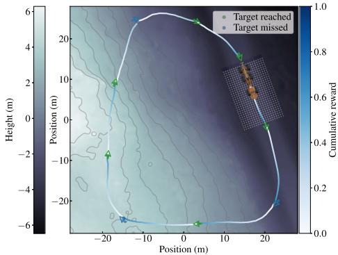  
Fig. 10. Top view of vehicle trajectories following a sequence of waypoints placed on a reconstruction of real terrain from high-density laser scans. The vehicle starts and ends at a primary road along a route similar to a real world forestry scenario.

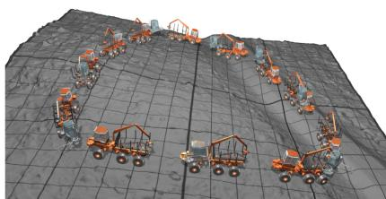  
Fig. 11. 3D rendering of the vehicle and waypoints.

# C. Smart Control on Real Forest Terrain

To simulate the use of the controller in a purposeful forestry application we test its driving skills on scanned terrains. We emulate a higher level planner and manually place a sequence of targets, or waypoints, starting and ending at a primary road to complete a full cycle, see Figs. 10 and 11. The terrain has a mean slope of $1 2 ^ { \circ }$ , a deep ditch alongside the road, and enough roughness to serve as a challenging test.

Despite being a difficult route on demanding terrain 6 out of 9 waypoints are reached, where the misses are small and do not affect the higher level goal of completing the route. The controller displays an ability to cross ditches, a challenging real world scenario, and handles target placements not seen in training with ease. The mean normalized return is $0 . 6 0 \pm 0 . 1 2$ where, as discussed with sloped terrains, the vast majority of lost reward comes from driving too fast downhill. Still, there is no tendency towards unsafe traversal and we note that the top speed was no more than $0 . 3 7 \mathrm { m } / \mathrm { s }$ above limit.

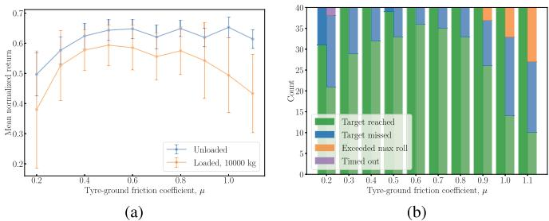  
Fig. 12. a) Undiscounted mean normalized return over 40 episodes as a function of tyre-ground friction coefficient, $\mu$ , where the error bars show one standard deviation. The vehicle is either unloaded or carries $1 0 0 0 0 \mathrm { k g }$ . b) Episode termination. The left bar in each pair corresponds to an unloaded vehicle and the right, slightly brighter, to one with $1 0 0 0 0 \mathrm { k g }$ load.

# D. Domain Sensitivity

The controller is insensitive to variations in ground-terrain friction coefficient $\mu$ , and able to adapt to load cases not seen during training. In natural environments, surface friction varies over space and time, while variable load is relevant in any transport application, e.g. forestry, agriculture. We chose a typical forestry site from the real dataset (Fig. 4 c) and let $\mu \in \{ 0 . 2 , 0 . 3 , . . . , 1 . 1 \}$ for two vehicle load cases: one with nominal weight and another where a static $1 0 0 0 0 \mathrm { k g }$ load ( $60 \%$ weight increase) is placed on the load bunk. The targets are placed $2 0 ~ \mathrm { m }$ away with random heading $[ - \pi / 3 , \pi / 3 ]$ , relative to the vehicle starting position. For each of the 20 cases we simulate 40 episodes and compute the undiscounted mean normalized return and standard deviation, see Fig. 12(a).

As expected, the controller performs at its best around the settings used for training, i.e., unloaded with $\mu = 0 . 7$ , and equally well for higher friction. Performance is not significantly affected until $\mu$ drops below 0.4, which roughly corresponds to the average sliding friction between tyres and wet earth roads [23]. From Fig. 12(b), it is clear that the target is frequently reached at $\mu = 0 . 3$ , but more seldom for $\mu = 0 . 2$ . The loaded case shows similar behaviour but with $10 \%$ lower episodic return. To some degree this is due to the higher energy consumption with the increase in weight, but Fig. 12(b) shows that in $10 \%$ of the cases, the heavier vehicle fails to reach the target. Notably, performance drops for friction above 0.8, where a fair portion of episodes terminate due to maximum roll being exceeded. The high friction and load resists turning at moderate speed and the controller compensates by tilting to increase traction on the outer wheels. With no experience in similar states, it proceeds until failure occurs.

To further understand the effect of different vehicle load and ground-tyre friction on performance we look at individual reward contributions. Fig. 13 shows $r _ { \mathrm { e n e r g y } } , r _ { \mathrm { s l i p } \parallel }$ , and $r _ { \mathrm { s l i p \perp } }$ for the two cases with lowest mean return, and training settings. Not surprisingly, low friction and added load leads to an increase in energy consumptions and slip. We observe that a loaded vehicle in high friction setting drives with significantly less slip compared to low friction, but similar side slip except in the first quarter of episodes. This again is due to the resistance in turning, and also the difficulties to control the frame articulation.

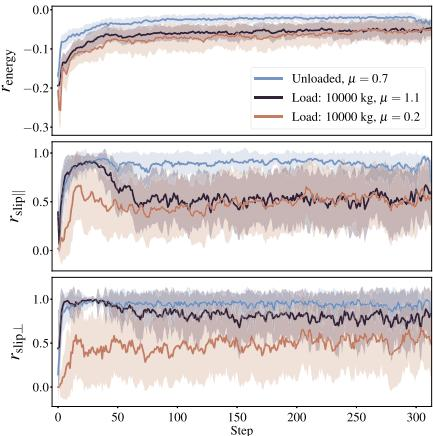  
Fig. 13. Mean reward contributions and standard deviation over 40 episodes for different friction and vehicle load. Number of steps was truncated at the shortest episode.

# VII. CONCLUSION

We conclude that deep RL is more than capable of learning control for rough terrain vehicles with continuous, high dimensional, observation, and action space. We have presented a controller that perceives, plans, and individually controls six suspensions, six wheels, and two frame articulation joints, without the use of frame stacking or recurrent networks as memory support. The controller relies on a local height map to perceive which obstacles to circumvent, how to handle steep slopes, etc., and then couples its perception with proprioceptive features to efficiently traverse rough terrain. The traversal is done with minimal slip, roll, and energy consumption, to reach a target placement. The controller is robust to friction between tyre and ground, as long as it does not fall below a critical value. It is more sensitive to changes in the vehicle weight, which poses a problem when collecting and transporting heavy objects. We suggest that deep RL will be a future cornerstone for control of vehicles with high dimensional state space, especially in environments where it is easier to react to the dynamics than predict them with sufficient accuracy.

[3] W. Wu, “Energy analysis of a hybrid forwarder,” Master’s thesis, 2017.   
[4] M. Hutter et al., “Force control for active chassis balancing,” IEEE/ASME Trans. Mechatronics, vol. 22, no. 2, pp. 613–622, Apr. 2017.   
[5] M. He et al., “Design, analysis and experiment of an eight-wheel robotic vehicle with four-swing arms,” Ind. Robot: Int. J. Robot. Research Application, vol. 46, no. 5, pp. 682–691, 2019.   
[6] O. Gelin, F. Henriksen, R. Volungholen, and R. Björheden, “Improved operator comfort and off-road capability through pendulum arm technology,” J. Terramechanics, vol. 90, pp. 41–48, 2020.   
[7] J. Lee, J. Hwangbo, L. Wellhausen, V. Koltun, and M. Hutter, “Learning quadrupedal locomotion over challenging terrain,” Sci. Robot., vol. 5, no. 47, 2020.   
[8] S. Josef and A. Degani, “Deep reinforcement learning for safe local planning of a ground vehicle in unknown rough terrain,” IEEE Robot. Automat. Lett., vol. 5, no. 4, pp. 6748–6755, Oct. 2020.   
[9] K. Zhang, F. Niroui, M. Ficocelli, and G. Nejat, “Robot navigation of environments with unknown rough terrain using deep reinforcement learning,” in Proc. IEEE Int. Symp. Saf., Secur., Rescue Robot., 2018, pp. 1–7.   
[10] M. Lundbäck, C. Häggström, and T. Nordfjell, “Worldwide trends in methods for harvesting and extracting industrial roundwood,” Int. J. Forest Eng., pp. 1–14, 2021.   
[11] D. C. Guastella and G. Muscato, “Learning-based methods of perception and navigation for ground vehicles in unstructured environments: A review,” Sensors, vol. 21, no. 1, p. 73, 2021.   
[12] J. Schulman, P. Moritz, S. Levine, M. Jordan, and P. Abbeel, “Highdimensional continuous control using generalized advantage estimation,” in Proc. Int. Conf. Learn. Representations (ICLR), 2016.   
[13] J. Schulman, F. Wolski, P. Dhariwal, A. Radford, and O. Klimov, “Proximal policy optimization algorithms,” CoRR, vol. abs/1707.06347, 2017. [Online]. Available: http://arxiv.org/abs/1707.06347   
[14] J. Achiam, “Spinning up in deep reinforcement learning,” 2018. Accessed: Nov. 18, 2021. [Online]. Available: https://spinningup.openai.com   
[15] Algoryx Simulations, “Agx dynamics,” Sep. 2017. [Online]. Available: https://www.algoryx.se/products/agx-dynamics/   
[16] A. Dell’Amico, L. Ericson, F. Henriksen, and P. Krus, “Modelling and experimental verification of a secondary controlled six-wheel pendulum arm forwarder,” in Proc. 13th ISTVS European Conf., Rome, Oct. 21- 23, 2015, pp. 1–10.   
[17] K. Perlin, “An image synthesizer,” ACM Siggraph Comput. Graph., vol. 19, no. 3, pp. 287–296, 1985.   
[18] “ SCA laxsjön digital testsite,” Accessed: Jun. 17, 2021. [Online]. Available: https://www.sca.com/en/top-news-startpage/2019-12/ sca-contributes-to-study-into-digital-forestry-management/.   
[19] Z. Xie, H. Y. Ling, N. H. Kim, and M. van de Panne, “ALLSTEPS: Curriculum-driven learning of stepping stone skills,” in Comput. Graph. Forum, vol. 39, no. 8, pp. 213–224, 2020.   
[20] X. B. Peng, P. Abbeel, S. Levine, and M. van de Panne, “Deepmimic: Example-guided deep reinforcement learning of physics-based character skills,” ACM Trans. Graph. (TOG), vol. 37, no. 4, pp. 1–14, 2018.   
[21] A. Raffin, A. Hill, M. Ernestus, A. Gleave, A. Kanervisto, and N. Dormann, “Stable baselines3,” [Online]. Available: https://github.com/DLR-RM/stable-baselines3, 2019.   
[22] S. Berg, “Terrängtypschema.[terrain classification for forestry work]. Forsningsstiftelsen Skogsarbeten Stockholm,” 1986.   
[23] J. Y. Wong, Theory of Ground Vehicles, 3 rd ed. Hoboken, NJ, USA: John Wiley & Sons, Inc., 2001.

# REFERENCES

[1] K. Iagnemma, A. Rzepniewski, S. Dubowsky, and P. Schenker, “Control of robotic vehicles with actively articulated suspensions in rough terrain,” Auton. Robots, vol. 14, no. 1, pp. 5–16, 2003.   
[2] O. Gelin and R. Björheden, “Concept evaluations of three novel forwarders for gentler forest operations,” $J .$ Terramechanics, vol. 90, pp. 49–57, 2020.