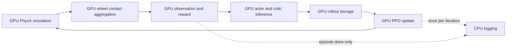

# 端到端 GPU 仿真训练优化方案

> [!important] 文档状态
> 本文是基于 `Graduation-Project` 当前源码完成的静态审查与修改设计，尚未执行代码修改。当前工作机没有可用的 Isaac Sim / Isaac Lab 运行环境，因此所有涉及真实 PhysX 行为、显存容量和训练吞吐量的结论，都必须在安装 RTX 5060 Ti 16 GB 的目标训练机上验证。

## 1. 方案背景

### 1.1 项目对象

本项目研究对象是一种三车体、六轮、两处三自由度等效球铰连接的铰接式地面机器人。当前强化学习任务主要在 Isaac Lab DirectRLEnv 中运行，通过 PPO 学习车辆在平地、坡地、随机粗糙地形、楼梯和离散障碍上的运动与形态调节策略。

当前控制结构大致为：

```text
PPO policy
→ 输出车轮和球铰控制目标
→ Isaac Lab actuator / low-level controller
→ PhysX articulation 与轮地接触
→ observation、reward、termination
→ PPO rollout 与参数更新
```

### 1.2 当前训练口径

当前主要配置包括：

| 项目 | 当前值 |
|---|---:|
| 仿真频率 | 120 Hz |
| RL 动作频率 | 30 Hz |
| Control decimation | 4 |
| 历史有效环境数 | 96 |
| Rollout steps/env | 512 |
| PPO epochs | 5 |
| PPO mini-batches | 16 |
| PPO updates/iteration | 80 |
| Actor observation | 328 维 |
| Critic observation | 906 维 |
| Critic height patch | 578 点，34×17 |
| Stage1 step metrics interval | 64 steps |
| 每轮 NaN 检查 | 每个 rollout step |
| 接触处理 | 六轮分别提取详细接触点并聚合 |

历史训练中，1000 iteration 预计需要接近 7 h。按 7 h 计算，平均每个 iteration 约需：

$$
\frac{7\times3600}{1000}=25.2\ \mathrm{s}
$$

### 1.3 当前训练工作量

96 个环境、每个环境 512 个 RL steps 时，每个 iteration 采集：

$$
B=96\times512=49152
$$

即 49,152 条 transition。

30 Hz 动作频率下，每个环境一次 rollout 覆盖：

$$
T_{rollout}=\frac{512}{30}=17.07\ \mathrm{s}
$$

每个 RL step 包含 4 个 physics steps，因此 1000 iteration 对应：

| 工作量 | 数值 |
|---|---:|
| Vectorized RL steps | 512,000 |
| Vectorized physics steps | 2,048,000 |
| Environment transitions | 49,152,000 |
| Environment-physics steps | 196,608,000 |
| PPO optimizer updates | 80,000 |

> [!warning] iteration 不是公平性能指标
> 修改 `num_envs`、`num_steps_per_env` 或 PPO epochs 后，每个 iteration 的样本量和优化次数会改变。因此后续不能只比较“1000 iteration 花了多久”，而应比较 transitions/s、environment-physics steps/s，以及达到相同成功率所需的墙钟时间。

### 1.4 参考文献带来的启示

Rudin 等在 *Learning to Walk in Minutes Using Massively Parallel Deep Reinforcement Learning* 中说明，大规模并行训练的关键并不是简单增加环境数量，而是同时满足：

- simulation、observation、reward、policy inference、rollout storage 和 PPO update 尽量驻留 GPU；
- 避免 CPU-GPU 数据往返；
- 平衡并行环境数与单环境连续 rollout 长度；
- 正确处理 timeout bootstrap；
- 用实际吞吐量和最终策略性能共同选择并行配置。

本项目已经将 simulation device 和 PPO device 配置为 `cuda:0`，但源码中仍存在大量 `.item()`、`.cpu()` 和 Python 布尔判断。这些操作会迫使 CPU 等待 GPU，破坏 CUDA 异步流水线。因此当前状态更准确地描述为：

> GPU 执行为主，但被频繁 CPU 同步串行化，而不是高效的端到端 GPU 训练。

## 2. 问题诊断

### 2.1 问题优先级

| 优先级 | 问题 | 主要影响 |
|---|---|---|
| P0 | `512 steps/env` 和每轮 80 次 PPO update | 单个 iteration 总工作量过大 |
| P0 | 六轮接触聚合每步执行 6 次 `.item()` | 强制同步 CUDA stream |
| P0 | 每步检查 observation/reward/done 的 NaN | 多次 GPU→CPU 同步 |
| P0 | PPO 每 mini-batch finite 检查与参数备份 | 80 次/iteration 重复同步和复制 |
| P1 | Logger 每步执行 `.cpu().numpy()` | 不必要的数据传回 CPU |
| P1 | 每 64 steps 收集大型 metrics | 大量独立 `.item()` |
| P1 | 每步检查所有训练环境是否退休 | 每步额外同步一次 |
| P1 | 六轮详细接触点提取，最大 128 点/轮/env | PhysX、显存和张量聚合开销 |
| P1 | Wheel allocator 重复计算诊断 Jacobian | 重复运动学计算 |
| P2 | 906 维 critic 和 578 点高度 patch | PPO 显存和网络计算开销 |
| P2 | 8/4 solver iterations | 物理仿真计算开销 |

### 2.2 六轮接触聚合的同步问题

文件：

```text
RL_Training/source/complete_car_lab/complete_car_lab/tasks/direct/complete_car/sensors/sensor_cfg.py
```

当前 `_aggregate_contact_force_vectors()` 中存在：

```python
total_contacts = int(counts.sum().item())
```

`.item()` 要求 CPU 获得 GPU 上的标量结果，因此会等待前面的 CUDA kernel 完成。

`get_wheel_contact_forces_w()` 对六个车轮分别执行一次详细接触查询和聚合。因此 1000 iteration 下，仅这一位置理论上就可能出现：

$$
1000\times512\times6=3,072,000
$$

次强制同步。

当前接触处理路径为：

```text
每个车轮单独创建 contact view
→ get_contact_data
→ normal force × contact normal
→ counts.sum().item()
→ repeat_interleave
→ index_select
→ index_add
→ 单轮净接触力
```

它同时造成：

- 六次 PhysX contact API 调用；
- 六次 `.item()` 同步；
- 频繁创建 `arange`、`zeros` 和索引张量；
- 接触点数量增大时额外索引与聚合开销；
- 环境数增加时 contact buffer 显存快速增长。

### 2.3 Runner 每步 NaN 检查

文件：

```text
agents/rsl_rl_ppo_cfg.py
rsl_rl/runners/on_policy_runner.py
```

当前配置：

```python
check_for_nan: bool = True
```

每个 rollout step 都会检查：

- actor observation；
- critic observation；
- reward；
- done。

这类检查最终需要进入 Python 条件判断，通常会同步 GPU。

与此同时，`base/env.py` 已经每步执行：

```python
torch.nan_to_num(observations)
torch.nan_to_num(rewards)
```

因此正式训练中存在重复保护：先修复 observation/reward，再逐 step 同步检查。

### 2.4 Logger 每步回传数据

文件：

```text
rsl_rl/utils/logger.py
```

当前 `process_env_step()` 即使没有环境 done，也执行 reward 和 episode length 的 `.cpu().numpy()`。正常 TensorBoard 训练路径每个 RL step 都会经过这里。

正确行为应该是：

```text
没有 done env
→ 不发生任何 GPU→CPU episode 数据传输

存在 done env
→ reward、length 和 intrinsic reward 合并传输一次
```

### 2.5 Step metrics 的同步问题

Stage1 当前：

```python
self.logging.step_metrics_interval = 64
```

512-step rollout 中会执行 8 次 `_collect_step_metrics()`。该函数包含大量：

```python
float(torch.mean(...).item())
float(torch.sum(...).item())
```

指标覆盖全局课程、每个 terrain column、球铰轴、支撑、滑移、overspeed、recovery 和 hard-terrain 完成信息。每个 `.item()` 都可能形成单独同步。

### 2.6 PPO 过度防御性检查

文件：

```text
rsl_rl/algorithms/ppo.py
```

每次 mini-batch update 当前执行：

- batch tensor finite 检查；
- loss finite 检查；
- 每个 parameter gradient finite 检查；
- actor/critic gradient norm finite 检查；
- 克隆全部 actor/critic 参数；
- optimizer step 后检查全部参数；
- value loss、surrogate loss、entropy 分别 `.item()`。

每个 iteration 有 80 次 mini-batch update，因此这些操作会重复 80 次。

### 2.7 仿真与输入开销

物理侧还包含：

- 120 Hz physics；
- TGS solver；
- 8 position iterations；
- 4 velocity iterations；
- stabilization；
- 六轮详细 contact reporting；
- 每轮每环境最多 128 个 contact points；
- 20×10 tile 的大型 generated terrain mesh。

学习侧包含：

- 328 维 actor observation；
- 906 维 critic observation；
- 578 点 critic height patch；
- 4 帧 observation history；
- 512-step rollout storage。

这些部分当前主要已经在 GPU 上向量化，不是第一批修改目标，但会限制环境数扩展。

## 3. 优化原则

### 3.1 修改顺序

必须遵循：

```text
建立原始基准
→ 消除不必要同步
→ 验证数值等价
→ 测量环境容量
→ 重选 envs/steps
→ 再优化 PPO 更新量
→ 最后考虑物理与 observation 降本
```

### 3.2 第一轮不得修改的内容

第一轮工程优化不修改：

- reward 定义和权重；
- observation 内容；
- action 定义；
- terrain 分布和难度；
- curriculum 语义；
- 120 Hz physics；
- 30 Hz policy；
- solver iterations；
- contact point 上限；
- actuator 参数。

这样才能判断训练提速是否真正来自 GPU 流水线优化。

### 3.3 目标数据路径



目标是把 CPU 交互限制到：

- 每 iteration 一次训练摘要；
- 真正 episode done 时一次 episode 统计；
- checkpoint 保存；
- 明确启用的 debug 检查；
- 低频 profiling 和 metrics 输出。

## 4. 阶段 0：原始性能基准

### 4.1 基准命令

在 RTX 5060 Ti 16 GB 目标机执行：

```bash
${ISAACLAB_PATH}/isaaclab.sh -p scripts/train.py \
  --task CompleteCar-Stage1 \
  --headless \
  --device cuda:0 \
  --num_envs 96 \
  --max_iterations 10 \
  --seed 1 \
  --run_name perf_baseline_96x512
```

前 2-3 iteration 视为 warm-up，不纳入均值。

### 4.2 基准指标

| 指标 | 目的 |
|---|---|
| collection time/iteration | 判断环境、接触和物理仿真耗时 |
| learning time/iteration | 判断 PPO 更新耗时 |
| total FPS | 衡量总体训练吞吐量 |
| GPU utilization | 判断 GPU 是否持续工作 |
| GPU memory | 判断环境扩展空间 |
| CPU utilization | 检查 CPU 同步与单核阻塞 |
| episode return | 检查策略行为是否变化 |
| reset/done rate | 排除 reset 数变化造成的假加速 |

监控命令：

```bash
nvidia-smi dmon -s pucvmet -d 1
```

### 4.3 基准结果记录表

| 配置 | Collection s/iter | Learning s/iter | Total FPS | VRAM | GPU util | Return |
|---|---:|---:|---:|---:|---:|---:|
| 原始 96×512 | 待测 | 待测 | 待测 | 待测 | 待测 | 待测 |
| 优化后 96×512 | 待测 | 待测 | 待测 | 待测 | 待测 | 待测 |

## 5. 阶段 1：低风险日志优化

### 5.1 Logger done guard

修改文件：

```text
rsl_rl/utils/logger.py
```

当前代码无条件执行 CPU transfer。修改后先计算：

```python
new_ids = (dones > 0).nonzero(as_tuple=False).flatten()
```

只有：

```python
if new_ids.numel() > 0:
```

时才把 episode reward 和 length 传回 CPU。

有 intrinsic reward 时，将 extrinsic、intrinsic、total reward 和 length 合并为一个 tensor，一次性 `.cpu()`。

验收条件：

- done mask 与修改前相同；
- rewbuffer 和 lenbuffer 内容相同；
- 无 done 时不发生 episode 数据 CPU transfer；
- 不改变 PPO transition。

### 5.2 Metrics interval 与 rollout 对齐

修改文件：

```text
baseline/complete_car_stage1_cfg.py
```

第一阶段将：

```python
self.logging.step_metrics_interval = 64
```

改为：

```python
self.logging.step_metrics_interval = 512
```

未来 `num_steps_per_env` 改为 32 或 64 后，metrics interval 也同步设为 32 或 64，使指标保持每 iteration 收集一次。

### 5.3 Metrics batch transfer

修改文件：

```text
base/env.py
```

将分散的：

```python
mean_a = float(tensor_a.mean().item())
mean_b = float(tensor_b.mean().item())
sum_c = float(tensor_c.sum().item())
```

改为：

```python
metric_tensors = torch.stack(
    (
        tensor_a.mean(),
        tensor_b.mean(),
        tensor_c.sum(),
    )
)
metric_values = metric_tensors.detach().cpu().tolist()
```

建议按三个区块分别合并：

| 区块 | 内容 |
|---|---|
| Global | 全局 reward、课程、支撑和恢复指标 |
| Terrain columns | col00-col09 的 row、success 和质量指标 |
| Articulation | 六个球铰轴与车体姿态指标 |

### 5.4 Retirement check 降频

修改文件：

```text
base/env.py
```

不再每个 RL step 执行：

```python
torch.any(next_train_mask).item()
```

只在以下时机检查：

- metrics step；
- rollout 最后一步；
- 当前配置要求全部 column 完成后停训；
- 出现明确 terrain-column completion event。

当前 Stage1 的 `terrain_column_stop_when_all_completed=False`，因此普通 step 不需要读取全部环境退休状态。

## 6. 阶段 2：生产检查模式

### 6.1 Runner NaN 检查模式

修改文件：

```text
agents/rsl_rl_ppo_cfg.py
rsl_rl/runners/on_policy_runner.py
scripts/train.py
```

保留现有 `check_for_nan` 字段，以兼容已经保存的 `agent.yaml`，新增：

```python
check_for_nan_interval: int = 0
```

定义：

| interval | 行为 |
|---:|---|
| 0 | 正式训练关闭逐 step 检查 |
| 1 | 每个 rollout step 检查 |
| 64 | 每 64 steps 检查一次 |
| rollout steps | 每 iteration 最后检查一次 |

正式配置：

```python
check_for_nan = False
check_for_nan_interval = 0
```

Debug smoke 配置：

```python
check_for_nan = True
check_for_nan_interval = 1
```

### 6.2 PPO finite-check mode

修改文件：

```text
agents/rsl_rl_ppo_cfg.py
rsl_rl/algorithms/ppo.py
```

新增：

```python
finite_check_mode: Literal["iteration", "minibatch"] = "iteration"
```

| 模式 | 用途 |
|---|---|
| `minibatch` | Debug，保留当前严格检查 |
| `iteration` | 正式训练，每 iteration 检查一次 |

正式训练流程：

```text
iteration 开始
→ 备份 actor/critic 参数一次
→ 完成全部 mini-batch update
→ 合并检查所有参数是否 finite
→ 正常则保留
→ 异常则恢复 iteration 开始时参数并清空 optimizer state
```

当前每 iteration 备份参数 80 次，修改后降为 1 次。

### 6.3 Loss GPU 累计

把每个 mini-batch 的：

```python
value_loss.item()
surrogate_loss.item()
entropy.mean().item()
```

改为 GPU 累计，在 iteration 末尾一次性 `.cpu()`。

第一轮保留 adaptive KL 的当前更新语义，避免同时改变学习率调度。

## 7. 阶段 3：车轮接触 GPU 化

### 7.1 方案 A：直接 net contact force

优先在目标机确认当前 Isaac Sim 5.1 `RigidContactView` 是否支持：

```python
get_net_contact_forces(dt=...)
```

若支持且物理语义与当前法向力聚合一致，则使用：

```text
PhysX net force tensor
→ reshape 为 [num_envs, filters, 3]
→ filter 维求和
→ [num_envs, 1, 3]
```

必须确认返回值是否包含切向摩擦力。如果当前 reward 和 observation 只需要法向支撑力，则不能在未验证的情况下用总接触力替代法向力。

### 7.2 方案 B：固定形状 GPU 聚合

如果 net-force API 语义不一致，则保留 `get_contact_data()`，删除：

```python
counts.sum().item()
```

初始化时缓存：

```python
self._contact_point_offsets = torch.arange(
    self.cfg.wheel_contact_max_points_per_env,
    device=device,
)
```

每步根据 `counts` 构造 GPU mask：

```python
offsets = self._contact_point_offsets.unsqueeze(0)
valid = offsets < counts.unsqueeze(1)
indices = starts.unsqueeze(1) + offsets
indices = indices.clamp_max(force_vectors.shape[0] - 1)
pair_forces = force_vectors[indices] * valid.unsqueeze(-1)
aggregated = pair_forces.sum(dim=1)
```

该路径不需要把接触总数转为 Python 整数。

### 7.3 缓存临时张量

初始化时缓存：

- contact point offsets；
- pair row indices；
- wheel body reshape 信息；
- filter count；
- 可复用 zero output。

避免每个 RL step 重复创建 `arange`、`zeros` 和固定索引。

### 7.4 接触力等价验证

短期保留旧聚合实现作为 debug reference。目标机运行相同状态，对比：

```python
torch.testing.assert_close(
    new_force,
    old_force,
    rtol=1e-5,
    atol=1e-4,
)
```

必须验证：

- 无接触状态；
- 单轮单点接触；
- 单轮多点接触；
- 六轮平地静止；
- 斜坡支撑；
- 台阶边缘接触；
- 接触点数量接近上限的状态。

物理验收：

$$
\left\|\sum_{i=1}^{6}\mathbf F_i\right\|\approx mg
$$

平地静止时，六轮总法向支撑力应与整车重力数量级一致。

## 8. 阶段 4：运动学重复计算

修改文件：

```text
kinematics/wheel_speed_allocator.py
```

当前 wheel kinematics 已计算一次，但两个诊断 Jacobian 又重复调用 `compute_wheel_kinematic_state()`。

新增：

```python
compute_diagnostics: bool = False
```

训练路径：

```text
compute_diagnostics=False
→ 不计算未使用的两个 Jacobian
```

离线验证：

```text
compute_diagnostics=True
→ 保留诊断输出
```

执行前必须搜索全部调用者，确认 active environment 不消费这些 Jacobian。

## 9. 阶段 5：训练性能参数入口

修改文件：

```text
scripts/train.py
```

新增 CLI：

```text
--num_steps_per_env
--num_learning_epochs
--num_mini_batches
--step_metrics_interval
--strict_checks
```

启动时打印：

| 字段 | 示例 |
|---|---:|
| Simulation device | cuda:0 |
| PPO device | cuda:0 |
| Environments | 2048 |
| Physics frequency | 120 Hz |
| Policy frequency | 30 Hz |
| Decimation | 4 |
| Steps/env | 32 |
| Batch | 65,536 |
| Rollout duration | 1.067 s |
| Physics steps/iteration | 128 |
| PPO epochs | 5 |
| Mini-batches | 16 |
| Optimizer updates/iteration | 80 |
| Metrics interval | 32 |
| Finite check mode | iteration |

## 10. 阶段 6：重选环境数与 rollout

### 10.1 环境容量测试

在完成同步优化后测试：

```text
128 → 256 → 512 → 1024 → 2048 → 4096 envs
```

停止增加环境数的条件：

- 显存达到 85%-90%；
- scene creation 被系统 kill；
- contact buffer overflow；
- 环境数翻倍但 total FPS 提升低于约 10%-15%；
- 单个 vectorized step 延迟明显上升；
- GPU utilization 已接近稳定饱和。

> [!warning] 不预设一定能达到 2048 environments
> 历史 6 GB 机器上，120 和 160 env 曾在 scene creation 阶段被系统 kill。RTX 5060 Ti 16 GB 提供更大容量，但六轮 PhysX contact buffer、terrain、articulation state 和 scene cloning 仍可能使实际最优环境数落在 256-1024，而不是论文中的 4096。

### 10.2 固定 batch 对照

第一组使用约 65k batch：

| Envs | Steps/env | Batch | 30 Hz rollout 时长 |
|---:|---:|---:|---:|
| 256 | 256 | 65,536 | 8.53 s |
| 512 | 128 | 65,536 | 4.27 s |
| 1024 | 64 | 65,536 | 2.13 s |
| 2048 | 32 | 65,536 | 1.07 s |
| 4096 | 16 | 65,536 | 0.53 s |

优先候选：

```text
1024 × 64
2048 × 32
4096 × 32
```

不优先选择 `4096 × 16`，因为 0.53 s 可能不足以覆盖三车体车辆完整的：

```text
球铰调姿
→ 轮胎载荷重新分配
→ 前车越障
→ 中车跟进
→ 后车通过
```

### 10.3 选择指标

| 维度 | 指标 |
|---|---|
| 性能 | transitions/s、collection FPS、learning FPS |
| 学习 | return/wall-clock、return/transitions、KL、value loss |
| Critic | explained variance、value target 稳定性 |
| 课程 | row progression、max-row attempt 和 success |
| 行为 | stairs/obstacle success、支撑、overspeed、stagnation |
| 稳定性 | reset cause、球铰越界、roll limit、timeout |

如果 32 steps 相比 64 steps 出现以下问题，应选择 64：

- critic explained variance 明显下降；
- value loss 增大；
- return 波动增加；
- 只能学习短时前进，不能形成完整越障动作链；
- rear-follow 和 recovery 行为无法建立。

## 11. 阶段 7：PPO 更新量

仅当 profile 证明 `learning_time` 占比较高时执行。

| Epochs | Mini-batches | Updates/iteration |
|---:|---:|---:|
| 5 | 16 | 80 |
| 5 | 8 | 40 |
| 3 | 16 | 48 |
| 3 | 8 | 24 |

第一组只比较：

```text
5 × 16
与
5 × 8
```

避免同时改变 epoch 数和 mini-batch 数。

验收必须同时看：

- return/wall-clock；
- return/transitions；
- adaptive KL；
- entropy；
- critic loss；
- 多 seed 方差；
- hard terrain replay 成功率。

## 12. 阶段 8：物理仿真降本

这一阶段会改变仿真动力学，必须最后执行。

### 12.1 Contact point 上限

先记录真实峰值，再测试：

```text
128 → 64 → 32
```

检查：

- contact truncation；
- 平地静止支撑力；
- 台阶边缘力峰值；
- 滑移率；
- reset cause；
- checkpoint replay 行为。

### 12.2 Solver iterations

按顺序测试：

```text
8 position / 4 velocity
→ 8 / 2
→ 4 / 2
```

检查：

- 轮地穿透；
- 球铰振荡；
- 接触力峰值；
- 轮速滑移；
- 越障成功率；
- 相同 checkpoint 的动作和轨迹差异。

### 12.3 Physics frequency

120 Hz 暂时保持。后续可用 240 Hz 作为数值参考，比较相同动作序列下的状态轨迹。

不建议为了提速直接把 physics 降到 60 Hz。

## 13. 阶段 9：Height patch 与 Critic

578 点 height patch 与 906 维 critic 会增加 PPO rollout storage 和 critic 更新开销，但不应与纯性能优化混在一起。

后续独立实验可比较：

```text
34×17 height patch
→ 更低分辨率 patch
```

或者：

```text
578 height values
→ height encoder
→ 128
→ 64 latent
→ critic
```

这一项属于 observation/architecture ablation，需要重新训练和独立论证。

## 14. 验证协议

### 14.1 当前机器静态验证

```bash
python3 -m compileall \
  RL_Training/scripts \
  RL_Training/source/complete_car_lab
```

```bash
git diff --check
```

```bash
pytest -q RL_Training/tests
```

建议新增测试：

```text
RL_Training/tests/test_contact_force_aggregation.py
RL_Training/tests/test_logger_done_transfer.py
RL_Training/tests/test_ppo_finite_check_mode.py
```

### 14.2 目标机严格 smoke

```bash
${ISAACLAB_PATH}/isaaclab.sh -p scripts/train.py \
  --task CompleteCar-Stage1 \
  --headless \
  --device cuda:0 \
  --num_envs 4 \
  --max_iterations 1 \
  --strict_checks \
  --run_name smoke_gpu_optimized
```

验收：

- scene 正常建立；
- simulation、observation、reward、actor、critic 均位于 `cuda:0`；
- loss finite；
- checkpoint 正常保存；
- contact force 与旧实现一致；
- 无 contact buffer error；
- reward、done 和 reset cause 正常。

### 14.3 同配置 A/B

必须先保持：

```text
96 env × 512 steps
```

只比较代码优化前后。这样才能证明速度提升来自流水线优化，而不是减少工作量。

### 14.4 新采样结构测试

A/B 通过后再测试：

```text
512 × 128
1024 × 64
2048 × 32
```

如果环境容量不足，则停在实际吞吐最优点，不强求达到 2048 或 4096。

## 15. 验收标准

### 15.1 工程验收

- 正常训练 step 路径不再包含接触聚合 `.item()`；
- 无 done env 时 logger 不执行 episode 数据 CPU transfer；
- metrics 每 iteration 只低频同步；
- PPO 参数备份由每 mini-batch 一次降为每 iteration 一次；
- loss 日志由每 mini-batch 多次 `.item()` 改为每 iteration 一次传输；
- simulation device 与 PPO device 均为 `cuda:0`；
- headless 正式训练不创建 camera、viewport 和 debug draw；
- 代码通过 compile、unit test 和目标机 smoke。

### 15.2 数值验收

- 新旧 contact force 在容差内一致；
- 相同 seed 的 reward 与 done 统计无系统偏移；
- 相同 checkpoint replay 不出现新增接触异常；
- 无 NaN、Inf 或 optimizer 状态损坏；
- 课程 row 和 reset cause 逻辑不变。

### 15.3 性能验收

- 同配置 `96×512` collection time 明显下降；
- GPU utilization 更连续，低利用率空洞减少；
- total FPS 提高；
- GPU→CPU 同步次数显著下降；
- 扩大环境数后 FPS 仍有正向扩展；
- 达到相同 replay 成功率的墙钟时间缩短。

## 16. 实施批次

建议拆成五个独立批次，每批完成后单独验证：

| 批次 | 内容 | 是否改变训练语义 |
|---:|---|---|
| 1 | Logger、metrics interval、retirement check | 否 |
| 2 | Runner NaN 模式、PPO finite-check mode、loss 聚合 | 正常结果不变，异常处理频率改变 |
| 3 | Contact aggregation GPU 化与等价测试 | 目标是不变，必须验证 |
| 4 | Wheel allocator 重复诊断计算清理 | 否 |
| 5 | CLI 性能参数与 envs/steps benchmark | 是，需要训练对照 |

物理 solver、contact point 上限、height patch 和 policy frequency 不进入前五批。

## 17. 预期输出

执行完成后应形成：

- 优化前后同配置性能对照表；
- contact force 新旧实现等价性报告；
- RTX 5060 Ti 16 GB 环境容量曲线；
- `envs × steps` 固定 batch 对照；
- collection time 与 learning time 分解；
- GPU utilization 和 VRAM 曲线；
- 最终推荐训练命令；
- 不同配置下的多 seed 学习与 replay 结果；
- 可用于毕业论文的训练效率实验说明。

## 18. 最终判断边界

本方案能够解决的问题是：

> 当前 GPU 训练路径中存在的大量同步、日志、接触聚合和 PPO 防御性检查开销，以及不合理的环境多样性与 rollout 长度组合。

本方案不能在执行前承诺：

- RTX 5060 Ti 一定能运行 2048 或 4096 environments；
- 优化后一定达到 Rudin 等论文中的分钟级训练；
- 减少 rollout steps 后策略性能一定不变；
- 降低 solver 或 contact point 上限不影响动力学；
- 单次短训练即可证明最终越障能力。

最终推荐配置必须由目标机实测决定，而不是直接复制文献中的 `4096 robots × 24 steps`。

> [!summary] 推荐执行顺序
> 先在 `96 env × 512 steps` 下完成同步清理和新旧等价验证；随后测量 5060 Ti 的环境容量；再比较 `512×128`、`1024×64`、`2048×32` 等固定 batch 配置；最后才考虑 PPO update、solver、contact points 和 height patch。这样可以区分真正的 GPU 流水线提速与简单减少训练工作量。
