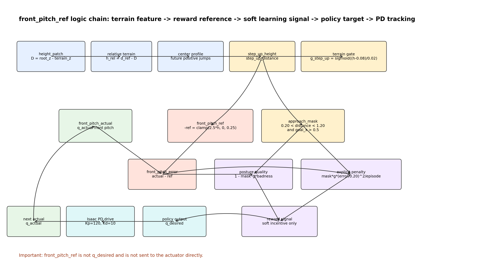
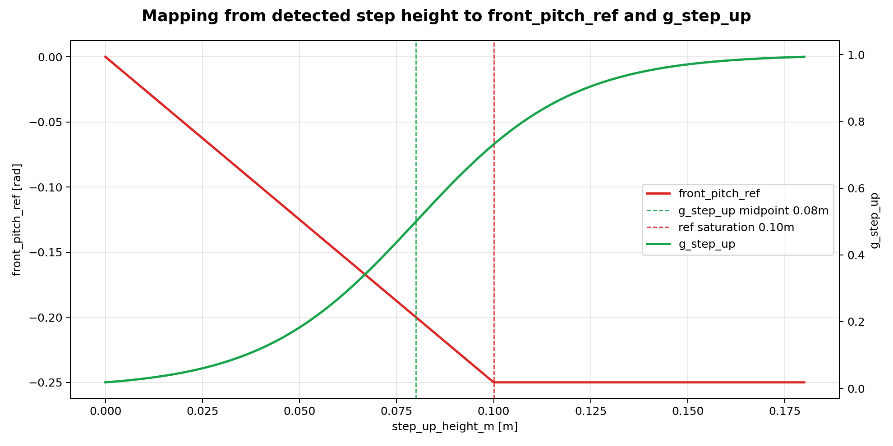
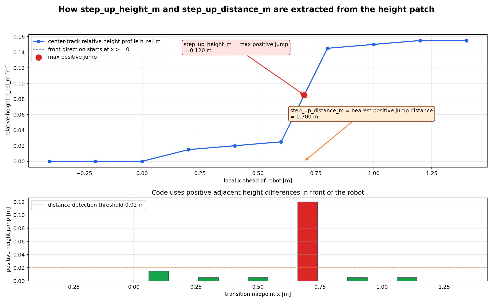
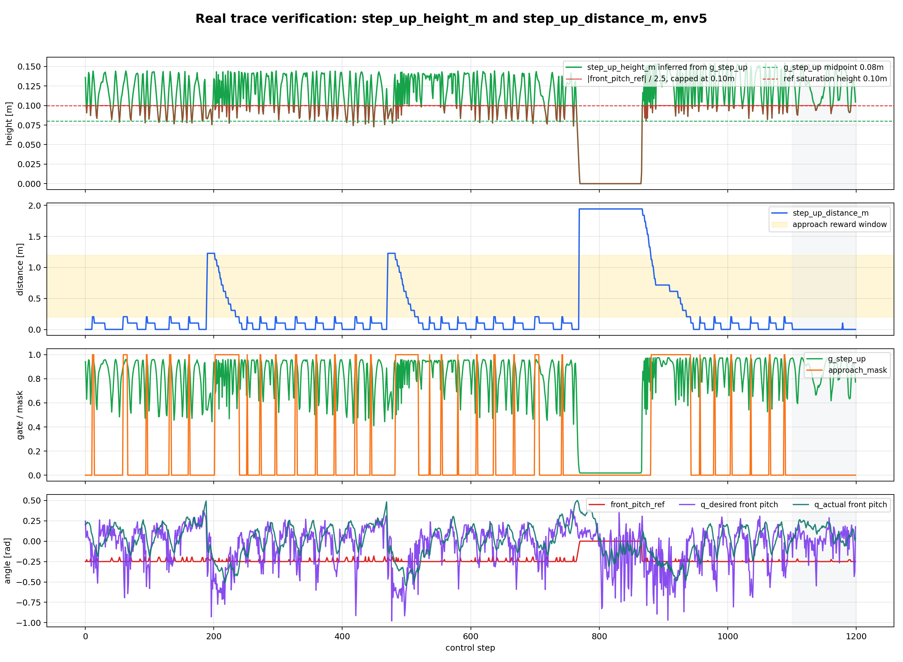
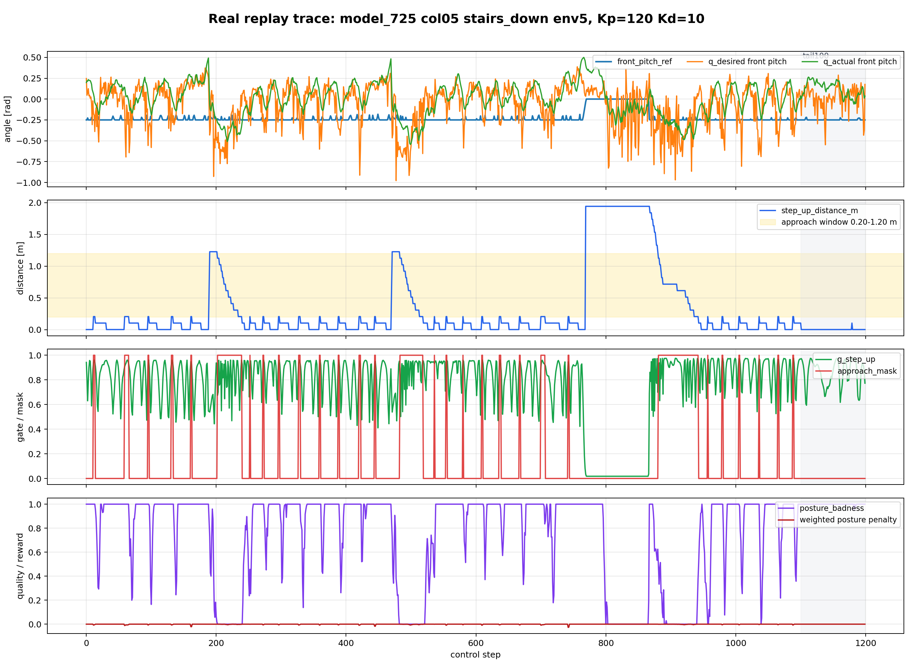
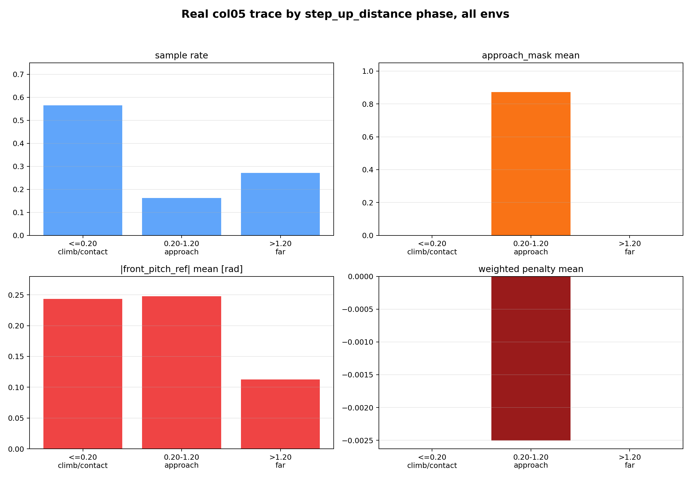

# front_pitch_ref 逻辑链路可视化说明

## 数据来源

- Trace：`results/stage1_model725_col05_diag_kp120_kd10_2026-05-12/raw_traces/model725_col05_diag_kp120_kd10_col05_stairs_down.csv`
- Policy：`model_725.pt`
- 地形：Stage1 第 `5` 列 `stairs_down`，`terrain_level=11`
- 控制增益：`Kp=120,Kd=10, effort=60 N*m, velocity=2 rad/s`
- 样本：`6` 个 env，`7193` 行真实 replay control-step trace

## 图 1：完整逻辑链路



核心链路：

1. height patch 提供 `D_patch = root_z - terrain_z`。
2. 以车体中部高度为参考，得到相对地形高度 `h_rel_m`。
3. 提取前方中心线高度剖面，并对相邻采样点做差分。
4. 正高度跳变得到 `step_up_height_m`，最近正高度跳变距离得到 `step_up_distance_m`。
5. `step_up_height_m` 生成 `front_pitch_ref`：
   - `front_pitch_ref = -clamp(2.5 * step_up_height_m, 0, 0.25)`
6. `step_up_distance_m` 生成 `approach_mask`：
   - `0.20 m < step_up_distance_m < 1.20 m`
   - 且目标在前方 `goal_x > 0.5 m`
7. `front_pitch_ref` 和 `front_pitch_actual` 形成 `front_pitch_error`。
8. `front_pitch_error` 只通过 reward 影响 policy，不直接进入底层 PD。
9. policy 输出 `q_desired`，再由 Isaac position drive 跟踪到 `q_actual`。

## 图 2：高度到参考角的映射



当前阈值含义：

- `g_step_up` 在 `step_up_height_m = 0.08 m` 时为 `0.5`。
- `front_pitch_ref` 在 `step_up_height_m = 0.10 m` 时达到最大值 `-0.25 rad`。
- 因此，对 `10 cm` 以上正高度突变，`front_pitch_ref` 不再继续增大。

这意味着 row11 台阶类地形里，`front_pitch_ref` 更像一个饱和参考，而不是随台阶高度细分的连续参考。

## 图 3：step_up_height 和 step_up_distance 怎么来



这张图对应 `terrain_features.py` 里的提取逻辑：

1. 先把 height patch 变成相对高度 `h_rel_m`。
2. 取车体前方中心轨迹附近的高度剖面 `profile_m`。
3. 对相邻采样点做差分：`d_profile_m = profile_m[i+1] - profile_m[i]`。
4. 只保留前方 `x >= 0` 的差分。
5. 正差分表示前方出现向上的高度跳变：
   - `step_up_jumps_m = relu(future_d_profile_m)`
6. `step_up_height_m` 是这些正跳变里的最大值。
7. `step_up_distance_m` 是第一个超过 `0.02 m` 正跳变所在位置到车体的前向距离。

因此：

- `step_up_height_m` 不是整块台阶平台的绝对高度，而是前方中心剖面里“最大的局部向上跳变”。
- `step_up_distance_m` 不是目标点距离，而是最近明显向上高度边缘的距离。

## 图 4：真实 trace 中的 step_up_height 和 step_up_distance



当前这次 trace 没有直接导出原始 `step_up_height_m`，所以图中绿色曲线用 reward 里的门控反推：

```text
g_step_up = sigmoid((step_up_height_m - 0.08) / 0.02)
step_up_height_m = 0.08 + 0.02 * log(g_step_up / (1 - g_step_up))
```

同时用红色曲线 `|front_pitch_ref| / 2.5` 做交叉验证。因为 `front_pitch_ref` 在 `0.25 rad` 处饱和，所以红色曲线最多只能显示到 `0.10 m`，超过这个高度会被截断。

真实 trace 统计：

| 范围 | 样本数 | 反推 `step_up_height_m` 均值 | 中位数 | p95 | `front_pitch_ref` 饱和率 | `step_up_distance_m` 均值 | `approach_mask` 均值 |
|---|---:|---:|---:|---:|---:|---:|---:|
| 全 trace | `7193` | `0.1026 m` | `0.1149 m` | `0.1516 m` | `65.9%` | `0.5911 m` | `14.2%` |
| env5 | `1198` | `0.1093 m` | `0.1181 m` | `0.1482 m` | `70.7%` | `0.3097 m` | `16.7%` |

这说明真实 row11 台阶里，`step_up_height_m` 经常超过 `0.10 m`，因此 `front_pitch_ref` 大量饱和；但 `step_up_distance_m` 大部分时间不在 `0.20-1.20 m` 的 approach 窗口内，所以 `approach_mask` 的覆盖仍然很窄。

## 图 5：真实回放 env5 时间序列



这张图验证了三个关键点：

1. `front_pitch_ref` 常常已经接近 `-0.25 rad`。
2. `q_desired` 并不稳定贴近 `front_pitch_ref`。
3. `approach_mask` 只在少数距离窗口内开启；很多 `g_step_up` 很高、`front_pitch_ref` 很大的时刻，显式姿态惩罚仍为 `0`。

## 图 6：真实 trace 按距离阶段统计



全 trace 分段统计：

| 距离阶段 | 样本比例 | `approach_mask` 均值 | `g_step_up` 均值 | `|front_pitch_ref|` 均值 | 姿态惩罚 raw 均值 |
|---|---:|---:|---:|---:|---:|
| `<=0.20 m` 接触/很近 | `56.6%` | `0.000` | `0.829` | `0.244 rad` | `0.00000000` |
| `0.20-1.20 m` approach | `16.3%` | `0.873` | `0.887` | `0.248 rad` | `0.00020876` |
| `>1.20 m` 太远 | `27.2%` | `0.000` | `0.373` | `0.112 rad` | `0.00000000` |

末 `100` step 分段统计：

| 距离阶段 | 样本比例 | `approach_mask` 均值 | `g_step_up` 均值 | `|front_pitch_ref|` 均值 | 姿态惩罚 raw 均值 |
|---|---:|---:|---:|---:|---:|
| `<=0.20 m` 接触/很近 | `66.5%` | `0.000` | `0.857` | `0.246 rad` | `0.00000000` |
| `0.20-1.20 m` approach | `9.2%` | `0.982` | `0.932` | `0.250 rad` | `0.00017694` |
| `>1.20 m` 太远 | `24.3%` | `0.000` | `0.249` | `0.087 rad` | `0.00000000` |

## 结论

`front_pitch_ref` 的生成逻辑本身是连贯的：真实 row11 台阶地形确实触发了较大的 `g_step_up`，并使 `front_pitch_ref` 多数时候饱和到接近 `-0.25 rad`。

当前更明显的问题在于 reward 激活阶段：

- 接触/很近阶段占全 trace `56.6%`，末 `100` step 占 `66.5%`。
- 这些阶段 `g_step_up` 和 `front_pitch_ref` 都很高。
- 但 `step_up_distance_m <= 0.20 m` 使 `approach_mask=0`，显式姿态惩罚关闭。

因此，当前 reward 更像是在“接近台阶前”短暂提醒 policy，而不是在“接触与爬升过程”持续约束前 pitch 姿态。
