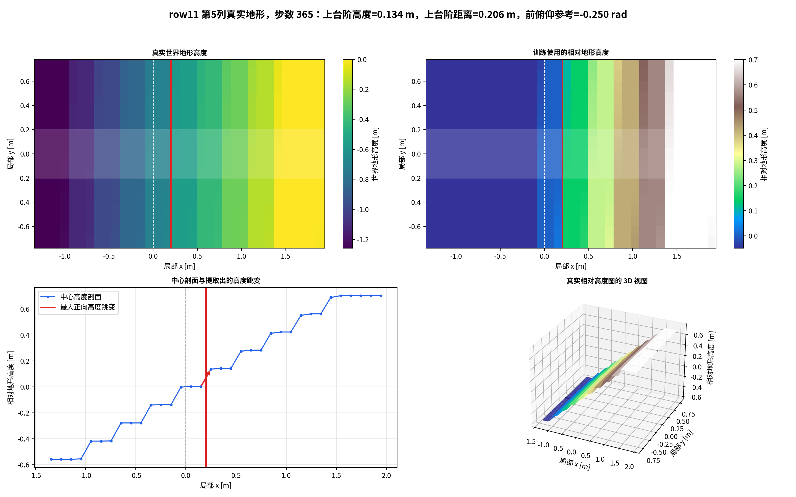
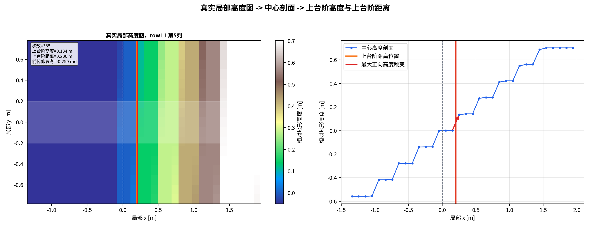
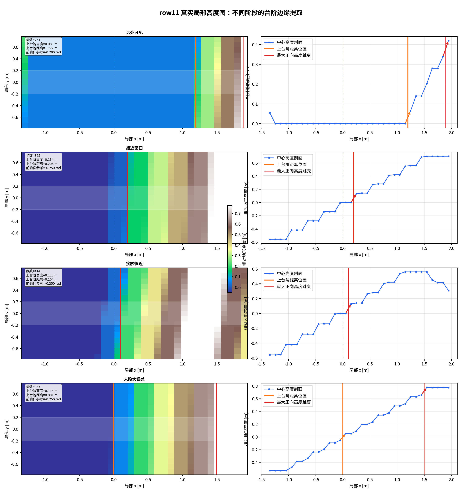
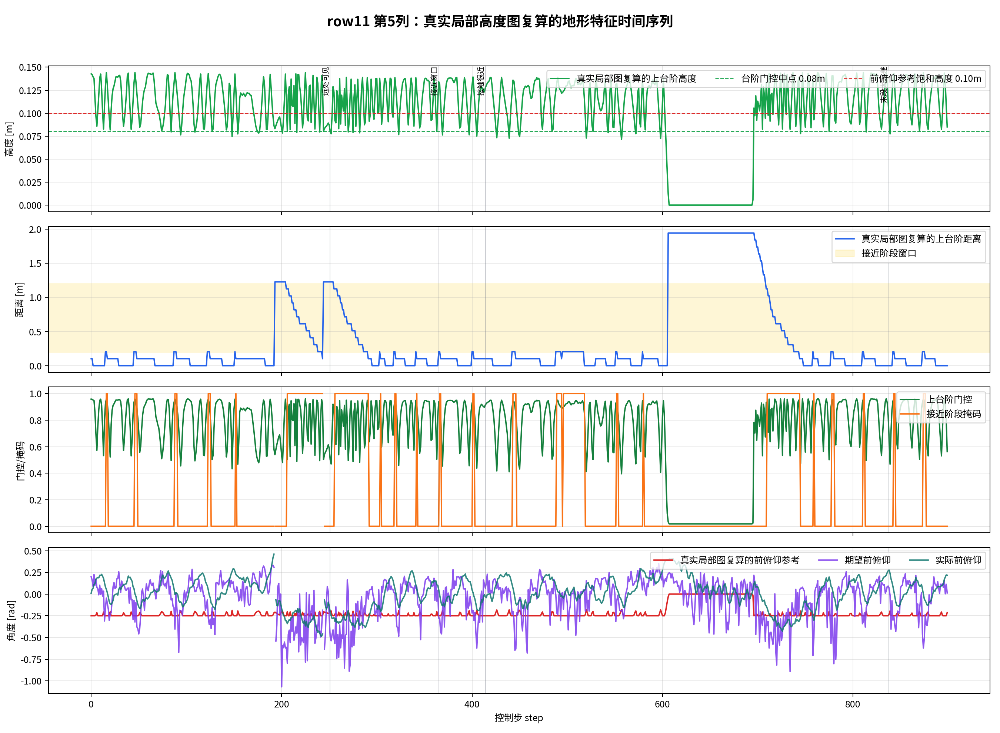

# Row11 Col05 真实 height patch 与 step-up 特征可视化

## 数据来源

- 有效数据目录：`results/stage1_row11_col05_height_patch_real_2026-05-12/raw_col05/`
- Policy：`model_725.pt`
- 地形：Stage1 第 `5` 列 `stairs_down`，强制 `row11`
- Env：`env0`
- 导出步数：`900` 个 height patch snapshot，CSV 中 `898` 行有效非 done step
- 原始局部高度图：`row11_col05_real_height_patch_kp120_kd10_height_patch_env0.npz`
- 对应 trace：`row11_col05_real_height_patch_kp120_kd10_col05_stairs_down.csv`

注意：同目录下早先的 `raw/` 是第一次未重置 Stage1 replay curriculum 时产生的 flat 数据，不作为本轮 row11 结论。有效数据使用 `raw_col05/`。

## 训练中真实局部高度图是什么

NPZ 中导出的 `relative_height_patch` 是训练 critic 使用的原始 patch：

- `D_patch = root_z - terrain_z`

为了提取地形起伏，训练代码会再用车体中部附近高度作为参考：

- `d_ref = median(D_patch around body center)`
- `h_rel_m = d_ref - D_patch`

因此可视化里同时保留两层数据：

- `terrain_z_world`：真实采样到的世界高度
- `h_rel_m`：训练地形特征实际使用的相对高度起伏

## 图 1：真实地形高度、相对高度、中心剖面和 3D 形状

这张图展示同一个真实 row11 patch：

1. 左上：真实世界地形高度 `terrain_z_world`。
2. 右上：训练使用的相对高度 `h_rel_m`。
3. 左下：中心轨迹高度剖面，以及被识别为最大正向跳变的位置。
4. 右下：同一个 `h_rel_m` patch 的 3D 视图。

## 图 2：单帧真实 patch 中如何得到 step_up_height 和 step_up_distance

计算过程完全复用 `terrain_features.py` 的逻辑：

1. 把 `D_patch` reshape 成 `34 x 17` 的局部网格。
2. 计算 `h_rel_m = d_ref - D_patch`。
3. 取中心轨迹附近 `|y| <= 0.20 m` 的中位高度剖面。
4. 对剖面沿前进方向做相邻差分。
5. 只看 `x >= 0` 的前方差分。
6. 正差分为前方向上高度跳变。
7. `step_up_height_m = max(positive jumps)`。
8. `step_up_distance_m` 是第一个超过 `0.02 m` 正跳变所在的前向距离。

## 图 3：不同阶段的真实 patch

这张图选了几个真实时刻：

- `far-visible`：前方已经能看到台阶，但距离还在 approach 窗口之外。
- `approach-window`：`step_up_distance_m` 落在 `0.20-1.20 m`，显式姿态惩罚可以激活。
- `contact-close`：台阶边缘已经非常近，`step_up_distance_m <= 0.20 m`。
- `tail-large-error`：末段误差较大的一个真实时刻。

## 图 4：真实 patch 复算出的时间序列

这张图用每一帧真实 height patch 重新计算：

- `step_up_height_m`
- `step_up_distance_m`
- `g_step_up`
- `front_pitch_ref`

并和 `q_desired`、`q_actual` 放在同一条时间轴上。

## 复算验证

从真实 height patch 复算得到：

| 指标 | 数值 |
|---|---:|
| snapshot 数 | `900` |
| patch 网格 | `34 x 17` |
| local x 范围 | `-1.3422 ~ 1.9422 m` |
| local y 范围 | `-0.7804 ~ 0.7804 m` |
| `step_up_height_m` 均值 | `0.1033 m` |
| `step_up_height_m` 中位数 | `0.1138 m` |
| `step_up_height_m` p95 | `0.1421 m` |
| `step_up_distance_m` 均值 | `0.3686 m` |
| `step_up_distance_m` 中位数 | `0.1036 m` |
| `step_up_distance_m` p95 | `1.9422 m` |
| `front_pitch_ref` 饱和率 | `65.1%` |

有一个时间对齐细节：`DirectRLEnv` 中 reward diagnostic 和 observation height patch 存在 `1` 个 control step 的顺序差。把 patch 第 `t` 步复算出的值和 CSV 第 `t+1` 步的 reward diagnostic 对齐后：

- `step_up_distance_m` 最大差值约 `4.34e-08 m`
- `front_pitch_ref` 最大差值约 `1.53e-07 rad`

这说明本报告的 `step_up_height_m`、`step_up_distance_m`、`front_pitch_ref` 确实是从训练使用的真实 height patch 按源码同一逻辑复算出来的。

## 结论

row11 第 `5` 列真实地形数据里，前方中心剖面经常出现 `10 cm` 量级以上正向高度跳变：

- `step_up_height_m` 均值约 `0.103 m`
- 中位数约 `0.114 m`
- 因为 `front_pitch_ref = -clamp(2.5 * step_up_height_m, 0, 0.25)`，所以 `front_pitch_ref` 约 `65%` 的时间进入 `-0.25 rad` 饱和。

因此，`front_pitch_ref` 不是凭空产生的；它确实来自真实局部高度图中的前方高度跳变。当前问题仍然更集中在后续 reward 生效窗口和 policy 是否响应该参考，而不是 `step_up_height_m` 没有被正确检测出来。

